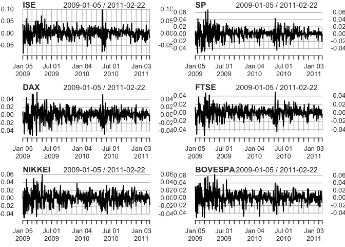
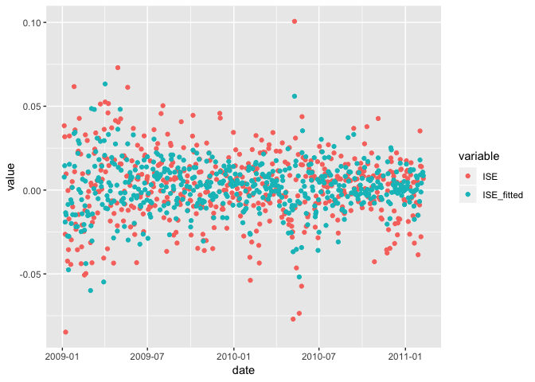
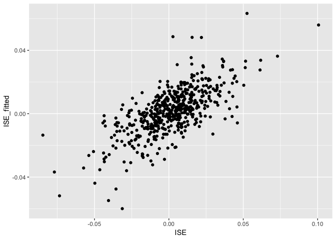
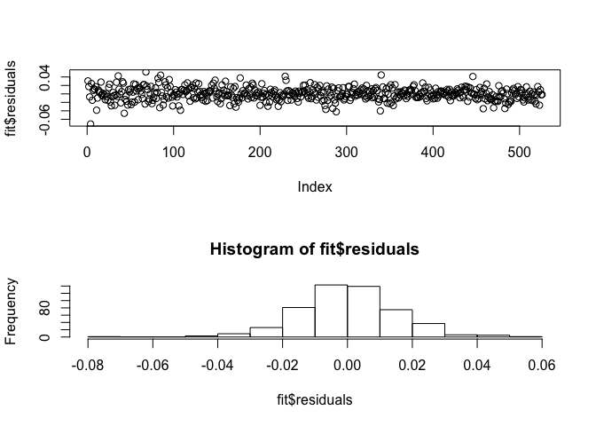
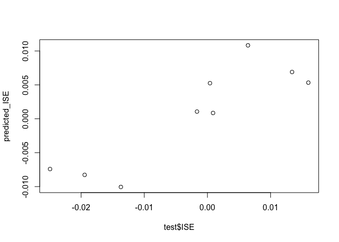

31006: Assignment2
================
Scott Shepard
4/11/2019

Istanbul Timeseries Exploration
===============================

Prompt: 1. Determine if all the TS are stationary a. qualitatively b. quantitatively 2. Split the data into train and test, keeping only the last 10 rows for test (from date 9-Feb-11). Remember to use only train dataset for \#3 to \#6. 3. Linearly regress ISE against the remaining 5 stock index returns - determine which coefficients are significant 4. For the non-significant coefficients, continue to lag by 1 day until all coefficients are significant - how many lags are needed? 5. Find correlations between ISE and each independent variable. Sum the square of the correlations. How does it compare to R-squared from \#4? 6. Concept question 1 - why do you think the R-squared in \#4 is so much less than the sum of square of the correlations? 7. Take the test dataset - perform the same lags from \#4 and call predict() function using the lm regression object from \#4. Why do you need to use the lm function object fro 8. Concept question - what do you find in \#1 and why?

``` r
library(zoo)
```

    ## 
    ## Attaching package: 'zoo'

    ## The following objects are masked from 'package:base':
    ## 
    ##     as.Date, as.Date.numeric

``` r
library(xts)
suppressMessages(library(tseries))
```

``` r
df <- read.csv("~/Datasets/TS regression - data_akbilgic.csv")
df$date <- as.Date(as.character(df$date), format='%d-%b-%y')

ISE  <- xts(df$ISE, df$date)
SP   <- xts(df$SP,  df$date)
DAX  <- xts(df$DAX, df$date)
FTSE <- xts(df$FTSE, df$date)
NIKKEI <- xts(df$NIKKEI, df$date)
BOVESPA <- xts(df$BOVESPA, df$date)
```

1a. Determine if all the TS are stationary - Qualitative
--------------------------------------------------------

The first step to both data exploration and determing if a time series is stationary is to plot it. I'm plotting all six time series here. A stationary time series will have an unchanging mean and should look stable, that is with no upward or downward trend.

``` r
par(mfrow=c(3,2))
plot(ISE)
plot(SP)
plot(DAX)
plot(FTSE)
plot(NIKKEI)
plot(BOVESPA)
```



Visually all of these time series look stationary. None of them have an obvious trend. They are all more or less centered at 0 (not important for the mean to be 0 but it is nice). I would say, qualitatively at least, that these time series are stationary.

1.b Determine of all the TS are stationary -- quantitatively
------------------------------------------------------------

One tool in our disposal for determining is a time series is stationary is the `kpss.test()` function. The KPSS test tests against the alternative that the series has a unit root. If a series has a unit root, it is has a stochastic trend that is unpredictable. In the KPSS test, if the p-value is large then the null is accepted. Since the unit root is the alternative hypothesis, a low p-value means that the time series is stationary, or at least there isn't enough evidence to conclude that it is not stationary.

``` r
library(tseries)

kpss.test(ISE)
```

    ## Warning in kpss.test(ISE): p-value greater than printed p-value

    ## 
    ##  KPSS Test for Level Stationarity
    ## 
    ## data:  ISE
    ## KPSS Level = 0.1967, Truncation lag parameter = 6, p-value = 0.1

``` r
adf.test(ISE)
```

    ## Warning in adf.test(ISE): p-value smaller than printed p-value

    ## 
    ##  Augmented Dickey-Fuller Test
    ## 
    ## data:  ISE
    ## Dickey-Fuller = -7.9492, Lag order = 8, p-value = 0.01
    ## alternative hypothesis: stationary

``` r
kpss.test(SP)
```

    ## Warning in kpss.test(SP): p-value greater than printed p-value

    ## 
    ##  KPSS Test for Level Stationarity
    ## 
    ## data:  SP
    ## KPSS Level = 0.08007, Truncation lag parameter = 6, p-value = 0.1

``` r
adf.test(SP)
```

    ## Warning in adf.test(SP): p-value smaller than printed p-value

    ## 
    ##  Augmented Dickey-Fuller Test
    ## 
    ## data:  SP
    ## Dickey-Fuller = -8.1353, Lag order = 8, p-value = 0.01
    ## alternative hypothesis: stationary

``` r
kpss.test(DAX)
```

    ## Warning in kpss.test(DAX): p-value greater than printed p-value

    ## 
    ##  KPSS Test for Level Stationarity
    ## 
    ## data:  DAX
    ## KPSS Level = 0.079887, Truncation lag parameter = 6, p-value = 0.1

``` r
adf.test(DAX)
```

    ## Warning in adf.test(DAX): p-value smaller than printed p-value

    ## 
    ##  Augmented Dickey-Fuller Test
    ## 
    ## data:  DAX
    ## Dickey-Fuller = -8.147, Lag order = 8, p-value = 0.01
    ## alternative hypothesis: stationary

``` r
kpss.test(FTSE)
```

    ## Warning in kpss.test(FTSE): p-value greater than printed p-value

    ## 
    ##  KPSS Test for Level Stationarity
    ## 
    ## data:  FTSE
    ## KPSS Level = 0.078836, Truncation lag parameter = 6, p-value = 0.1

``` r
adf.test(FTSE)
```

    ## Warning in adf.test(FTSE): p-value smaller than printed p-value

    ## 
    ##  Augmented Dickey-Fuller Test
    ## 
    ## data:  FTSE
    ## Dickey-Fuller = -7.8456, Lag order = 8, p-value = 0.01
    ## alternative hypothesis: stationary

``` r
kpss.test(NIKKEI)
```

    ## Warning in kpss.test(NIKKEI): p-value greater than printed p-value

    ## 
    ##  KPSS Test for Level Stationarity
    ## 
    ## data:  NIKKEI
    ## KPSS Level = 0.061547, Truncation lag parameter = 6, p-value = 0.1

``` r
adf.test(NIKKEI)
```

    ## Warning in adf.test(NIKKEI): p-value smaller than printed p-value

    ## 
    ##  Augmented Dickey-Fuller Test
    ## 
    ## data:  NIKKEI
    ## Dickey-Fuller = -7.7679, Lag order = 8, p-value = 0.01
    ## alternative hypothesis: stationary

``` r
kpss.test(BOVESPA)
```

    ## Warning in kpss.test(BOVESPA): p-value greater than printed p-value

    ## 
    ##  KPSS Test for Level Stationarity
    ## 
    ## data:  BOVESPA
    ## KPSS Level = 0.26752, Truncation lag parameter = 6, p-value = 0.1

``` r
adf.test(BOVESPA)
```

    ## Warning in adf.test(BOVESPA): p-value smaller than printed p-value

    ## 
    ##  Augmented Dickey-Fuller Test
    ## 
    ## data:  BOVESPA
    ## Dickey-Fuller = -7.7122, Lag order = 8, p-value = 0.01
    ## alternative hypothesis: stationary

None of the KPSS levels are large enough to reject the null hypothesis,
i.e. all these trends are stationary.

All the ADF tests reject the null and accept the alternative. ADF is backwards from KPSS so the alternative is that the trend is stationary.

Both ADF and KPSS conclude that all trends are stationary.

2. Train & Test
---------------

``` r
train <- df[1:(nrow(df)-10), ]
test <- df[(nrow(df)-10):nrow(df), ]
```

2. Linear Regression
--------------------

Linearly regress ISE against remianing 5 stock index returns and determin which coefficients are significant.

``` r
fit <- lm(ISE ~ ., data=train[,-1])

summary(fit)
```

    ## 
    ## Call:
    ## lm(formula = ISE ~ ., data = train[, -1])
    ## 
    ## Residuals:
    ##       Min        1Q    Median        3Q       Max 
    ## -0.071180 -0.009248  0.000083  0.009304  0.051863 
    ## 
    ## Coefficients:
    ##               Estimate Std. Error t value Pr(>|t|)    
    ## (Intercept)  0.0008833  0.0006640   1.330 0.183979    
    ## SP          -0.0607521  0.0770823  -0.788 0.430970    
    ## DAX          0.3417440  0.0961243   3.555 0.000412 ***
    ## FTSE         0.6033493  0.1077621   5.599 3.50e-08 ***
    ## NIKKEI       0.3266529  0.0462163   7.068 5.09e-12 ***
    ## BOVESPA      0.1117630  0.0626647   1.784 0.075087 .  
    ## ---
    ## Signif. codes:  0 '***' 0.001 '**' 0.01 '*' 0.05 '.' 0.1 ' ' 1
    ## 
    ## Residual standard error: 0.0152 on 520 degrees of freedom
    ## Multiple R-squared:  0.493,  Adjusted R-squared:  0.4881 
    ## F-statistic: 101.1 on 5 and 520 DF,  p-value: < 2.2e-16

DAX, FTSE, and NIKKEI are significant coefficients. BOVESPA is significant at a 0.1 level so we won't count that one. SP is not significant at all.

About half the variance is explained by the regression model.

Explore the fitted model a bit.

``` r
library(dplyr)
```

    ## 
    ## Attaching package: 'dplyr'

    ## The following objects are masked from 'package:xts':
    ## 
    ##     first, last

    ## The following objects are masked from 'package:stats':
    ## 
    ##     filter, lag

    ## The following objects are masked from 'package:base':
    ## 
    ##     intersect, setdiff, setequal, union

``` r
library(reshape2)
library(ggplot2)

train$ISE_fitted <- y_hat <- predict(fit)

melt(train, id.vars=('date'), measure.vars=c('ISE', 'ISE_fitted')) %>% 
  ggplot(aes(x=date, y=value, color=variable)) + geom_point()
```



``` r
ggplot(train, aes(x=ISE, y=ISE_fitted)) + geom_point()
```



``` r
par(mfrow=c(2,1))
plot(fit$residuals)

hist(fit$residuals)
```



The fit is decent. The residuals show no pattern and are normally distributed. Plotting the real vs fitted values shows a very clear linear pattern but the overall scatter shows a lot of variance that is not captured.

3. Lag Non-Significant Coefficients
-----------------------------------

We can improve the model by lagging the non-significant coefficients until they become sigfificant.

``` r
library(DataCombine)

lag = 1
df_slide = slide(train, Var='SP', TimeVar='date', NewVar=paste0('SP_', lag), slideBy=-lag)
```

    ## 
    ## Lagging SP by 1 time units.

``` r
drops = c('date', 'ISE_fitted', 'SP')
summary(lm(ISE ~ ., data=df_slide[,!names(df_slide) %in% drops]))
```

    ## 
    ## Call:
    ## lm(formula = ISE ~ ., data = df_slide[, !names(df_slide) %in% 
    ##     drops])
    ## 
    ## Residuals:
    ##       Min        1Q    Median        3Q       Max 
    ## -0.069334 -0.009554  0.000174  0.009197  0.053806 
    ## 
    ## Coefficients:
    ##              Estimate Std. Error t value Pr(>|t|)    
    ## (Intercept) 0.0007035  0.0006537   1.076 0.282376    
    ## DAX         0.3106823  0.0912562   3.405 0.000714 ***
    ## FTSE        0.5946201  0.1056108   5.630 2.95e-08 ***
    ## NIKKEI      0.2095742  0.0545883   3.839 0.000139 ***
    ## BOVESPA     0.1073495  0.0531139   2.021 0.043780 *  
    ## SP_1        0.2233447  0.0564961   3.953 8.78e-05 ***
    ## ---
    ## Signif. codes:  0 '***' 0.001 '**' 0.01 '*' 0.05 '.' 0.1 ' ' 1
    ## 
    ## Residual standard error: 0.01493 on 519 degrees of freedom
    ##   (1 observation deleted due to missingness)
    ## Multiple R-squared:  0.5086, Adjusted R-squared:  0.5039 
    ## F-statistic: 107.4 on 5 and 519 DF,  p-value: < 2.2e-16

A single day lag on SP brings the two non-significant coefficients into significance, but BOVESPA isn't yet significant enough.

``` r
library(DataCombine)

search = data.frame(data.frame(sp_lag=numeric(), bv_lag=numeric(), sp_pval=numeric(), bv_pval=numeric()))

sp_lags = 1:10
bv_lags = 1:10
for(sp_lag in sp_lags) {
  for(bv_lag in bv_lags) { 
    df_slide = slide(train, Var='SP', TimeVar='date', NewVar=paste0('SP_', lag), slideBy=-sp_lag)
    df_slide = slide(df_slide, Var='BOVESPA', TimeVar='date', NewVar=paste0('BOVESPA_', lag), slideBy=-bv_lag)
    drops = c('date', 'ISE_fitted', 'SP', 'BOVESPA')
    sm <- summary(lm(ISE ~ ., data=df_slide[,!names(df_slide) %in% drops]))
    
    search[nrow(search)+1,] = list(sp_lag, bv_lag, sm$coef[5,4], sm$coef[6,4])
  }
}

search[search$sp_pval < 0.02 & search$bv_pval < 0.02, ]
```

    ##    sp_lag bv_lag    sp_pval      bv_pval
    ## 11      2      1 0.01786126 6.912666e-06

``` r
sp_lag = 2
bv_lag = 1

df_slide = slide(train, Var='SP', TimeVar='date', NewVar=paste0('SP_', sp_lag), slideBy=-sp_lag)
df_slide = slide(df_slide, Var='BOVESPA', TimeVar='date', NewVar=paste0('BOVESPA_', bv_lag), slideBy=-bv_lag)
drops = c('date', 'ISE_fitted', 'SP', 'BOVESPA')

model <- lm(ISE ~ ., data=df_slide[,!names(df_slide) %in% drops])
    
summary(model)
```

    ## 
    ## Call:
    ## lm(formula = ISE ~ ., data = df_slide[, !names(df_slide) %in% 
    ##     drops])
    ## 
    ## Residuals:
    ##       Min        1Q    Median        3Q       Max 
    ## -0.063412 -0.009491  0.000468  0.008739  0.050599 
    ## 
    ## Coefficients:
    ##               Estimate Std. Error t value Pr(>|t|)    
    ## (Intercept)  0.0007513  0.0006491   1.157 0.247635    
    ## DAX          0.3355329  0.0890788   3.767 0.000184 ***
    ## FTSE         0.6368064  0.1024472   6.216 1.05e-09 ***
    ## NIKKEI       0.2395311  0.0489366   4.895 1.32e-06 ***
    ## SP_2        -0.1082670  0.0455658  -2.376 0.017861 *  
    ## BOVESPA_1    0.2057244  0.0452856   4.543 6.91e-06 ***
    ## ---
    ## Signif. codes:  0 '***' 0.001 '**' 0.01 '*' 0.05 '.' 0.1 ' ' 1
    ## 
    ## Residual standard error: 0.01481 on 518 degrees of freedom
    ##   (2 observations deleted due to missingness)
    ## Multiple R-squared:  0.516,  Adjusted R-squared:  0.5113 
    ## F-statistic: 110.4 on 5 and 518 DF,  p-value: < 2.2e-16

SP lag by 2, BOVESPA lag by 1 leads to all coefficients significant at a 0.02 level.

5. Find correlations between ISE and each independent variable. Sum the square of the correlations. How does it compare to R-squared from \#4?
----------------------------------------------------------------------------------------------------------------------------------------------

``` r
cor(train$ISE, train$SP)
```

    ## [1] 0.4494173

``` r
cor(train$ISE, train$DAX)
```

    ## [1] 0.631075

``` r
cor(train$ISE, train$FTSE)
```

    ## [1] 0.6485253

``` r
cor(train$ISE, train$NIKKEI)
```

    ## [1] 0.3921567

``` r
cor(train$ISE, train$BOVESPA)
```

    ## [1] 0.4473112

``` r
sum(c(
  cor(train$ISE, train$SP),
  cor(train$ISE, train$DAX),
  cor(train$ISE, train$FTSE),
  cor(train$ISE, train$NIKKEI),
  cor(train$ISE, train$BOVESPA)
  )^2
)
```

    ## [1] 1.374691

The sum of square of correlations is much higher than R^2 found in part 4. R^2 is 0.51 which sum of squared correlations is 1.3

6. Concept question 1 - why do you think the R-squared in \#4 is so much less than the sum of square of the correlations?
-------------------------------------------------------------------------------------------------------------------------

They are computed completely differently. R^2 is the percentage of variance explained by the model. You can't just sum up the correlations of individual variables. The variance explained by SP might also be explained by DAX. They are not independent from each other.

7. Take the test dataset - perform the same lags from \#4 and call predict() function using the lm regression object from \#4. Why do you need to use the lm function object from \#4?
--------------------------------------------------------------------------------------------------------------------------------------------------------------------------------------

We need to use the original model object because here we are testing a fitted model, not training a new model. This is suppose to be data that the model has not seen yet for validation.

``` r
test_slide = slide(test, Var='SP', TimeVar='date', NewVar=paste0('SP_', 2), slideBy=-2)
```

    ## 
    ## Lagging SP by 2 time units.

``` r
test_slide = slide(test_slide, Var='BOVESPA', TimeVar='date', NewVar=paste0('BOVESPA_', 1), slideBy=-1)
```

    ## 
    ## Lagging BOVESPA by 1 time units.

``` r
drops = c('date', 'SP', 'BOVESPA')

predicted_ISE = predict(model, newdata = test_slide[,!names(test_slide) %in% drops])
plot(test$ISE, predicted_ISE)
```



Not a spectacular prediction but not terrbile.

8. What do you find in \#1 and why?
-----------------------------------

In part 1 I found that all the timeseries were stationary. They are return indexes which means it's the daily return from open to close (or maybe from close the previous day). I'm rather surprised that they are all stationary as there should be a definite upward trend in daily return from 2009-2010. Maybe this is already trend corrected data?
