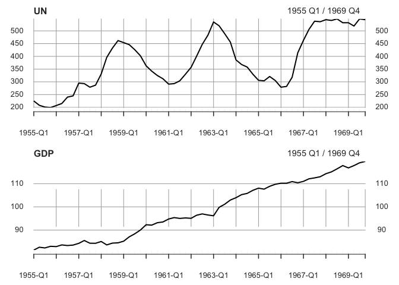
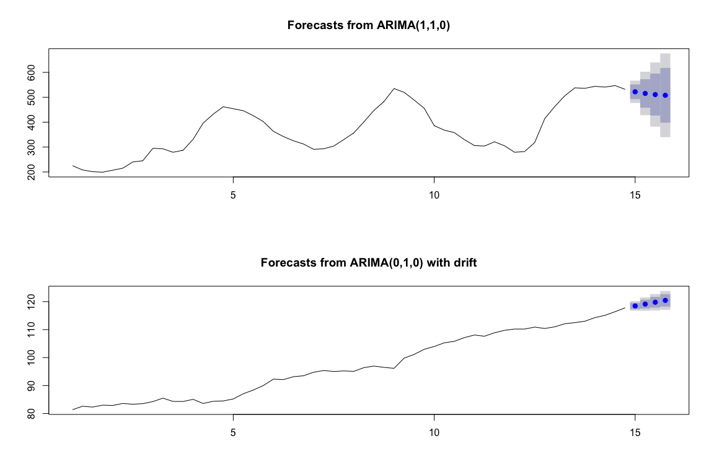
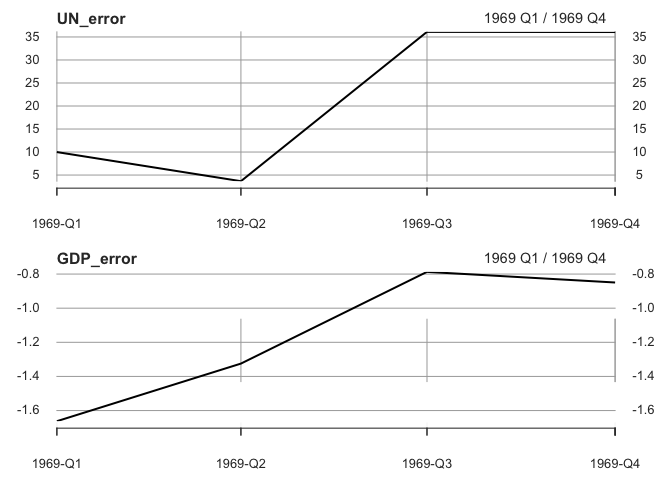
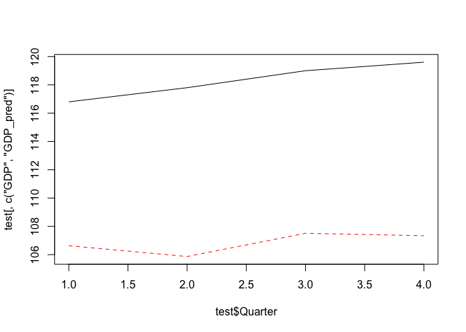
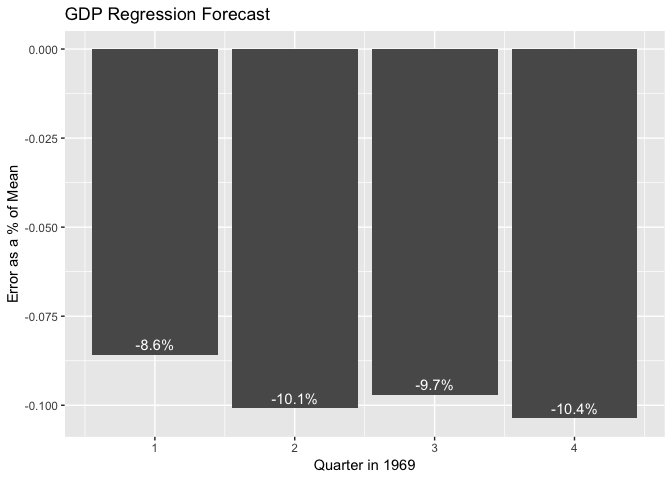
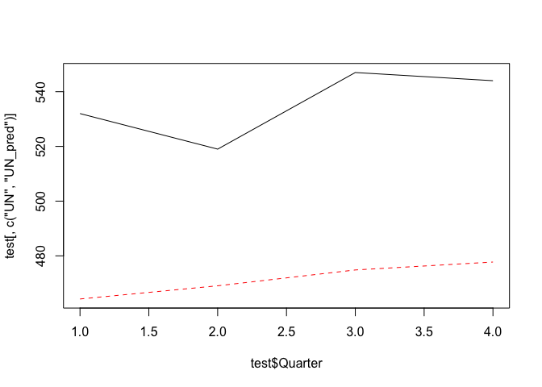
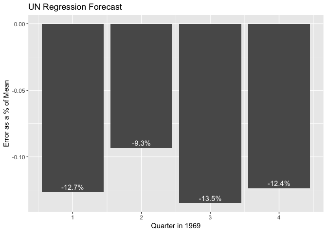

31006: Assignment 3
================
Scott Shepard
4/11/2019

Prompt
======

**ARIMA modeling:**

1.  Use datasets from 1955 to 1968 to build an ARMA or ARIMA models for UN and GDP. Use auto.arima() from package forecast.
2.  Justify why you chose (ARMA or ARIMA) one over the other. Note there will be 2 models, one for UN and another for GDP.
3.  Use the chosen UN and GDP models to forecast the UN and the GDP for 1969. Use forecast() from package forecast
4.  Compare your forecasts with the actual values using error = actual - estimate and plot the errors.
5.  Calculate the sum of squared error for each UN and GDP models.

**Regression - build regression models that use:**

1.  UN as the independent variable and GDP as the dependent variable - use data from 1955 to 1968 to build the model. Forecast for 1969 and plot the errors as a percentage of the mean. Also calculate the sum of squared(error) as a percentage of the mean.
2.  GDP as the independent variable and UN as the dependent variable - use data from 1955 to 1968 to build the model. Forecast for 1969 and plot the errors as a percentage of the mean. Also calculate the sum of squared(error) as a percentage of the mean of the actual values.
3.  Compare the 2 models using the sum of squared error as a percentage of the mean of the actual values - any reason to believe which should be the independent and the dependent variable ?

Setup & Data Loading
--------------------

``` r
library(openxlsx)

df <- read.xlsx("~/Datasets/31006/Unemployment_GDP_UK.xlsx", 1)

for( i in 2:nrow(df)) {
  if(is.na(df$Year[i])) {
    df$Year[i] <- df$Year[i-1]
  }
}

head(df)
```

    ##   Year Quarter  UN   GDP
    ## 1 1955       1 225 81.37
    ## 2 1955       2 208 82.60
    ## 3 1955       3 201 82.30
    ## 4 1955       4 199 83.00
    ## 5 1956       1 207 82.87
    ## 6 1956       2 215 83.60

ARIMA Modeling
==============

``` r
library(zoo)
library(xts)

quarters <- as.yearqtr(paste(df$Year, df$Quarter, sep="-"))

UN  <- as.xts(df$UN,  order.by=quarters)
GDP <- as.xts(df$GDP, order.by=quarters)

par(mfrow=c(2,1))
plot.xts(UN)
plot.xts(GDP)
```



1. Build ARMA/ARIMA Models for UN & GDP for 1955-1968
-----------------------------------------------------

``` r
library(forecast)

UN_arima <- auto.arima(UN['1955/1968'])
GDP_arima <- auto.arima(GDP['1955/1968'])

summary(UN_arima)
```

    ## Series: UN["1955/1968"] 
    ## ARIMA(1,1,0) 
    ## 
    ## Coefficients:
    ##          ar1
    ##       0.6666
    ## s.e.  0.0977
    ## 
    ## sigma^2 estimated as 525.1:  log likelihood=-250.08
    ## AIC=504.15   AICc=504.39   BIC=508.17
    ## 
    ## Training set error measures:
    ##                    ME     RMSE      MAE       MPE     MAPE      MASE
    ## Training set 1.730281 22.50123 17.50413 0.6750518 4.903581 0.2142186
    ##                    ACF1
    ## Training set 0.04532975

``` r
summary(GDP_arima)
```

    ## Series: GDP["1955/1968"] 
    ## ARIMA(0,1,0) with drift 
    ## 
    ## Coefficients:
    ##        drift
    ##       0.6624
    ## s.e.  0.1152
    ## 
    ## sigma^2 estimated as 0.743:  log likelihood=-69.36
    ## AIC=142.73   AICc=142.96   BIC=146.74
    ## 
    ## Training set error measures:
    ##                       ME      RMSE       MAE         MPE      MAPE
    ## Training set 0.001441207 0.8464517 0.6381945 -0.02097366 0.6730658
    ##                   MASE       ACF1
    ## Training set 0.2402527 0.05442436

2. Justify choice of ARMA or ARIMA
----------------------------------

The I in ARIMA stands for integrated. It's used to difference the dataset first before applying an ARMA model. ARIMA models are useful when working on non-stationary time series. Both the GDP and UN time series are both non-stationary so using an ARIMA model instead of an ARMA model is appropriate.

``` r
library(tseries)

kpss.test(UN)
```

    ## 
    ##  KPSS Test for Level Stationarity
    ## 
    ## data:  UN
    ## KPSS Level = 0.77042, Truncation lag parameter = 3, p-value = 0.01

``` r
kpss.test(GDP)
```

    ## 
    ##  KPSS Test for Level Stationarity
    ## 
    ## data:  GDP
    ## KPSS Level = 1.586, Truncation lag parameter = 3, p-value = 0.01

The KPSS levels are both high enough to reject the null and accept the alternate that these series as non-stationary.

3. Forest UN & GDP for 1969
---------------------------

``` r
UN_1969_forecast  <- forecast(UN_arima, h=4)
GDP_1969_forecast <- forecast(GDP_arima, h=4)

UN_1969_forecast
```

    ##       Point Forecast    Lo 80    Hi 80    Lo 95    Hi 95
    ## 15 Q1       522.0004 492.6348 551.3661 477.0896 566.9113
    ## 15 Q2       515.3343 458.2585 572.4101 428.0444 602.6243
    ## 15 Q3       510.8904 426.6249 595.1560 382.0174 639.7635
    ## 15 Q4       507.9280 397.9369 617.9191 339.7111 676.1448

``` r
GDP_1969_forecast
```

    ##       Point Forecast    Lo 80    Hi 80    Lo 95    Hi 95
    ## 15 Q1       118.4624 117.3577 119.5670 116.7729 120.1518
    ## 15 Q2       119.1247 117.5625 120.6870 116.7355 121.5140
    ## 15 Q3       119.7871 117.8737 121.7004 116.8609 122.7133
    ## 15 Q4       120.4495 118.2401 122.6588 117.0705 123.8284

``` r
par(mfrow=c(2,1))
plot(UN_1969_forecast)
plot(GDP_1969_forecast)
```



4. Compare forecasts with the actual values and plot errors
-----------------------------------------------------------

``` r
UN_error  <- UN['1969']  - data.frame( UN_1969_forecast)$Point.Forecast
GDP_error <- GDP['1969'] - data.frame(GDP_1969_forecast)$Point.Forecast

par(mfrow=c(2,1))
plot(UN_error)
plot(GDP_error)
```



5. Calcuate sum of squared error for each model
-----------------------------------------------

``` r
sum(UN_error^2)
```

    ## [1] 2718.519

``` r
sum(GDP_error^2)
```

    ## [1] 5.85944

Regression
==========

1. UN as ind. var and GDP as dep. var
-------------------------------------

``` r
train <- df[df$Year < 1969,]
test <- df[df$Year == 1969,]

m1 <- lm(GDP ~ UN, train)

test$GDP_pred <- predict(m1, newdata = test)

matplot(x=test$Quarter, y=test[,c("GDP", "GDP_pred")], type='l')
```



``` r
library(ggplot2)

test$GDP_error <- test$GDP_pred - test$GDP
test$GDP_error_pct <- test$GDP_error / mean(test$GDP)

ggplot(test, aes(x=Quarter, y=GDP_error_pct)) + 
  geom_bar(stat='identity') + 
  geom_text(aes(label=paste0(round(GDP_error_pct*100, 1), '%')), vjust=-0.5, color="white") + 
  labs(x='Quarter in 1969', y='Error as a % of Mean', title='GDP Regression Forecast')
```



``` r
sum(test$GDP_error^2) / mean(test$GDP)
```

    ## [1] 4.465299

2. UN as dep. var and GDP as ind. var
-------------------------------------

``` r
m2 <- lm(UN ~ GDP, train)

test$UN_pred <- predict(m2, newdata = test)

matplot(x=test$Quarter, y=test[,c("UN", "UN_pred")], type='l')
```



``` r
test$UN_error <- test$UN_pred - test$UN
test$UN_error_pct <- test$UN_error / mean(test$UN)

ggplot(test, aes(x=Quarter, y=UN_error_pct)) + 
  geom_bar(stat='identity') + 
  geom_text(aes(label=paste0(round(UN_error_pct*100, 1), '%')), vjust=-0.5, color="white") + 
  labs(x='Quarter in 1969', y='Error as a % of Mean', title='UN Regression Forecast')
```



``` r
sum(test$UN_error^2) / mean(test$UN)
```

    ## [1] 31.15049

Which one is the dependent variable?
------------------------------------

UN unemployment did a better job of predicting GDP than GDP did of predicting UN unemployment. The sum or squared errors over the mean of actual values is lower. This might mean that unemployment is the independent variable and GDP the dependent variable. This would make sense as the fewer people out of work, the more stuff a country produces. However this is really weak evidence that one or the other is the independent or dependent variable.
