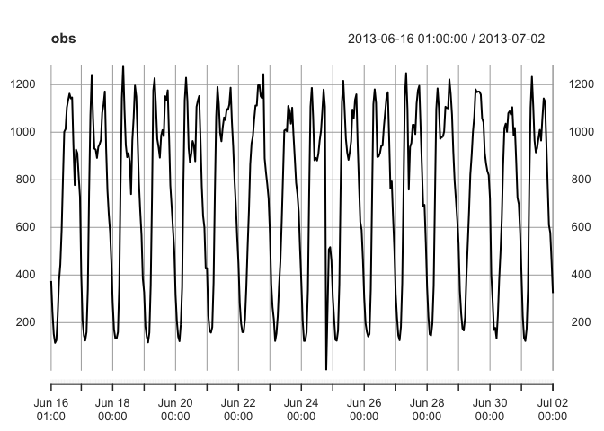
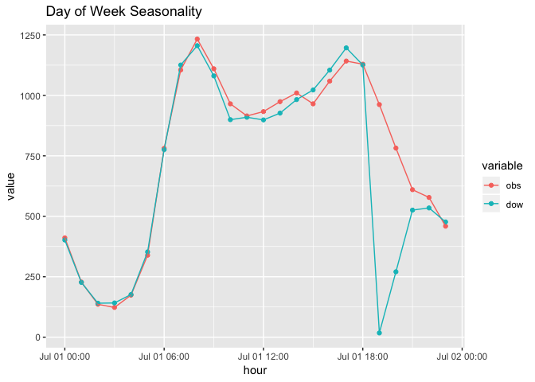
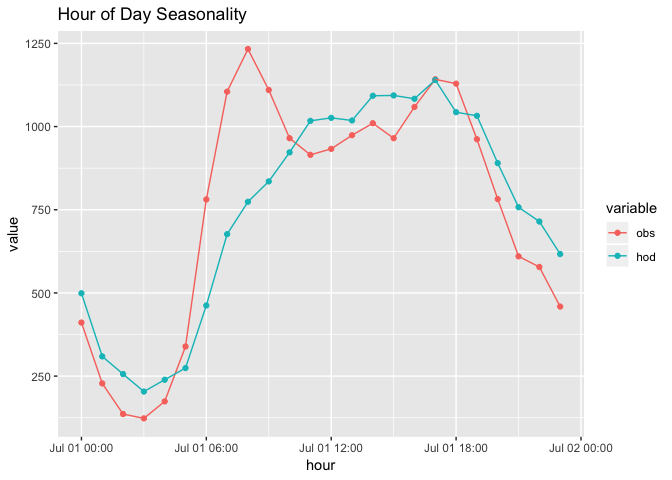
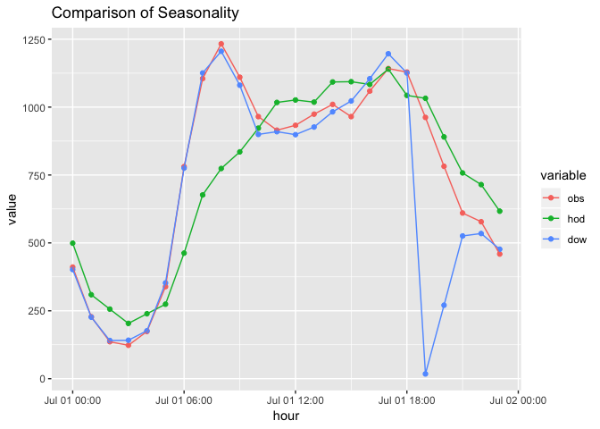

31006: Assignment 4
================
Scott Shepard
5/2/2019

Prompt
------

The daily data is from Illinois Dept of Transporation (IDOT) for I80E 1EXIT (the 2nd data column) - note each data point is an hourly count of the number of vehicles at a specific location on I80E.

Use the daily data for last 2 weeks of June 2013 to develop an ARIMA forecasting model.

Objective is to forecast the hourly counts for July 1.

The actual data file for July 1 is included for you to test your estimate.

**Part 1** - Use ARIMA(p,d,q) model to forecast. Find the model returned by R `auto.arima()`. Change the values of p and q and determine the best model using AICc and BIC. Do AICc and BIC select the same model as the best model?

**Part 2** - Use day of the week seasonal ARIMA(p,d,q)(P,Q,D)s model to forecast for July 1 (which is a Monday) - note use the hourly data

**Part 3** - Use hour of the day seasonal ARIMA (p,d,q)(P,D,Q)s model to forecast for the hours 8:00, 9:00, 17:00 and 18:00 on July 1

**Part 4** - For the July 1 8:00, 9:00, 17:00 and 18:00 forecasts, which model is better (part 2 or part 3) ?

Part 0: Reading Data
--------------------

``` r
library(reshape2)
library(ggplot2)
library(gdata)
library(stringr)
library(xts)
library(forecast)
library(zoo)
```

``` r
base_path <- "~/Datasets/31006/1-57 Traffic/"

date_parse_helper <- function(d) {
  d <- str_replace_all(d, "I-57-|\\.xls", "")
  as.Date(d, format = "%Y-%B-%d")
}

read_i57_xls <- function(base_path, file_name) {
  df_ <- read.xls(file.path(base_path, file_name), skip=4, header=F, stringsAsFactors=F)
  df_$date <- date_parse_helper(file_name)
  df_$datetime <- as.POSIXct(paste(df_$date, df_[,3]), format="%Y-%m-%d %H:%M")
  df_[1:24,]
}

df <- plyr::ldply(list.files(base_path)[c(2:16,1)], function(f) read_i57_xls(base_path, f))
head(df[,1:10])
```

    ##   V1 V2    V3   V4  V5   V6  V7  V8 V9 V10
    ## 1       01:00 1024 375  406 566 132 61  69
    ## 2       02:00  555 244  415 244  70 42  43
    ## 3       03:00  340 152  216 155  57 34  29
    ## 4       04:00  255 115  698 127  32 28  15
    ## 5       05:00  288 126 1335 132  46 31  17
    ## 6       06:00  495 228  898 222  72 34  20

The field we are trying to forecast here is V5.

``` r
time_index <- seq(from = as.POSIXct("2013-06-16 01:00"), 
                  to = as.POSIXct("2013-07-02 00:00"), by = "hour")

obs <- xts(df[,5], order.by = time_index, frequency = 24)

train <- obs['2013-06-16/2013-06-30']
test <- obs['2013-07-01']

plot(obs)
```



Data looks highly seasonal, a strong time-based component. Traffic is lowest around 2am, with a double peak during weekdays aroung 9am and 5pm, and a single peak on weekdays at midday. Visually, it looks like the hourly compoment will be more important than the weekday component.

Part 1: ARIMA
-------------

Use ARIMA(p,d,q) model to forecast. Find the model returned by R `auto.arima()`. Change the values of p and q and determine the best model using AICc and BIC. Do AICc and BIC select the same model as the best model?

``` r
m0 <- auto.arima(train)
m1 <- Arima(train, c(4,0,6))
m2 <- Arima(train, c(8,0,12))

compare_models <- data.frame(m0[c('aic', 'bic', 'loglik')])
names(compare_models) <- c('aic', 'bic', 'loglik')
compare_models <- rbind(compare_models, data.frame(m1[c('aic', 'bic', 'loglik')]))
compare_models <- rbind(compare_models, data.frame(m2[c('aic', 'bic', 'loglik')]))
compare_models$model <- c('m0','m1','m2')
compare_models
```

    ##        aic      bic    loglik model
    ## 1 4443.511 4470.694 -2214.755    m0
    ## 2 4413.860 4460.460 -2194.930    m1
    ## 3 4400.925 4486.358 -2178.462    m2

Using AIC and BIC alone do not give the same model as using `auto.arima`. AIC continues to fall as more and more terms are added. BIC penalized additional terms and so increases again when the terms get too large, however even BIC prefered values of p and q higher than the "best" model. Even rerunning `auto.arima` with higher max p and q values yields the same answer.

Part 2: Day of Week Seasonality
-------------------------------

Use day of the week seasonal ARIMA(p,d,q)(P,Q,D)s model to forecast for July 1

I can force DOW seasonality on the training set by making the frequency 168, which is the number of hours in a week.

``` r
dow_arima <- auto.arima(ts(train, frequency = 168))
dow_forecast <- forecast(dow_arima, h=24)

dfp <- data.frame(hour=index(test),
                  obs=test[,1], 
                  dow=dow_forecast$mean)

melt(dfp, id.vars = "hour") %>% 
  ggplot(aes(x=hour, y=value, group=variable, color=variable)) + 
  geom_point() + 
  geom_line() +
  ggtitle('Day of Week Seasonality')
```



Overall the forecast using DOW looks pretty good. However there is a weirdly large drop at 7pm. It's picking that up from the Monday before.

Part 3: Hour of Day Seasonality
-------------------------------

By setting the frequency to 24, we are telling the arima model that there are 24 measurements in a period, and so it will look at the observations 24 steps in the past to consider seasonality.

``` r
hour_arima <- auto.arima(ts(train, frequency = 24))
hod_forecast <- forecast(hour_arima, h=24)

dfp <- data.frame(hour=index(test),
                  obs=test[,1], 
                  hod=hod_forecast$mean)

melt(dfp, id.vars = "hour") %>% 
  ggplot(aes(x=hour, y=value, group=variable, color=variable)) + 
  geom_point() + 
  geom_line() + 
  ggtitle('Hour of Day Seasonality')
```



Hour of day doesn't have the huge drop that dow of week had, but it doesn't quite capute the rush of Monday morning traffic. It's probably a bit smoothed out by the weekend mornings which aren't as intense.

Compare Seasonalities
---------------------

``` r
dfp <- data.frame(hour=index(test),
                  obs=test[,1], 
                  hod=hod_forecast$mean,
                  dow=dow_forecast$mean, 
                  row.names = NULL)

melt(dfp, id.vars = "hour") %>% 
  ggplot(aes(x=hour, y=value, group=variable, color=variable)) + 
  geom_point() + 
  geom_line() + 
  ggtitle("Comparison of Seasonality")
```



Comparing both plots on top of each other show the day-of-week seasonality outperforming the hour-of-day seasonality for most data-points until 7pm with that wild divergence.

``` r
rush_hours = as.POSIXct(
  paste('2013-07-01', c('08:00:00', '09:00:00', '17:00:00', '18:00:00')))

dfp$hod_error <- dfp$hod - dfp$obs
dfp$dow_error <- dfp$dow - dfp$obs

df_rush <- dfp[dfp$hour %in% rush_hours, ]
df_rush
```

    ##                   hour  obs       hod      dow   hod_error  dow_error
    ## 9  2013-07-01 08:00:00 1233  773.9157 1205.575 -459.084316 -27.425477
    ## 10 2013-07-01 09:00:00 1110  835.1757 1080.575 -274.824330 -29.425477
    ## 18 2013-07-01 17:00:00 1142 1139.9541 1196.575   -2.045893  54.574523
    ## 19 2013-07-01 18:00:00 1129 1043.1851 1125.575  -85.814863  -3.425477

``` r
c(sum(df_rush$hod_error^2), sum(df_rush$dow_error^2))
```

    ## [1] 293655.198   4608.128

The day-of-week seasonality model has a much lower SSE than the hour-of-day seasonality for the specific rush hours. That is a bit surprising to me but I supposed that the weekend non-rush hour times confuse the model too much.
