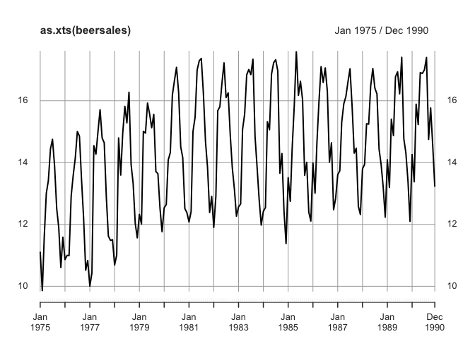
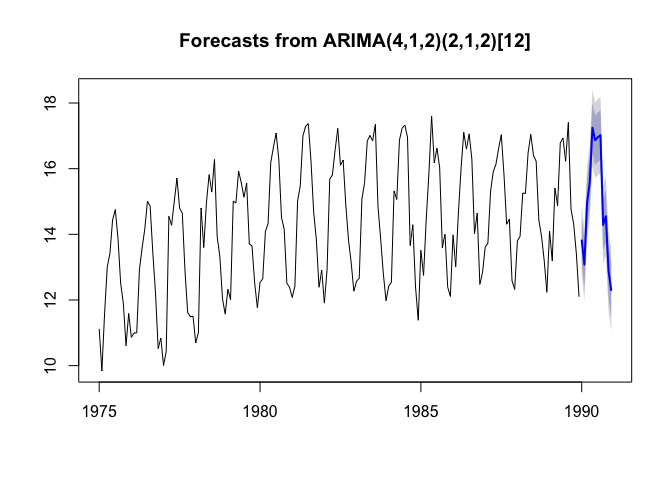
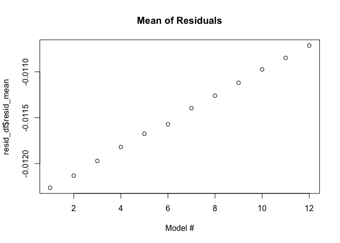
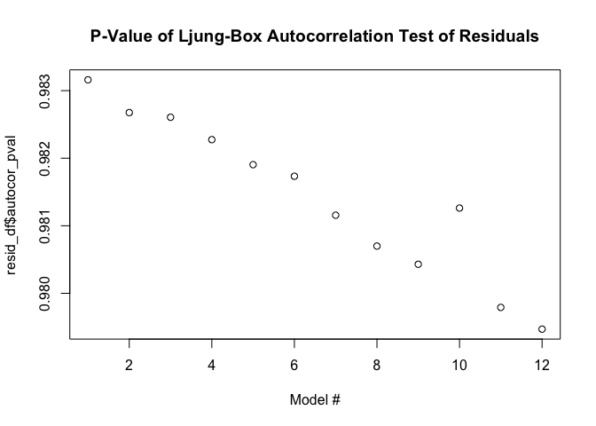
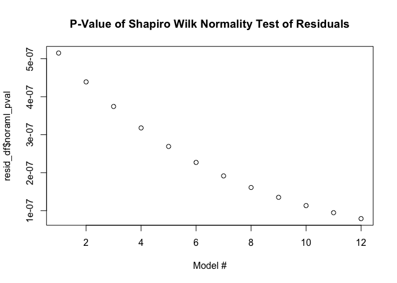
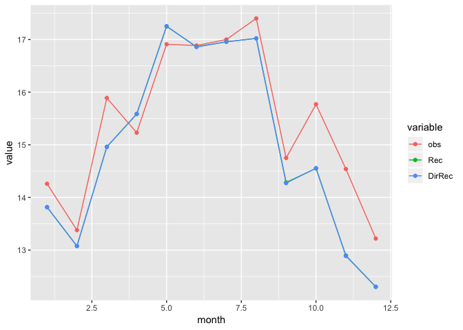
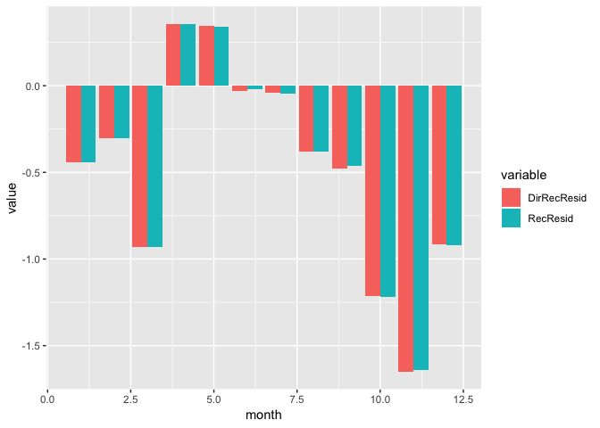

Assignment 5 - Multi Step Forecasts
================
Scott Shepard
5/2/2019

Prompt
======

Load data from TSA package (the package is written by authors Jonathan Cryer and Kung-Sik Chan).

    > library("TSA")
    > data(beersales)

The data is the monthly beer sales in millions of barrels, 01/1975 - 12/1990.

Train: 01/1975 - 12/1989.

Test: 1990

**Part 1**

Use ARIMA(p,d,q) model to forecast beer sales for all months of 1990 using the following two multi-step forecasting approaches. For each model, check mean, autocorrelation and normality of the residuals. Confirm if the residuals are white noise.

*1A* - Use the h-period in forecast() to forecast each month of 1990. This is also known as recursive forecasting where you fit a model only once and use it recursively for h-periods.

*1B* - Use the monthly data as a continuous time series. Forecast for 1990 Jan, Plug forecast into the time series, build a new model to forecast for 1990 Feb. And so on and so forth. In other words, h=1 in all the forecasts. This is known as direct recursive (DirRec) forecasting where you fit a new model for each time step.

*1C* - Plot the mean, the p-value of the autocorrelation test and the p-value of the normality test of the residuals of the 12 models.

**Part 2**

Plot the Recursive and DirRec along with the actuals. Use ylim=c(12.5, 17) to get a good visual of the plot differences.

**Part 3**

Calculate the MSE for 1990 - which of the two approaches give better result and why?

Part 1
======

Plot beersales data, split into training and test.

``` r
library(TSA)
library(xts)
library(forecast)

data(beersales)

plot(as.xts(beersales))
```



``` r
bs <- as.xts(beersales)

train <- window(beersales, end=c(1989,12))
test <- window(beersales, start=1990)
```

1A - Recursive
--------------

Use default options to resurvively forecast for 1990

``` r
start_time = Sys.time()
m1a <- auto.arima(train)
print(Sys.time() - start_time)
```

    ## Time difference of 4.769813 secs

``` r
Rec = forecast(m1a, h=12)
plot(forecast(m1a, h=12))
```



1B
--

``` r
train_adj <- train
f_1990 <- c()
m1bs <- list()

start_time <- Sys.time()
for(i in 1:12) {
  m1b <- auto.arima(train_adj)
  m1bs[[i]] <- m1b
  pf <- forecast(m1b, h=1)$mean
  f_1990  <- c(f_1990,  pf)
  train_adj   <- ts(c(train_adj, pf), start=1975, frequency=12)
}
Sys.time() - start_time
```

    ## Time difference of 51.15489 secs

``` r
library(dplyr)

df <- data.frame(
  month = c(1:12), 
  obs=test, 
  Rec = Rec$mean,
  DirRec=f_1990
  ) %>% mutate(
  DirRecResid = DirRec - obs,
  RecResid = Rec - obs
  )

head(df, 12)
```

    ##    month     obs      Rec   DirRec DirRecResid    RecResid
    ## 1      1 14.2600 13.81601 13.81601 -0.44398999 -0.44398999
    ## 2      2 13.3800 13.07707 13.07593 -0.30407006 -0.30293424
    ## 3      3 15.8900 14.96181 14.95918 -0.93082037 -0.92818610
    ## 4      4 15.2300 15.58503 15.58648  0.35647577  0.35502719
    ## 5      5 16.9100 17.24847 17.25354  0.34353839  0.33847037
    ## 6      6 16.8854 16.86360 16.85712 -0.02827697 -0.02180024
    ## 7      7 17.0000 16.95571 16.95756 -0.04244354 -0.04428818
    ## 8      8 17.4000 17.02231 17.02034 -0.37966176 -0.37768567
    ## 9      9 14.7500 14.28619 14.27248 -0.47751566 -0.46381099
    ## 10    10 15.7700 14.55136 14.55731 -1.21269210 -1.21864480
    ## 11    11 14.5400 12.89695 12.88748 -1.65251530 -1.64305375
    ## 12    12 13.2200 12.30127 12.30538 -0.91461801 -0.91873134

1C
--

Plot the mean, p-value of autocorrelation test, and p-value of the normality test of the residuals of the 12 models.

``` r
resid_df = plyr::ldply(m1bs, function(m) {
  data.frame(
    resid_mean = mean(m$residuals), 
    autocor_pval = Box.test(m$residuals, type='Ljung-Box')$p.value,
    noraml_pval = shapiro.test(m$residuals)$p.value
  )
})

plot(resid_df$resid_mean, main="Mean of Residuals", xlab="Model #")
```



``` r
plot(resid_df$autocor_pval, main="P-Value of Ljung-Box Autocorrelation Test of Residuals", xlab="Model #")
```



``` r
plot(resid_df$noraml_pval, main="P-Value of Shapiro Wilk Normality Test of Residuals", xlab="Model #")
```



The mean of the residuals steadily approaches zero as the model number increases. This is good as it means that data is getting better and better.

The p-value of the autocorrelation test steadily decreases with model number. However the p-values are so high I'm not sure it matters. The residuals are not correlated and continue not to be correlated.

The same happens with normality. The residuals are basically normal. Even if the p-values for the Shapiro-Wilk normality test are increasing, the values are so small as to the movement to be negligent. One extra datapoint doesn't move the model very much.

Part 2
======

Plot Recursive and DirRec along with the actuals.

``` r
library(reshape2)
library(ggplot2)

df %>% 
  select(month, obs, Rec, DirRec) %>% 
  melt(id.vars='month') %>% 
  ggplot(aes(x=month, y=value, color=variable, group=variable)) + 
  geom_line() + geom_point()
```



The Recursive and Direct Resursive preditions are so close as to not be visably different.

``` r
df <- df %>% mutate(
    DirRecResid = DirRec - obs,
    RecResid = Rec - obs
  )

df %>% 
  select(month, DirRecResid, RecResid) %>%
  melt(id.vars='month') %>%
  ggplot(aes(x=month, y=value, fill=variable)) +
  geom_bar(stat="identity", position="dodge")
```



Plotting the residuals shows way. While the models are technically different, it's not by much. The seasonality picked up by the auto.arima model is more powerful than including the extra datapoints in direct resursive.

Part 3
======

Calulate MSE.

``` r
c(mean(df$DirRecResid^2), mean(df$RecResid^2))
```

    ## [1] 0.5678189 0.5650020

The direct recursive method took much more time, 44.2 seconds compared to 3.9 seconds and yielded a larger MSE. DirRec is a much more computationally expensive process because you have to build as many models as periods you want to forecast out. In this case, the extra computational time isn't worth the increase in accuracy, which is none.
