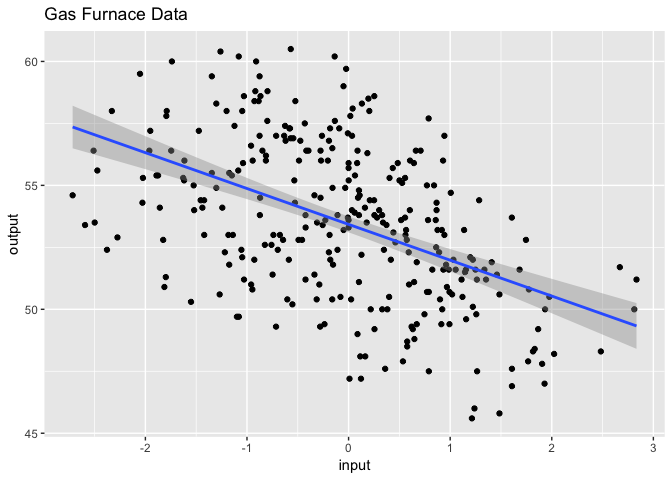

Assignment6
================
Scott Shepard
5/10/2019

Prompt
------

Input gas rate - this is the independent variable

Output gas CO2 % - this is the dependent variable that needs to be forecast

Tasks:

1.  Use linear regression model - plot the ACF - what can you conclude ?
2.  Use ARIMA (0,0,1) model for the residuals. Adjust the Input gas rate and Output CO2 % with the MA coefficient. Combine with the linear regression model. Plot the residuals.
3.  Use ARIMA (1,0,0) model for the residuals. Adjust the Input gas rate and Output CO2 % with the AR coefficient. Combine with the linear regression model. Plot the residuals.
4.  Use ARIMA (0,0,2) model for the residuals. Adjust the Input gas rate and Output CO2 % with the MA coefficient. Combine with the linear regression model. Plot the residuals.
5.  Use ARIMA (2,0,0) model for the residuals. Adjust the Input gas rate and Output CO2 % with the AR coefficient. Combine with the linear regression model. Plot the residuals.
6.  Use ARIMA (2,0,2) model for the residuals. Adjust the Input gas rate and Output CO2 % with the AR and MA coefficients. Combine with the linear regression model. Plot the residuals.
7.  Use fractional ARIMA model (aka ARFIMA) for the output gas CO2% - plot the residuals, acf and pacf plots of the model. You can use an R package like fracdiff – be careful to determine which lag to choose when executing this test.
8.  Perform Summaries, Durbin-Watson and Box-Ljung tests for each model and build table to compare AICs, BICs and p-vaules for each test across the ARIMA and ARFIMA models.
9.  Based on ACF plots and test results, which ARIMA model gives the best result in terms of residuals being close to white noise ?

1. Linear Regression
--------------------

``` r
library(ggplot2)
library(forecast)
```

    ## Warning: package 'forecast' was built under R version 3.5.2

``` r
df <- read.csv('~/Datasets/31006/Gas Furnace Dataset.csv')
names(df) <- c('input', 'output')

ggplot(df, aes(x=input, y=output)) + 
  geom_point() + 
  geom_smooth(method='lm') + 
  ggtitle('Gas Furnace Data')
```



``` r
m <- lm(output ~ input, data=df)

acf(m$residuals)
```


Serious autocorrelation of the residuals at low lags.

``` r
plot(m$residuals, type='l', main='Residuals of Linear Model')
```


Since the residuals are clearly autocorrelated, the assumption about non-correlated models are violated. The linear model coefficients can be adjusted by using the Cochrane-Orcutt process: fit an ARMA model to the residuals, adjust X & Y by the coefficients of the model, refit and iterate until it converges.

2. ARIMA (0,0,1)
----------------

1.  Use ARIMA (0,0,1) model for the residuals.
2.  Adjust the Input gas rate and Output CO2 % with the MA coefficient.
3.  Combine with the linear regression model.
4.  Plot the residuals.

Use MA(1) model for the residuals

``` r
ma1 <- Arima(m$residuals, order = c(0,0,1))
summary(ma1)
```

    ## Series: m$residuals 
    ## ARIMA(0,0,1) with non-zero mean 
    ## 
    ## Coefficients:
    ##          ma1    mean
    ##       0.9421  0.0055
    ## s.e.  0.0150  0.1697
    ## 
    ## sigma^2 estimated as 2.283:  log likelihood=-542.27
    ## AIC=1090.54   AICc=1090.62   BIC=1101.61
    ## 
    ## Training set error measures:
    ##                         ME     RMSE      MAE      MPE     MAPE     MASE
    ## Training set -0.0001362106 1.505864 1.228424 55.33706 73.70963 1.492611
    ##                   ACF1
    ## Training set 0.8305884

Adjust input gas rate and Output CO2 % with the MA coefficient.

Here we use the handy `arma.innovation` function.

``` r
arma.innovation <- function(x, arma.model, ar.truncation=10) {
  p <- arma.model$arma[1]
  q <- arma.model$arma[2]
  ar.coef <- arma.model$coef[seq_len(p)]
  ma.coef <- arma.model$coef[p + seq_len(q)]
  if (q == 0) {
    infinite.ar.coef <- ar.coef
  } else {
    infinite.ar.coef <- -ARMAtoMA(-ma.coef, -ar.coef, ar.truncation)
  }
  return(as.vector(filter(x, c(1, -infinite.ar.coef), side=1)))
}

df$input_ma1  <- arma.innovation(df$input, ma1)
df$output_ma1 <- arma.innovation(df$output, ma1)
df[11:16,]
```

    ##     input output  input_ma1 output_ma1
    ## 11 -0.588   52.0 -0.4728942   41.22204
    ## 12 -1.055   52.4 -0.6660419   41.47673
    ## 13 -1.421   53.0 -0.7935307   41.73303
    ## 14 -1.520   54.0 -0.6800786   42.43970
    ## 15 -1.302   54.9 -0.4854334   42.67396
    ## 16 -0.814   56.0 -0.1631669   43.50138

Combine with the linear regression model.

``` r
linear_ma1 <- lm(output_ma1 ~ input_ma1, data=df)
summary(linear_ma1)
```

    ## 
    ## Call:
    ## lm(formula = output_ma1 ~ input_ma1, data = df)
    ## 
    ## Residuals:
    ##     Min      1Q  Median      3Q     Max 
    ## -4.9333 -1.2486  0.0529  1.2978  4.0232 
    ## 
    ## Coefficients:
    ##             Estimate Std. Error t value Pr(>|t|)    
    ## (Intercept)  41.7433     0.1048  398.39   <2e-16 ***
    ## input_ma1    -1.6665     0.1499  -11.12   <2e-16 ***
    ## ---
    ## Signif. codes:  0 '***' 0.001 '**' 0.01 '*' 0.05 '.' 0.1 ' ' 1
    ## 
    ## Residual standard error: 1.768 on 284 degrees of freedom
    ##   (10 observations deleted due to missingness)
    ## Multiple R-squared:  0.3033, Adjusted R-squared:  0.3009 
    ## F-statistic: 123.7 on 1 and 284 DF,  p-value: < 2.2e-16

Plot the residuals.

``` r
acf(linear_ma1$residuals)
```


``` r
plot(linear_ma1$residuals, type='l')
```


Durbin-Watson and Box-Ljung tests

3. ARIMA (1,0,0)
----------------

Same deal as above, but with an AR(1) model instead.

``` r
ar1 <- Arima(m$residuals, order = c(1,0,0))
df$input_ar1  <- arma.innovation(df$input, ar1)
df$output_ar1 <- arma.innovation(df$output, ar1)
linear_ar1 <- lm(output_ar1 ~ input_ar1, data=df)
acf(linear_ar1$residuals)
```


``` r
plot(linear_ar1$residuals, type='l')
```


With pure autoregressive errors, we can use the new model to backwards ajust the old linear model and iterate until the estimates converge.

The way to model errors using an autoregressive process is to: 1. Build a naive linear model 2. Model the residuals using AR(p) 3. Adjust x & y using AR coefficient by x'(t) = x(t) - b\*x(t-1) 4. Run new linear model with x' and y' 5. Using new esimates and slope and intercept to adjust previous model by new\_slope = adjusted\_slope and new\_intercept = adjusted\_intercept / (1-sum(AR\_coef)) 6. Repeat 2-5 until coefficients converge

This is called the Cochrane-Orcutt process

``` r
cochrane.orcutt <- function(x, y, order, iterations=10) {
  linear.model <- lm(y ~ x)
  res <- linear.model$residuals
  
  for(i in 1:iterations) {
    coefs <- adjust_lm_coef(x, y, res, order)
    res <- adjust_residuals(x, y, coefs[1], coefs[2])
  }
  
  list("coefs"=coefs, "residuals"=res)
}

adjust_lm_coef <- function(x, y, resid, order) {
  arma.model <- Arima(resid, order)
  
  xadj <- arma.innovation(x, arma.model)
  yadj <- arma.innovation(y, arma.model)
  
  lm.adj <- lm(yadj ~ xadj)
  
  n <- length(coef(arma.model))
  
  intercept_adj <- lm.adj$coefficients[1] / (1-sum(arma.model$coef[1:(n-1)]))
  slope_adj <- lm.adj$coefficients[2]
  c(intercept_adj, slope_adj)
}

adjust_residuals <- function(x, y, intercept, slope) {
  y - (intercept + x * slope)
}

ar1_co <- cochrane.orcutt(df$input, df$output, c(1,0,0))
ar1_co$coefs
```

    ## (Intercept)        xadj 
    ##  54.0961329   0.7351539

The intercept and slope are different than the single-iteration pass we get with just modeling the residuals once.

``` r
linear_ar1
```

    ## 
    ## Call:
    ## lm(formula = output_ar1 ~ input_ar1, data = df)
    ## 
    ## Coefficients:
    ## (Intercept)    input_ar1  
    ##      3.5601       0.6402

Compare to running an ARIMA with xreg

``` r
Arima(df$output, c(1,0,0), xreg = df$input)
```

    ## Series: df$output 
    ## Regression with ARIMA(1,0,0) errors 
    ## 
    ## Coefficients:
    ##          ar1  intercept  df$input
    ##       0.9798    54.0720    0.7352
    ## s.e.  0.0104     1.7694    0.1250
    ## 
    ## sigma^2 estimated as 0.497:  log likelihood=-316.63
    ## AIC=641.26   AICc=641.4   BIC=656.02

The intercept and slope here are the same as the iterative process.

``` r
plot(linear_ar1$residuals, type='l')
```


``` r
acf(linear_ar1$residuals)
```


Still not white noise though.

Another method of modeling with autoregressive error susing the glme package.

``` r
library(nlme)
mod.gls <- gls(output ~ input, data=df, correlation=corARMA(p=1), method="ML")
summary(mod.gls)
```

    ## Generalized least squares fit by maximum likelihood
    ##   Model: output ~ input 
    ##   Data: df 
    ##        AIC      BIC    logLik
    ##   641.2603 656.0218 -316.6302
    ## 
    ## Correlation Structure: AR(1)
    ##  Formula: ~1 
    ##  Parameter estimate(s):
    ##       Phi 
    ## 0.9798378 
    ## 
    ## Coefficients:
    ##                Value Std.Error   t-value p-value
    ## (Intercept) 54.04170 1.7603576 30.699272       0
    ## input        0.73514 0.1249729  5.882367       0
    ## 
    ##  Correlation: 
    ##       (Intr)
    ## input 0.006 
    ## 
    ## Standardized residuals:
    ##        Min         Q1        Med         Q3        Max 
    ## -2.6588629 -0.9423099 -0.1336714  0.6777926  2.0752438 
    ## 
    ## Residual standard error: 3.510581 
    ## Degrees of freedom: 296 total; 294 residual

``` r
acf(mod.gls$residuals)
```


``` r
plot(mod.gls$residuals, type='l')
```


4. ARIMA (0,0,2)
----------------

MA(2) now

``` r
ma2 <- Arima(m$residuals, order = c(0,0,2))
df$input_ma2  <- arma.innovation(df$input, ma2)
df$output_ma2 <- arma.innovation(df$output, ma2)
linear_ma2 <- lm(output_ma2 ~ input_ma2, data=df)
acf(linear_ma2$residuals)
```


``` r
plot(linear_ma2$residuals, type='l')
```


4. ARIMA (2,0,0)
----------------

AR(2)

``` r
ar2 <- Arima(m$residuals, order = c(2,0,0))
df$input_ar2  <- arma.innovation(df$input, ar2)
df$output_ar2 <- arma.innovation(df$output, ar2)
linear_ar2 <- lm(output_ar2 ~ input_ar2, data=df)
acf(linear_ar2$residuals)
```


``` r
plot(linear_ar2$residuals, type='l')
```


Getting better, closer to white noise now.

Try the converging method of Cochrane-Orcutt.

``` r
ar2_co <- cochrane.orcutt(df$input, df$output, c(2,0,0))
ar2_co$coefs
```

    ## (Intercept)        xadj 
    ##  53.5668197   0.4463177

Compare to running ARIMA with xreg again.

``` r
Arima(df$output, c(2,0,0), xreg = df$input)
```

    ## Series: df$output 
    ## Regression with ARIMA(2,0,0) errors 
    ## 
    ## Coefficients:
    ##          ar1      ar2  intercept  df$input
    ##       1.8054  -0.8451    53.5678    0.4458
    ## s.e.  0.0302   0.0303     0.5435    0.1114
    ## 
    ## sigma^2 estimated as 0.1421:  log likelihood=-132.04
    ## AIC=274.09   AICc=274.29   BIC=292.54

Coefficients pretty much converged to the same value again!

``` r
Arima(ar2_co$residuals, c(2,0,0))
```

    ## Series: ar2_co$residuals 
    ## ARIMA(2,0,0) with non-zero mean 
    ## 
    ## Coefficients:
    ##          ar1      ar2    mean
    ##       1.8054  -0.8451  0.0006
    ## s.e.  0.0302   0.0303  0.5435
    ## 
    ## sigma^2 estimated as 0.1416:  log likelihood=-132.04
    ## AIC=272.09   AICc=272.22   BIC=286.85

AIC and BIC are slighly different with the two approaches even though log likelihood is the same. One of them is probably doing an adjustment for dropped values or something I would guess.

6. ARIMA (2,0,2)
----------------

Since neither pure autoregressive nor pure moving average did the trick, perhaps a combination of the two

``` r
ar2ma2 <- Arima(m$residuals, c(2,0,2))
summary(ar2ma2)
```

    ## Series: m$residuals 
    ## ARIMA(2,0,2) with non-zero mean 
    ## 
    ## Coefficients:
    ##          ar1      ar2     ma1     ma2    mean
    ##       1.6077  -0.7500  0.4075  0.3444  0.0189
    ## s.e.  0.0442   0.0437  0.0641  0.0539  0.3086
    ## 
    ## sigma^2 estimated as 0.1909:  log likelihood=-175.19
    ## AIC=362.38   AICc=362.67   BIC=384.52
    ## 
    ## Training set error measures:
    ##                         ME      RMSE      MAE      MPE     MAPE      MASE
    ## Training set -0.0005712752 0.4332026 0.329282 11.65013 42.17707 0.4000978
    ##                    ACF1
    ## Training set 0.06807661

``` r
df$input_ar2ma2  <- arma.innovation(df$input, ar2ma2)
df$output_ar2ma2 <- arma.innovation(df$output, ar2ma2)

linear_ar2ma2 <- lm(output_ar2ma2 ~ input_ar2ma2, data=df)

acf(linear_ar2ma2$residuals)
```


``` r
plot(linear_ar2ma2$residuals, type='l')
```


Hey that's prety good! There's still significant autocorrelation at lag=1.

7. Fractional ARIMA
-------------------

``` r
library(arfima)
```

    ## Loading required package: ltsa

    ## Note that the arfima package has new defaults starting with
    ## 1.4-0: type arfimachanges() for a list, as well as some other notes.
    ## NOTE: some of these are quite important!

    ## 
    ## Attaching package: 'arfima'

    ## The following object is masked from 'package:forecast':
    ## 
    ##     arfima

    ## The following object is masked from 'package:stats':
    ## 
    ##     BIC

``` r
model.arfima <- arfima(z=df$output, order=c(2,0,2),
                       xreg=data.frame(xreg=df$input))
```

    ## Note: only one starting point.  Only one mode can be found -- this is now the default behavior.
    ## Beginning the fits with 1 starting values.

``` r
summary(model.arfima)
```

    ## 
    ## Call:
    ##  
    ## arfima(z = df$output, order = c(2, 0, 2), xreg = data.frame(xreg = df$input))
    ## 
    ## 
    ## Mode 1 Coefficients:
    ##             Estimate Std. Error   z-value   Pr(>|z|)    
    ## phi(1)     1.5006666  0.0657039  22.83985 < 2.22e-16 ***
    ## phi(2)    -0.6590275  0.0588133 -11.20542 < 2.22e-16 ***
    ## theta(1)  -0.1715500  0.0910549  -1.88403   0.059561 .  
    ## theta(2)  -0.2730339  0.0659242  -4.14163 3.4484e-05 ***
    ## d.f        0.4236914  0.0863829   4.90481 9.3519e-07 ***
    ## xreg      -0.0261273  0.1105441  -0.23635   0.813159    
    ## Intercept 53.7471528  3.0343039  17.71317 < 2.22e-16 ***
    ## ---
    ## Signif. codes:  0 '***' 0.001 '**' 0.01 '*' 0.05 '.' 0.1 ' ' 1
    ## sigma^2 estimated as 0.112708; Log-likelihood = 321.659; AIC = -627.318; BIC = -597.795
    ## 
    ## Numerical Correlations of Coefficients:
    ##           phi(1) phi(2) theta(1) theta(2) d.f   xreg  Intercept
    ## phi(1)     1.00  -0.88   0.19     0.32    -0.40 -0.02 -0.01    
    ## phi(2)    -0.88   1.00  -0.44    -0.28     0.06  0.20  0.00    
    ## theta(1)   0.19  -0.44   1.00     0.18     0.61 -0.09  0.01    
    ## theta(2)   0.32  -0.28   0.18     1.00     0.09  0.17  0.00    
    ## d.f       -0.40   0.06   0.61     0.09     1.00 -0.13  0.03    
    ## xreg      -0.02   0.20  -0.09     0.17    -0.13  1.00  0.00    
    ## Intercept -0.01   0.00   0.01     0.00     0.03  0.00  1.00    
    ## 
    ## Theoretical Correlations of Coefficients:
    ##          phi(1) phi(2) theta(1) theta(2) d.f  
    ## phi(1)    1.00  -0.90   0.17     0.35    -0.44
    ## phi(2)   -0.90   1.00  -0.44    -0.46     0.10
    ## theta(1)  0.17  -0.44   1.00     0.56     0.68
    ## theta(2)  0.35  -0.46   0.56     1.00     0.33
    ## d.f      -0.44   0.10   0.68     0.33     1.00
    ## 
    ## Expected Fisher Information Matrix of Coefficients:
    ##          phi(1) phi(2) theta(1) theta(2) d.f  
    ## phi(1)    9.74   8.81  -0.51    -1.01     2.88
    ## phi(2)    8.81   9.74   0.36    -0.51     1.89
    ## theta(1) -0.51   0.36   1.10    -0.15    -0.86
    ## theta(2) -1.01  -0.51  -0.15     1.10    -0.40
    ## d.f       2.88   1.89  -0.86    -0.40     1.65
    ## 
    ## Theoretical standard errors not reported since there is either FGN or (dynamic) regression in the model

``` r
plot(residuals(model.arfima)[[1]], type='l')
```


``` r
acf(residuals(model.arfima)[[1]])
```


``` r
pacf(residuals(model.arfima)[[1]])
```


8. Compare Models
-----------------

For each model: 1. Perform Summaries,
2. Durbin-Watson and Box-Ljung tests 3. build table to compare AICs, BICs and p-vaules for each test

``` r
library(lmtest)

summary(ma1)
```

    ## Series: m$residuals 
    ## ARIMA(0,0,1) with non-zero mean 
    ## 
    ## Coefficients:
    ##          ma1    mean
    ##       0.9421  0.0055
    ## s.e.  0.0150  0.1697
    ## 
    ## sigma^2 estimated as 2.283:  log likelihood=-542.27
    ## AIC=1090.54   AICc=1090.62   BIC=1101.61
    ## 
    ## Training set error measures:
    ##                         ME     RMSE      MAE      MPE     MAPE     MASE
    ## Training set -0.0001362106 1.505864 1.228424 55.33706 73.70963 1.492611
    ##                   ACF1
    ## Training set 0.8305884

``` r
summary(linear_ma1)
```

    ## 
    ## Call:
    ## lm(formula = output_ma1 ~ input_ma1, data = df)
    ## 
    ## Residuals:
    ##     Min      1Q  Median      3Q     Max 
    ## -4.9333 -1.2486  0.0529  1.2978  4.0232 
    ## 
    ## Coefficients:
    ##             Estimate Std. Error t value Pr(>|t|)    
    ## (Intercept)  41.7433     0.1048  398.39   <2e-16 ***
    ## input_ma1    -1.6665     0.1499  -11.12   <2e-16 ***
    ## ---
    ## Signif. codes:  0 '***' 0.001 '**' 0.01 '*' 0.05 '.' 0.1 ' ' 1
    ## 
    ## Residual standard error: 1.768 on 284 degrees of freedom
    ##   (10 observations deleted due to missingness)
    ## Multiple R-squared:  0.3033, Adjusted R-squared:  0.3009 
    ## F-statistic: 123.7 on 1 and 284 DF,  p-value: < 2.2e-16

``` r
dwtest(linear_ma1)
```

    ## 
    ##  Durbin-Watson test
    ## 
    ## data:  linear_ma1
    ## DW = 0.26454, p-value < 2.2e-16
    ## alternative hypothesis: true autocorrelation is greater than 0

``` r
Box.test(linear_ma1$residuals, type='Ljung-Box')
```

    ## 
    ##  Box-Ljung test
    ## 
    ## data:  linear_ma1$residuals
    ## X-squared = 216.8, df = 1, p-value < 2.2e-16

``` r
ma1_pvals = c(
  dwtest(linear_ma1)$p.value, 
  Box.test(linear_ma1$residuals, type='Ljung-Box')$p.value)
```

``` r
summary(ar1)
```

    ## Series: m$residuals 
    ## ARIMA(1,0,0) with non-zero mean 
    ## 
    ## Coefficients:
    ##          ar1    mean
    ##       0.9337  0.1481
    ## s.e.  0.0202  0.8337
    ## 
    ## sigma^2 estimated as 0.9941:  log likelihood=-419.15
    ## AIC=844.29   AICc=844.38   BIC=855.36
    ## 
    ## Training set error measures:
    ##                         ME      RMSE      MAE     MPE     MAPE     MASE
    ## Training set -0.0003582303 0.9936474 0.806012 33.2518 97.26795 0.979354
    ##                   ACF1
    ## Training set 0.8120822

``` r
summary(linear_ar1)
```

    ## 
    ## Call:
    ## lm(formula = output_ar1 ~ input_ar1, data = df)
    ## 
    ## Residuals:
    ##     Min      1Q  Median      3Q     Max 
    ## -1.8541 -0.5284 -0.1004  0.5203  2.5392 
    ## 
    ## Coefficients:
    ##             Estimate Std. Error t value Pr(>|t|)    
    ## (Intercept)  3.56010    0.04232   84.12  < 2e-16 ***
    ## input_ar1    0.64017    0.12934    4.95 1.26e-06 ***
    ## ---
    ## Signif. codes:  0 '***' 0.001 '**' 0.01 '*' 0.05 '.' 0.1 ' ' 1
    ## 
    ## Residual standard error: 0.7268 on 293 degrees of freedom
    ##   (1 observation deleted due to missingness)
    ## Multiple R-squared:  0.07716,    Adjusted R-squared:  0.07401 
    ## F-statistic:  24.5 on 1 and 293 DF,  p-value: 1.257e-06

``` r
dwtest(linear_ar1)
```

    ## 
    ##  Durbin-Watson test
    ## 
    ## data:  linear_ar1
    ## DW = 0.31266, p-value < 2.2e-16
    ## alternative hypothesis: true autocorrelation is greater than 0

``` r
Box.test(linear_ar1$residuals, type='Ljung-Box')
```

    ## 
    ##  Box-Ljung test
    ## 
    ## data:  linear_ar1$residuals
    ## X-squared = 212.01, df = 1, p-value < 2.2e-16

``` r
ar1_pvals = c(
  dwtest(linear_ar1)$p.value, 
  Box.test(linear_ar1$residuals, type='Ljung-Box')$p.value)
```

``` r
summary(ma2)
```

    ## Series: m$residuals 
    ## ARIMA(0,0,2) with non-zero mean 
    ## 
    ## Coefficients:
    ##          ma1     ma2    mean
    ##       1.5853  0.8726  0.0093
    ## s.e.  0.0270  0.0241  0.1842
    ## 
    ## sigma^2 estimated as 0.8541:  log likelihood=-397.22
    ## AIC=802.43   AICc=802.57   BIC=817.2
    ## 
    ## Training set error measures:
    ##                        ME      RMSE       MAE      MPE     MAPE      MASE
    ## Training set 0.0001196743 0.9194674 0.7384539 29.23998 59.81523 0.8972668
    ##                   ACF1
    ## Training set 0.6386467

``` r
summary(linear_ma2)
```

    ## 
    ## Call:
    ## lm(formula = output_ma2 ~ input_ma2, data = df)
    ## 
    ## Residuals:
    ##      Min       1Q   Median       3Q      Max 
    ## -2.89862 -0.68330 -0.00837  0.72836  2.37567 
    ## 
    ## Coefficients:
    ##             Estimate Std. Error t value Pr(>|t|)    
    ## (Intercept)  18.9943     0.0573 331.496  < 2e-16 ***
    ## input_ma2    -1.2249     0.1482  -8.264 5.44e-15 ***
    ## ---
    ## Signif. codes:  0 '***' 0.001 '**' 0.01 '*' 0.05 '.' 0.1 ' ' 1
    ## 
    ## Residual standard error: 0.9673 on 284 degrees of freedom
    ##   (10 observations deleted due to missingness)
    ## Multiple R-squared:  0.1939, Adjusted R-squared:  0.191 
    ## F-statistic:  68.3 on 1 and 284 DF,  p-value: 5.435e-15

``` r
dwtest(linear_ma2)
```

    ## 
    ##  Durbin-Watson test
    ## 
    ## data:  linear_ma2
    ## DW = 0.56621, p-value < 2.2e-16
    ## alternative hypothesis: true autocorrelation is greater than 0

``` r
Box.test(linear_ma2$residuals, type='Ljung-Box')
```

    ## 
    ##  Box-Ljung test
    ## 
    ## data:  linear_ma2$residuals
    ## X-squared = 148.01, df = 1, p-value < 2.2e-16

``` r
ma2_pvals = c(
  dwtest(linear_ma2)$p.value, 
  Box.test(linear_ma2$residuals, type='Ljung-Box')$p.value)
```

``` r
summary(ar2)
```

    ## Series: m$residuals 
    ## ARIMA(2,0,0) with non-zero mean 
    ## 
    ## Coefficients:
    ##          ar1      ar2     mean
    ##       1.7431  -0.8658  -0.0082
    ## s.e.  0.0282   0.0282   0.2331
    ## 
    ## sigma^2 estimated as 0.2444:  log likelihood=-212.36
    ## AIC=432.73   AICc=432.86   BIC=447.49
    ## 
    ## Training set error measures:
    ##                         ME      RMSE       MAE      MPE     MAPE      MASE
    ## Training set -5.195292e-05 0.4918133 0.3805292 13.81235 51.33143 0.4623663
    ##                   ACF1
    ## Training set 0.4088855

``` r
summary(linear_ar2)
```

    ## 
    ## Call:
    ## lm(formula = output_ar2 ~ input_ar2, data = df)
    ## 
    ## Residuals:
    ##      Min       1Q   Median       3Q      Max 
    ## -1.45118 -0.26221  0.00071  0.27451  1.48117 
    ## 
    ## Coefficients:
    ##             Estimate Std. Error t value Pr(>|t|)    
    ## (Intercept)  6.55867    0.02587  253.56  < 2e-16 ***
    ## input_ar2   -0.37494    0.12583   -2.98  0.00313 ** 
    ## ---
    ## Signif. codes:  0 '***' 0.001 '**' 0.01 '*' 0.05 '.' 0.1 ' ' 1
    ## 
    ## Residual standard error: 0.4432 on 292 degrees of freedom
    ##   (2 observations deleted due to missingness)
    ## Multiple R-squared:  0.02951,    Adjusted R-squared:  0.02619 
    ## F-statistic: 8.879 on 1 and 292 DF,  p-value: 0.003128

``` r
dwtest(linear_ar2)
```

    ## 
    ##  Durbin-Watson test
    ## 
    ## data:  linear_ar2
    ## DW = 0.87123, p-value < 2.2e-16
    ## alternative hypothesis: true autocorrelation is greater than 0

``` r
Box.test(linear_ar2$residuals, type='Ljung-Box')
```

    ## 
    ##  Box-Ljung test
    ## 
    ## data:  linear_ar2$residuals
    ## X-squared = 93.419, df = 1, p-value < 2.2e-16

``` r
ar2_pvals = c(
  dwtest(linear_ar2)$p.value, 
  Box.test(linear_ar2$residuals, type='Ljung-Box')$p.value)
```

``` r
summary(ar2ma2)
```

    ## Series: m$residuals 
    ## ARIMA(2,0,2) with non-zero mean 
    ## 
    ## Coefficients:
    ##          ar1      ar2     ma1     ma2    mean
    ##       1.6077  -0.7500  0.4075  0.3444  0.0189
    ## s.e.  0.0442   0.0437  0.0641  0.0539  0.3086
    ## 
    ## sigma^2 estimated as 0.1909:  log likelihood=-175.19
    ## AIC=362.38   AICc=362.67   BIC=384.52
    ## 
    ## Training set error measures:
    ##                         ME      RMSE      MAE      MPE     MAPE      MASE
    ## Training set -0.0005712752 0.4332026 0.329282 11.65013 42.17707 0.4000978
    ##                    ACF1
    ## Training set 0.06807661

``` r
summary(linear_ar2ma2)
```

    ## 
    ## Call:
    ## lm(formula = output_ar2ma2 ~ input_ar2ma2, data = df)
    ## 
    ## Residuals:
    ##      Min       1Q   Median       3Q      Max 
    ## -1.01538 -0.23122 -0.01227  0.20911  1.44035 
    ## 
    ## Coefficients:
    ##              Estimate Std. Error t value Pr(>|t|)    
    ## (Intercept)   4.39907    0.02226 197.638   <2e-16 ***
    ## input_ar2ma2 -0.29361    0.11131  -2.638   0.0088 ** 
    ## ---
    ## Signif. codes:  0 '***' 0.001 '**' 0.01 '*' 0.05 '.' 0.1 ' ' 1
    ## 
    ## Residual standard error: 0.3763 on 284 degrees of freedom
    ##   (10 observations deleted due to missingness)
    ## Multiple R-squared:  0.02391,    Adjusted R-squared:  0.02048 
    ## F-statistic: 6.958 on 1 and 284 DF,  p-value: 0.008805

``` r
dwtest(linear_ar2ma2)
```

    ## 
    ##  Durbin-Watson test
    ## 
    ## data:  linear_ar2ma2
    ## DW = 1.5037, p-value = 1.297e-05
    ## alternative hypothesis: true autocorrelation is greater than 0

``` r
Box.test(linear_ar2ma2$residuals, type='Ljung-Box')
```

    ## 
    ##  Box-Ljung test
    ## 
    ## data:  linear_ar2ma2$residuals
    ## X-squared = 17.371, df = 1, p-value = 3.075e-05

``` r
ar2ma2_pvals = c(
  dwtest(linear_ar2ma2)$p.value, 
  Box.test(linear_ar2ma2$residuals, type='Ljung-Box')$p.value)
```

``` r
summary(model.arfima)
```

    ## 
    ## Call:
    ##  
    ## arfima(z = df$output, order = c(2, 0, 2), xreg = data.frame(xreg = df$input))
    ## 
    ## 
    ## Mode 1 Coefficients:
    ##             Estimate Std. Error   z-value   Pr(>|z|)    
    ## phi(1)     1.5006666  0.0657039  22.83985 < 2.22e-16 ***
    ## phi(2)    -0.6590275  0.0588133 -11.20542 < 2.22e-16 ***
    ## theta(1)  -0.1715500  0.0910549  -1.88403   0.059561 .  
    ## theta(2)  -0.2730339  0.0659242  -4.14163 3.4484e-05 ***
    ## d.f        0.4236914  0.0863829   4.90481 9.3519e-07 ***
    ## xreg      -0.0261273  0.1105441  -0.23635   0.813159    
    ## Intercept 53.7471528  3.0343039  17.71317 < 2.22e-16 ***
    ## ---
    ## Signif. codes:  0 '***' 0.001 '**' 0.01 '*' 0.05 '.' 0.1 ' ' 1
    ## sigma^2 estimated as 0.112708; Log-likelihood = 321.659; AIC = -627.318; BIC = -597.795
    ## 
    ## Numerical Correlations of Coefficients:
    ##           phi(1) phi(2) theta(1) theta(2) d.f   xreg  Intercept
    ## phi(1)     1.00  -0.88   0.19     0.32    -0.40 -0.02 -0.01    
    ## phi(2)    -0.88   1.00  -0.44    -0.28     0.06  0.20  0.00    
    ## theta(1)   0.19  -0.44   1.00     0.18     0.61 -0.09  0.01    
    ## theta(2)   0.32  -0.28   0.18     1.00     0.09  0.17  0.00    
    ## d.f       -0.40   0.06   0.61     0.09     1.00 -0.13  0.03    
    ## xreg      -0.02   0.20  -0.09     0.17    -0.13  1.00  0.00    
    ## Intercept -0.01   0.00   0.01     0.00     0.03  0.00  1.00    
    ## 
    ## Theoretical Correlations of Coefficients:
    ##          phi(1) phi(2) theta(1) theta(2) d.f  
    ## phi(1)    1.00  -0.90   0.17     0.35    -0.44
    ## phi(2)   -0.90   1.00  -0.44    -0.46     0.10
    ## theta(1)  0.17  -0.44   1.00     0.56     0.68
    ## theta(2)  0.35  -0.46   0.56     1.00     0.33
    ## d.f      -0.44   0.10   0.68     0.33     1.00
    ## 
    ## Expected Fisher Information Matrix of Coefficients:
    ##          phi(1) phi(2) theta(1) theta(2) d.f  
    ## phi(1)    9.74   8.81  -0.51    -1.01     2.88
    ## phi(2)    8.81   9.74   0.36    -0.51     1.89
    ## theta(1) -0.51   0.36   1.10    -0.15    -0.86
    ## theta(2) -1.01  -0.51  -0.15     1.10    -0.40
    ## d.f       2.88   1.89  -0.86    -0.40     1.65
    ## 
    ## Theoretical standard errors not reported since there is either FGN or (dynamic) regression in the model

``` r
Box.test(residuals(model.arfima)$Mode1, type='Ljung-Box')
```

    ## 
    ##  Box-Ljung test
    ## 
    ## data:  residuals(model.arfima)$Mode1
    ## X-squared = 0.24446, df = 1, p-value = 0.621

``` r
arfima_pvals = c(
  NA, 
  Box.test(linear_ar2ma2$residuals, type='Ljung-Box')$p.value)
```

``` r
t(data.frame(
  ar1 = c(ar1$aic, ar1$bic, ar1_pvals),
  ar2 = c(ar2$aic, ar2$bic, ar2_pvals),
  ma1 = c(ma1$aic, ma1$bic, ma1_pvals),
  ma2 = c(ma2$aic, ma2$bic, ma2_pvals),
  ar2ma2 = c(ar2ma2$aic, ar2ma2$bic, ar2ma2_pvals),
  arifma = c(AIC(model.arfima), BIC(model.arfima), arfima_pvals),
  row.names = c('aic', 'bic', 'Durbin-Watson pval', 'Ljung-Box pval')
))
```

    ##              aic       bic Durbin-Watson pval Ljung-Box pval
    ## ar1     844.2931  855.3642       2.017493e-48   0.000000e+00
    ## ar2     432.7265  447.4879       1.139366e-22   0.000000e+00
    ## ma1    1090.5417 1101.6128       9.633846e-50   0.000000e+00
    ## ma2     802.4343  817.1958       1.234526e-34   0.000000e+00
    ## ar2ma2  362.3761  384.5182       1.297285e-05   3.075205e-05
    ## arifma -627.3176 -597.7947                 NA   3.075205e-05

9. Conclusions
--------------

From the ACF, summaries, AIC, and BIC, I think the fractional ARIMA model did the best job at capturing the residual time series information.
