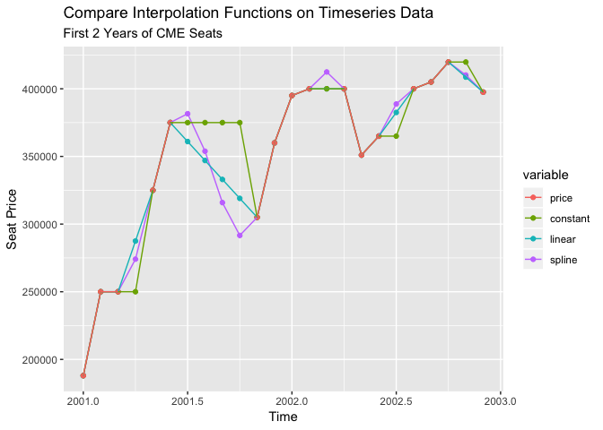
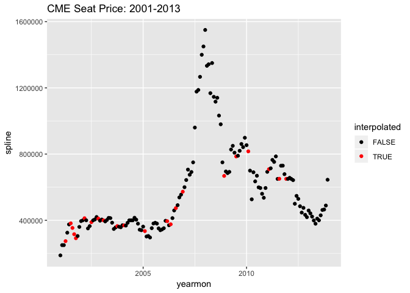
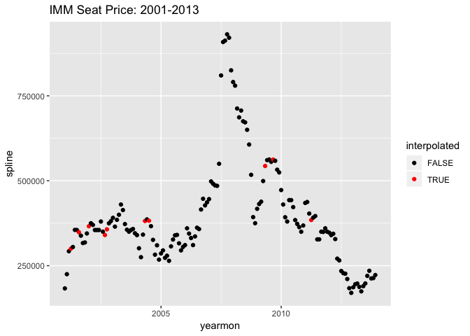
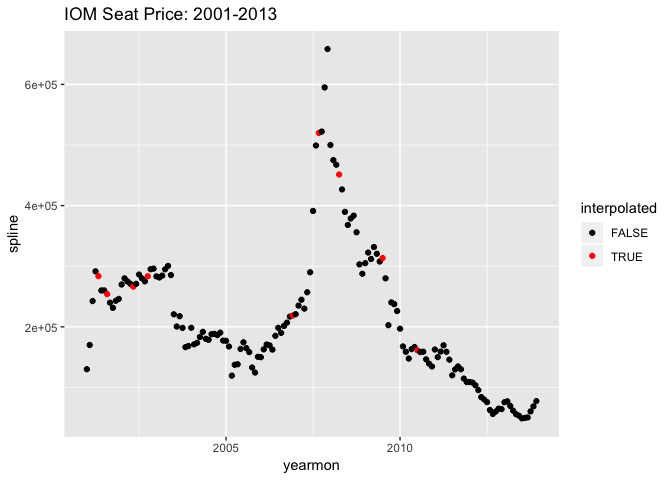

Assignment7
================
Scott Shepard
5/24/2019

Prompt
------

The data contain seat prices from the Chicago Mercantile Exchange.

There are three classes of seats CME, IMM, and IOM which confer the rights to trade different sets of commodities traded. CME seat owners can trade everything, IMM seat owners are allowed to trade everything except agricultural products, and IOM seat owners are allowed to trade only in index products and all options.

The seat price files are marked as \*\*\*S. The files contain the price for which CME seats sold and the date of the sale. As expected, the seat price time series is irregularly spaced in time.

Your task is to adopt an algorithm to create a time series that contains a seat price for each month starting from January 2001 to December 2013. You need to do this for the 3 classes of seats. Note that all 3 seat classes have sale prices for January 2001 so you should not have any start up issues. Please clearly explain why you adopted your algorithm and what other alternatives you may have considered and why you rejected the alternatives.

``` r
cmeS <- read.csv("~/Datasets/31006/cmeS.csv")
immS <- read.csv("~/Datasets/31006/immS.csv")
iomS <- read.csv("~/Datasets/31006/iomS.csv")

head(cmeS)
```

    ##   DateOfSale Year Month  price division
    ## 1  1/10/2001 2001     1 188000      CME
    ## 2  2/21/2001 2001     2 250000      CME
    ## 3  3/26/2001 2001     3 250000      CME
    ## 4  5/17/2001 2001     5 325000      CME
    ## 5  6/11/2001 2001     6 375000      CME
    ## 6  11/6/2001 2001    11 305000      CME

To create a monthly timeseries from this data we need to:
\* Average the data at the monthly level
\* Interpolate when missing a month's data

``` r
library(dplyr)
library(zoo)
library(ggplot2)
library(reshape2)

create_timeseries <- function(df_, interpolation='spline') {
  # Date formatting
  df_$DateOfSale <- as.Date(df_$DateOfSale, '%m/%d/%Y')
  df_$yearmon <- as.yearmon(df_$DateOfSale)
  
  # Group by month
  df_ <- df_ %>%
    group_by(yearmon) %>%
    summarize(price=mean(price)) %>%
    data.frame() %>%
    merge(data.frame(yearmon = as.yearmon(2001 + seq(0, 12*13-1)/12)),all=T)
  
  # Interpolate
  df_$interpolated <- is.na(df_$price)
  x = df_$yearmon
  if('constant' %in% interpolation) {
    df_$constant <- approx(df_$yearmon, df_$price, xout=x, method = "constant")$y  
  }
  if('linear' %in% interpolation) {
    df_$linear <- approx(df_$yearmon, df_$price, xout=x)$y
  }
  if('spline' %in% interpolation) {
    df_$spline <- spline(df_, n=nrow(df_))$y
  }
  df_
}

df <- create_timeseries(cmeS, interpolation = c('constant', 'linear', 'spline'))
head(df)
```

    ##    yearmon  price interpolated constant linear   spline
    ## 1 Jan 2001 188000        FALSE   188000 188000 188000.0
    ## 2 Feb 2001 250000        FALSE   250000 250000 250000.0
    ## 3 Mar 2001 250000        FALSE   250000 250000 250000.0
    ## 4 Apr 2001     NA         TRUE   250000 287500 274093.7
    ## 5 May 2001 325000        FALSE   325000 325000 325000.0
    ## 6 Jun 2001 375000        FALSE   375000 375000 375000.0

We can now compare the interpolated points with three different methods:
\* Constant: take previous value and populate foward
\* Linear: Take first and last point and draw straight line
\* Spline: Cublic spline function

``` r
head(df, 24) %>%
  melt(id.vars = c('yearmon', 'interpolated')) %>%
  arrange(rev(variable)) %>%
  ggplot(aes(x=yearmon, y=value, color=variable, group=desc(variable))) + 
  geom_point() +
  geom_line() + 
  labs(title='Compare Interpolation Functions on Timeseries Data',
       subtitle='First 2 Years of CME Seats',
       x='Time', y='Seat Price')
```

    ## Warning: Removed 8 rows containing missing values (geom_point).



It sure looks to me like the spline funtion does the best job at looking like the timeseries. The constant and linear functions are very obvious breaks in the series where the spline points could be real TS data if you didn't know.

Create the other timeseries

``` r
ts_cmeS <- create_timeseries(cmeS)
ts_immS <- create_timeseries(immS)
ts_iomS <- create_timeseries(iomS)

ggplot(ts_cmeS, aes(x=yearmon, y=spline, color=interpolated)) + 
  geom_point() + scale_color_manual(values=c('black', 'red')) + 
  ggtitle('CME Seat Price: 2001-2013')
```

    ## Don't know how to automatically pick scale for object of type yearmon. Defaulting to continuous.



``` r
ggplot(ts_immS, aes(x=yearmon, y=spline, color=interpolated)) + 
  geom_point() + scale_color_manual(values=c('black', 'red')) +
  ggtitle('IMM Seat Price: 2001-2013')
```

    ## Don't know how to automatically pick scale for object of type yearmon. Defaulting to continuous.



``` r
ggplot(ts_iomS, aes(x=yearmon, y=spline, color=interpolated)) + 
  geom_point() + scale_color_manual(values=c('black', 'red')) + 
  ggtitle('IOM Seat Price: 2001-2013')
```

    ## Don't know how to automatically pick scale for object of type yearmon. Defaulting to continuous.


