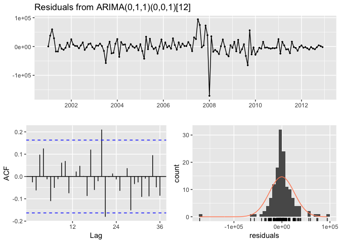
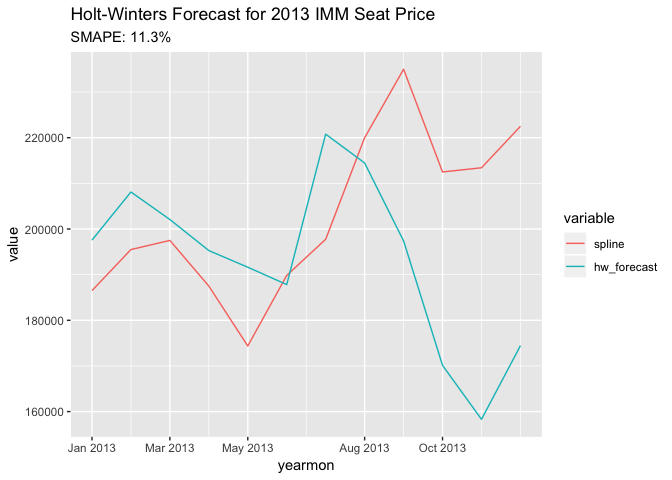
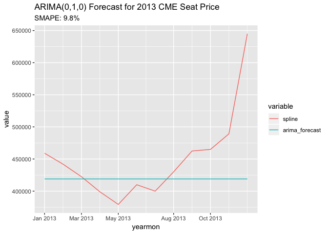

Assignment 8
================
Scott Shepard
6/1/2019

-   [Prompt](#prompt)
-   [Data](#data)
    -   [Create Time Serieses](#create-time-serieses)
    -   [Contract Volume Data](#contract-volume-data)
        -   [Train / Test](#train-test)
-   [Task A: Fit Models](#task-a-fit-models)
    -   [Linear Regression](#linear-regression)
        -   [CME](#cme)
        -   [IMM](#imm)
        -   [IOM](#iom)
    -   [Linear Regression with ARIMA Errors](#linear-regression-with-arima-errors)
        -   [CME](#cme-1)
        -   [IMM](#imm-1)
        -   [IOM](#iom-1)
    -   [Holt Winters](#holt-winters)
        -   [CME](#cme-2)
        -   [IMM](#imm-2)
        -   [IOM](#iom-2)
    -   [ARIMA](#arima)
        -   [CME](#cme-3)
        -   [IMM](#imm-3)
        -   [IOM](#iom-3)
    -   [Seasonal ARIMA](#seasonal-arima)
        -   [CME](#cme-4)
        -   [IMM](#imm-4)
        -   [IOM](#iom-4)
    -   [Fractional ARIMA](#fractional-arima)
        -   [CME](#cme-5)
        -   [IMM](#imm-5)
        -   [IOM](#iom-5)
    -   [ARMA and GARCH combination](#arma-and-garch-combination)
        -   [CME](#cme-6)
        -   [Fitting the God Damn GARCH](#fitting-the-god-damn-garch)
        -   [IMM](#imm-6)
        -   [IOM](#iom-6)
-   [Task B: Evaluation](#task-b-evaluation)
    -   [Linear Regression](#linear-regression-1)
    -   [Regression with ARIMA Errors](#regression-with-arima-errors)
    -   [Holt-Winters](#holt-winters-1)
    -   [ARIMA](#arima-1)
    -   [Seasonal ARIMA](#seasonal-arima-1)
    -   [Fractional ARIMA](#fractional-arima-1)
    -   [Garch](#garch)
-   [Recommendation](#recommendation)

Prompt
======

This assignment is dependent on completion of previous assignment. Objective of this project is to forecast CME seat prices using CME trading volume.

Now that you have a monthly time series of CME seat prices, the file `Contracts_Volume.csv` contains the monthly trading volume for different CME products.

Each row has the first date of the following month (the trade volume is for the month), the commodity indicator for CME, the short description of the commodity, whether it is Future (F) or Option (O), the electronic trading volume and the total trading volume. The floor trading volume is the difference between the total volume and the electronic volume.

The file `Contracts_Classification.csv` associates each CME commodity with a seat class.

Note that owning a CME seat gives a trader advantage for floor trading. In contrast, owning a CME seat does not have any advantage for electronic trading. Since electronic trading constitutes market participants trading directly with other participants via CME's network connections and order matching engine.

There are three classes of seats CME, IMM, and IOM which confer the rights to trade different sets of commodities traded. CME seat owners can trade everything, IMM seat owners are allowed to trade all futures and options except agricultural products, and IOM seat owners are allowed to trade future and options only in index products and all other CME options.

To find the volume, for example index products, add both the futures and options volume for the same index product for a month.

Your task is to use the trading volume information to forecast the CME monthly seat price for 2013. It is recommended to do exploratory data analysis to find initial data relationships such as correlations. For example, the total trade volume for all CME products might be a good predictor for CME seat class, but not for the others. You may have to choose and select which commodities have influence on the IMM and IOM seat prices.

The tasks are outlined below.

Task A:

Use the following algorithms:

-   Linear regression (seat price is independent, volume(s) dependent)
-   Linear regression with ARMA errors (use arima with xreg)
-   Holt Winters
-   ARIMA
-   Seasonal ARIMA (SARIMA) - here seasonality is monthly
-   Fractional ARIMA (ARFIMA) - check applicability first using the ACF
-   ARMA and GARCH combination - use the fGarch R library and garchFit()

Note that you have to implement each of the above algorithms for each of the 3 classes of seats: CME, IMM, IOM.

Task B:

Since you already have the seat prices for the 2013, evaluate each algorithm from Task A using sMAPE. Which one do you recommend to forecast monthly prices for each of the seat classes?

Data
====

Create Time Serieses
--------------------

This function is copied over from assignment 7.

``` r
cmeS <- read.csv("~/Datasets/31006/cmeS.csv")
immS <- read.csv("~/Datasets/31006/immS.csv")
iomS <- read.csv("~/Datasets/31006/iomS.csv")

library(dplyr)
library(zoo)
library(ggplot2)
library(reshape2)

create_timeseries <- function(df_, interpolation='spline') {
  # Date formatting
  df_$DateOfSale <- as.Date(df_$DateOfSale, '%m/%d/%Y')
  df_$yearmon <- as.yearmon(df_$DateOfSale)
  
  # Group by month
  df_ <- df_ %>%
    group_by(yearmon) %>%
    summarize(price=mean(price)) %>%
    data.frame() %>%
    merge(data.frame(yearmon = as.yearmon(2001 + seq(0, 12*13-1)/12)),all=T)
  
  # Interpolate
  df_$interpolated <- is.na(df_$price)
  x = df_$yearmon
  if('constant' %in% interpolation) {
    df_$constant <- approx(df_$yearmon, df_$price, xout=x, method = "constant")$y  
  }
  if('linear' %in% interpolation) {
    df_$linear <- approx(df_$yearmon, df_$price, xout=x)$y
  }
  if('spline' %in% interpolation) {
    df_$spline <- spline(df_, n=nrow(df_))$y
  }
  df_
}

cmeS <- create_timeseries(cmeS)
immS <- create_timeseries(immS)
iomS <- create_timeseries(iomS)
```

Contract Volume Data
--------------------

The new datasets need to be merged in with the time series. 1. Contracts Volume 2. Contracts Classification


``` r
attach_monthly_vol <- function(ts_df, division, monthly_df = monthly_vol) {
  monthly_df <- dplyr::filter(monthly_df, Division==division)
  monthly_df <- select(monthly_df, -Division)
  left_join(ts_df, monthly_df, by='yearmon')
}

ts_cmeS_all <- attach_monthly_vol(cmeS, 'CME')
ts_immS_all <- attach_monthly_vol(immS, 'IMM')
ts_iomS_all <- attach_monthly_vol(iomS, 'IOM')

head(ts_cmeS_all)
```

    ##    yearmon  price interpolated   spline electric.vol total.vol floor.vol
    ## 1 Jan 2001 188000        FALSE 188000.0      5385520  55810609  50425089
    ## 2 Feb 2001 250000        FALSE 250000.0      5342048  45437337  40095289
    ## 3 Mar 2001 250000        FALSE 250000.0      7354218  57351206  49996988
    ## 4 Apr 2001     NA         TRUE 274093.7      7156921  53638046  46481125
    ## 5 May 2001 325000        FALSE 325000.0      7278038  56644028  49365990
    ## 6 Jun 2001 375000        FALSE 375000.0      7294761  55914286  48619525

### Train / Test

Before fitting any models, remove the 2013 year from the timeseries objects and keep the 2013 year as the values to judge the forecasts.

``` r
ts_cmeS_2013 <- dplyr::filter(ts_cmeS_all, yearmon >= 2013)
ts_immS_2013 <- dplyr::filter(ts_immS_all, yearmon >= 2013)
ts_iomS_2013 <- dplyr::filter(ts_iomS_all, yearmon >= 2013)

ts_cmeS <- dplyr::filter(ts_cmeS_all, yearmon < 2013)
ts_immS <- dplyr::filter(ts_immS_all, yearmon < 2013)
ts_iomS <- dplyr::filter(ts_iomS_all, yearmon < 2013)
```

Task A: Fit Models
==================

Linear Regression
-----------------

Seat price is independent, Volume dependent

### CME

``` r
lm_cme <- lm(spline ~ floor.vol, data=ts_cmeS)
summary(lm_cme)
```

    ## 
    ## Call:
    ## lm(formula = spline ~ floor.vol, data = ts_cmeS)
    ## 
    ## Residuals:
    ##     Min      1Q  Median      3Q     Max 
    ## -382618 -197764 -109561  104028 1036226 
    ## 
    ## Coefficients:
    ##               Estimate Std. Error t value Pr(>|t|)    
    ## (Intercept)  6.865e+05  6.883e+04   9.974   <2e-16 ***
    ## floor.vol   -2.298e-03  1.488e-03  -1.544    0.125    
    ## ---
    ## Signif. codes:  0 '***' 0.001 '**' 0.01 '*' 0.05 '.' 0.1 ' ' 1
    ## 
    ## Residual standard error: 283000 on 142 degrees of freedom
    ## Multiple R-squared:  0.01652,    Adjusted R-squared:  0.009591 
    ## F-statistic: 2.385 on 1 and 142 DF,  p-value: 0.1247

``` r
ts_floor_vol_scatter <- function(ts_df, division) {
  ggplot(ts_df, aes(x=floor.vol, y=spline)) + 
    geom_point() + 
    geom_smooth(method='lm') + 
    labs(title=paste(division, 'Seat Floor Volume vs. Interpolated Price'),
         subitle='Linear Model')
}

ts_with_floor_vol_plot <- function(ts_df, division) {
  X <- ts_df$yearmon
  Y1 <- ts_df$spline
  Y2 <- ts_df$floor.vol
  par(mar = c(5, 5, 3, 5))
  plot(x=X, y=Y1, type ="l", 
       ylab = paste("Interpolated Price of",division,"Seat"),
       main = paste(division, "Seat price & Floor Volume"), 
       xlab = "Time", xaxt='n',
       col = "blue")
  par(new = TRUE)
  plot(x=X, y=Y2, type = "l", 
       xaxt = "n", yaxt = "n", ylab = "", xlab = "", 
       col = "red", lty = 2)
  axis(side = 4)
  mtext("Floor Volume", side = 4, line = 3)
  legend("topleft", c("Seat Price", "Floor Volume"),
         col = c("blue", "red"), lty = c(1, 2))
}

ts_floor_vol_scatter(ts_cmeS, 'CME')
```


``` r
ts_with_floor_vol_plot(ts_cmeS, 'CME')
```


### IMM

``` r
lm_imm <- lm(spline ~ floor.vol, data=ts_immS)
summary(lm_imm)
```

    ## 
    ## Call:
    ## lm(formula = spline ~ floor.vol, data = ts_immS)
    ## 
    ## Residuals:
    ##     Min      1Q  Median      3Q     Max 
    ## -243342  -96200  -41983   43652  521330 
    ## 
    ## Coefficients:
    ##              Estimate Std. Error t value Pr(>|t|)    
    ## (Intercept) 3.552e+05  3.014e+04  11.783   <2e-16 ***
    ## floor.vol   3.165e-03  1.577e-03   2.006   0.0467 *  
    ## ---
    ## Signif. codes:  0 '***' 0.001 '**' 0.01 '*' 0.05 '.' 0.1 ' ' 1
    ## 
    ## Residual standard error: 148400 on 142 degrees of freedom
    ## Multiple R-squared:  0.02757,    Adjusted R-squared:  0.02072 
    ## F-statistic: 4.026 on 1 and 142 DF,  p-value: 0.04672

``` r
ts_floor_vol_scatter(ts_immS, 'IMM')
```


``` r
ts_with_floor_vol_plot(ts_immS, 'IMM')
```


### IOM

``` r
lm_iom <- lm(spline ~ floor.vol, data=ts_iomS)
summary(lm_iom)
```

    ## 
    ## Call:
    ## lm(formula = spline ~ floor.vol, data = ts_iomS)
    ## 
    ## Residuals:
    ##     Min      1Q  Median      3Q     Max 
    ## -146905  -67759  -29884   47368  445021 
    ## 
    ## Coefficients:
    ##              Estimate Std. Error t value Pr(>|t|)    
    ## (Intercept) 1.055e+05  2.783e+04   3.789 0.000222 ***
    ## floor.vol   4.898e-03  1.064e-03   4.602 9.21e-06 ***
    ## ---
    ## Signif. codes:  0 '***' 0.001 '**' 0.01 '*' 0.05 '.' 0.1 ' ' 1
    ## 
    ## Residual standard error: 101900 on 142 degrees of freedom
    ## Multiple R-squared:  0.1298, Adjusted R-squared:  0.1236 
    ## F-statistic: 21.17 on 1 and 142 DF,  p-value: 9.212e-06

``` r
ts_floor_vol_scatter(ts_iomS, 'IOM')
```


``` r
ts_with_floor_vol_plot(ts_iomS, 'IOM')
```


Linear Regression with ARIMA Errors
-----------------------------------

### CME

``` r
library(forecast)

lm_arima_cme <- auto.arima(ts_cmeS$spline, xreg=ts_cmeS$floor.vol)
summary(lm_arima_cme)
```

    ## Series: ts_cmeS$spline 
    ## Regression with ARIMA(0,1,0) errors 
    ## 
    ## Coefficients:
    ##        xreg
    ##       9e-04
    ## s.e.  5e-04
    ## 
    ## sigma^2 estimated as 4.1e+09:  log likelihood=-1785
    ## AIC=3574   AICc=3574.08   BIC=3579.92
    ## 
    ## Training set error measures:
    ##                    ME     RMSE      MAE       MPE     MAPE      MASE
    ## Training set 1843.689 63582.38 40326.97 0.1729572 6.513899 0.9892668
    ##                    ACF1
    ## Training set 0.06051796

### IMM

``` r
lm_arima_imm <- auto.arima(ts_immS$spline, xreg=ts_immS$floor.vol)
summary(lm_arima_imm)
```

    ## Series: ts_immS$spline 
    ## Regression with ARIMA(0,1,1) errors 
    ## 
    ## Coefficients:
    ##          ma1   xreg
    ##       0.4947  1e-04
    ## s.e.  0.0789  4e-04
    ## 
    ## sigma^2 estimated as 1.211e+09:  log likelihood=-1697.47
    ## AIC=3400.93   AICc=3401.1   BIC=3409.82
    ## 
    ## Training set error measures:
    ##                    ME    RMSE      MAE        MPE     MAPE      MASE
    ## Training set -68.2915 34440.5 22838.66 -0.2128505 5.821848 0.9226015
    ##                      ACF1
    ## Training set 0.0001413873

### IOM

``` r
lm_arima_iom <- auto.arima(ts_iomS$spline, xreg=ts_iomS$floor.vol)
summary(lm_arima_iom)
```

    ## Series: ts_iomS$spline 
    ## Regression with ARIMA(0,0,4) errors 
    ## 
    ## Coefficients:
    ##          ma1     ma2     ma3     ma4  intercept    xreg
    ##       1.4957  1.3570  0.9412  0.4073  226287.39  -1e-04
    ## s.e.  0.0811  0.1187  0.1020  0.0680   15929.26   3e-04
    ## 
    ## sigma^2 estimated as 1.142e+09:  log likelihood=-1704.23
    ## AIC=3422.46   AICc=3423.28   BIC=3443.25
    ## 
    ## Training set error measures:
    ##                    ME     RMSE      MAE       MPE     MAPE     MASE
    ## Training set 286.3762 33081.44 23380.24 -4.829001 12.35801 1.379752
    ##                   ACF1
    ## Training set 0.1450323

Holt Winters
------------

### CME

``` r
hw_cme <- HoltWinters(ts(ts_cmeS$spline, start=2001, frequency = 12))
c(hw_cme$alpha, hw_cme$beta, hw_cme$gamma)
```

    ##     alpha      beta     gamma 
    ## 0.8933428 0.0000000 1.0000000

### IMM

``` r
hw_imm <- HoltWinters(ts(ts_immS$spline, start=2001, frequency = 12))
c(hw_imm$alpha, hw_imm$beta, hw_imm$gamma)
```

    ##       alpha        beta       gamma 
    ## 0.967253362 0.006049313 1.000000000

### IOM

``` r
hw_iom <- HoltWinters(ts(ts_iomS$spline, start=2001, frequency = 12))
c(hw_iom$alpha, hw_iom$beta, hw_iom$gamma)
```

    ##       alpha        beta       gamma 
    ## 1.000000000 0.005094445 0.047363617

ARIMA
-----

### CME

``` r
arima_cme <- auto.arima(ts_cmeS$spline, seasonal = F)
summary(arima_cme)
```

    ## Series: ts_cmeS$spline 
    ## ARIMA(0,1,0) 
    ## 
    ## sigma^2 estimated as 4.179e+09:  log likelihood=-1786.87
    ## AIC=3575.75   AICc=3575.77   BIC=3578.71
    ## 
    ## Training set error measures:
    ##                    ME     RMSE      MAE       MPE     MAPE      MASE
    ## Training set 1605.472 64420.79 40482.72 0.1484913 6.459397 0.9930876
    ##                   ACF1
    ## Training set 0.0484681

``` r
auto.arima(ts(ts_cmeS$spline, start=2001, frequency = 12), seasonal = F)
```

    ## Series: ts(ts_cmeS$spline, start = 2001, frequency = 12) 
    ## ARIMA(0,1,0) 
    ## 
    ## sigma^2 estimated as 4.179e+09:  log likelihood=-1786.87
    ## AIC=3575.75   AICc=3575.77   BIC=3578.71

### IMM

``` r
arima_imm <- auto.arima(ts_immS$spline, seasonal = F)
summary(arima_imm)
```

    ## Series: ts_immS$spline 
    ## ARIMA(0,1,1) 
    ## 
    ## Coefficients:
    ##          ma1
    ##       0.4978
    ## s.e.  0.0776
    ## 
    ## sigma^2 estimated as 1.204e+09:  log likelihood=-1697.53
    ## AIC=3399.06   AICc=3399.14   BIC=3404.98
    ## 
    ## Training set error measures:
    ##                     ME     RMSE      MAE       MPE    MAPE      MASE
    ## Training set -80.92796 34454.86 22838.74 -0.214472 5.82868 0.9226046
    ##                      ACF1
    ## Training set 0.0004782524

### IOM

``` r
arima_iom <- auto.arima(ts_iomS$spline, seasonal = F)
summary(arima_iom)
```

    ## Series: ts_iomS$spline 
    ## ARIMA(0,1,1) 
    ## 
    ## Coefficients:
    ##          ma1
    ##       0.3504
    ## s.e.  0.0845
    ## 
    ## sigma^2 estimated as 694746618:  log likelihood=-1658.14
    ## AIC=3320.29   AICc=3320.37   BIC=3326.21
    ## 
    ## Training set error measures:
    ##                   ME     RMSE      MAE        MPE     MAPE      MASE
    ## Training set -350.59 26174.36 15831.15 -0.7058227 7.064244 0.9342529
    ##                     ACF1
    ## Training set -0.02927372

Seasonal ARIMA
--------------

Seasonality is monthly

### CME

``` r
auto.arima(ts(ts_cmeS$spline, start=2001, frequency = 12))
```

    ## Series: ts(ts_cmeS$spline, start = 2001, frequency = 12) 
    ## ARIMA(0,1,0) 
    ## 
    ## sigma^2 estimated as 4.179e+09:  log likelihood=-1786.87
    ## AIC=3575.75   AICc=3575.77   BIC=3578.71

`auto.arima` won't automatically pick up a seasonal compoment on the CME seat version even when putting it into a time series object. So I'll manually fit one.

First plot with a difference and a lagged seasonal (12 month) difference.

``` r
ts_cmeS$spline %>% 
  ts(start=2001, frequency = 12) %>% 
  diff(lag=12) %>%
  diff() %>%
  ggtsdisplay()
```


``` r
ts_cmeS$spline %>%
  ts(start=2001, frequency = 12) %>% 
  Arima(order=c(c(0,1,1)), seasonal=c(0,0,1)) %>%
  residuals() %>%
  ggtsdisplay()
```


A significant spike at lag 2 indicates an additional non-seasoanl term is needed.

``` r
sarima_cme <- ts_cmeS$spline %>%
  ts(start=2001, frequency = 12) %>% 
  Arima(order=c(c(0,1,2)), seasonal=c(0,0,1))

checkresiduals(sarima_cme)
```


    ## 
    ##  Ljung-Box test
    ## 
    ## data:  Residuals from ARIMA(0,1,2)(0,0,1)[12]
    ## Q* = 33.305, df = 21, p-value = 0.04294
    ## 
    ## Model df: 3.   Total lags used: 24

``` r
summary(sarima_cme)
```

    ## Series: . 
    ## ARIMA(0,1,2)(0,0,1)[12] 
    ## 
    ## Coefficients:
    ##          ma1     ma2     sma1
    ##       0.0492  0.1701  -0.0841
    ## s.e.  0.0898  0.0754   0.0835
    ## 
    ## sigma^2 estimated as 4.056e+09:  log likelihood=-1783.29
    ## AIC=3574.58   AICc=3574.87   BIC=3586.43
    ## 
    ## Training set error measures:
    ##                    ME     RMSE      MAE      MPE     MAPE      MASE
    ## Training set 1484.123 62795.16 40575.22 0.161284 6.509511 0.2063234
    ##                     ACF1
    ## Training set -0.01569647

That's okay enough I think. It's not great but it's okay.

### IMM

``` r
auto.arima(ts(ts_immS$spline, start=2001, frequency = 12))
```

    ## Series: ts(ts_immS$spline, start = 2001, frequency = 12) 
    ## ARIMA(0,1,1) 
    ## 
    ## Coefficients:
    ##          ma1
    ##       0.4978
    ## s.e.  0.0776
    ## 
    ## sigma^2 estimated as 1.204e+09:  log likelihood=-1697.53
    ## AIC=3399.06   AICc=3399.14   BIC=3404.98

Ugh not this again. Okay do the same thing as with CME. The ARIMA for this model was of the order c(0,1,1) so start with that plus some seasonality terms.

``` r
ts_immS$spline %>%
  ts(start=2001, frequency = 12) %>% 
  Arima(order=c(c(0,1,1)), seasonal=c(0,0,1)) %>%
  residuals() %>%
  ggtsdisplay()
```


``` r
sarima_imm <- ts_immS$spline %>%
  ts(start=2001, frequency = 12) %>% 
  Arima(order=c(c(0,1,1)), seasonal=c(0,0,1))

checkresiduals(sarima_imm)
```


    ## 
    ##  Ljung-Box test
    ## 
    ## data:  Residuals from ARIMA(0,1,1)(0,0,1)[12]
    ## Q* = 21.432, df = 22, p-value = 0.4942
    ## 
    ## Model df: 2.   Total lags used: 24

``` r
summary(sarima_imm)
```

    ## Series: . 
    ## ARIMA(0,1,1)(0,0,1)[12] 
    ## 
    ## Coefficients:
    ##          ma1    sma1
    ##       0.5011  0.0865
    ## s.e.  0.0763  0.0837
    ## 
    ## sigma^2 estimated as 1.203e+09:  log likelihood=-1697
    ## AIC=3400   AICc=3400.18   BIC=3408.89
    ## 
    ## Training set error measures:
    ##                     ME     RMSE      MAE        MPE     MAPE      MASE
    ## Training set -143.2263 34317.16 22482.58 -0.2119896 5.745479 0.1918567
    ##                   ACF1
    ## Training set 0.0038845

That's fine. This model only needed a c(0,1,1) non-seasonal model where the CME series needed a c(0,1,2). I think that's interesting.

### IOM

``` r
auto.arima(ts(ts_iomS$spline, start=2001, frequency = 12))
```

    ## Series: ts(ts_iomS$spline, start = 2001, frequency = 12) 
    ## ARIMA(0,1,1)(0,0,1)[12] 
    ## 
    ## Coefficients:
    ##          ma1     sma1
    ##       0.3390  -0.1310
    ## s.e.  0.0858   0.0874
    ## 
    ## sigma^2 estimated as 687614803:  log likelihood=-1657
    ## AIC=3320   AICc=3320.17   BIC=3328.89

Swell. This picked up a seaonality term all its own. We'll go with that.

``` r
sarima_iom <- ts_iomS$spline %>%
  ts(start=2001, frequency = 12) %>% 
  Arima(order=c(c(0,1,1)), seasonal=c(0,0,1))

checkresiduals(sarima_iom)
```



    ## 
    ##  Ljung-Box test
    ## 
    ## data:  Residuals from ARIMA(0,1,1)(0,0,1)[12]
    ## Q* = 26.938, df = 22, p-value = 0.2136
    ## 
    ## Model df: 2.   Total lags used: 24

``` r
summary(sarima_iom)
```

    ## Series: . 
    ## ARIMA(0,1,1)(0,0,1)[12] 
    ## 
    ## Coefficients:
    ##          ma1     sma1
    ##       0.3390  -0.1310
    ## s.e.  0.0858   0.0874
    ## 
    ## sigma^2 estimated as 687614803:  log likelihood=-1657
    ## AIC=3320   AICc=3320.17   BIC=3328.89
    ## 
    ## Training set error measures:
    ##                     ME     RMSE      MAE       MPE     MAPE      MASE
    ## Training set -367.8055 25947.82 15806.48 -0.831474 7.080018 0.1814111
    ##                     ACF1
    ## Training set -0.02613206

Fractional ARIMA
----------------

Check applicability first using the ACF. If the ACF decays very slowly then the series could be a good candidate for an ARFIMA model. ARFIMA models are good for detecting long-memory, and lots of autocorrelation at deep lags mean that the series has a long memory, or depenence on lots of lagged values.

### CME

Simulate a fractional ARIMA and plot the ACF of it against he ACF of the CME time series so that it is easy to see if they are similar or dissimilar.

``` r
library(fracdiff)

ts.test <- fracdiff.sim( 1000, ar = .55, ma = -.4, d = .3) 

par(mfrow=c(2,1))
acf(ts.test$series, lag=50)
acf(ts_cmeS$spline, lag=50)
```


Looks to me like a slowly decaying ACF plot. Next, fit the ARFIMA.

``` r
arfima_cme <- arfima(ts(ts_cmeS$spline, start=2001, frequency = 12))

summary(arfima_cme)
```

    ## 
    ## Call:
    ##   arfima(y = ts(ts_cmeS$spline, start = 2001, frequency = 12)) 
    ## 
    ## Coefficients:
    ##        Estimate Std. Error z value Pr(>|z|)    
    ## d       0.31129    0.03492   8.914  < 2e-16 ***
    ## ar.ar1  0.70811    0.08446   8.384  < 2e-16 ***
    ## ar.ar2  0.21488    0.08236   2.609  0.00908 ** 
    ## ---
    ## Signif. codes:  0 '***' 0.001 '**' 0.01 '*' 0.05 '.' 0.1 ' ' 1
    ## sigma[eps] = 63038.66 
    ## [d.tol = 0.0001221, M = 100, h = 1.894e-05]
    ## Log likelihood: -1796 ==> AIC = 3600.254 [4 deg.freedom]

### IMM

``` r
acf(ts_immS$spline, lag=50)
```


``` r
arfima_imm <- arfima(ts_immS$spline)

summary(arfima_imm)
```

    ## 
    ## Call:
    ##   arfima(y = ts_immS$spline) 
    ## 
    ## Coefficients:
    ##        Estimate Std. Error z value Pr(>|z|)    
    ## d       0.01651    0.02835   0.582     0.56    
    ## ar.ar1  0.94529    0.09504   9.946   <2e-16 ***
    ## ma.ma1 -0.50648    0.03149 -16.081   <2e-16 ***
    ## ---
    ## Signif. codes:  0 '***' 0.001 '**' 0.01 '*' 0.05 '.' 0.1 ' ' 1
    ## sigma[eps] = 34184.94 
    ## [d.tol = 0.0001221, M = 100, h = 1.8e-05]
    ## Log likelihood: -1708 ==> AIC = 3423.233 [4 deg.freedom]

### IOM

``` r
acf(ts_iomS$spline, lag=50)
```


``` r
arfima_iom <- arfima(ts_iomS$spline)

summary(arfima_iom)
```

    ## 
    ## Call:
    ##   arfima(y = ts_iomS$spline) 
    ## 
    ## *** Warning during (fdcov) fit: unable to compute correlation matrix; maybe change 'h'
    ## 
    ## Coefficients:
    ##        Estimate
    ## d         0.000
    ## ar.ar1    0.949
    ## ma.ma1   -0.370
    ## sigma[eps] = 26067.75 
    ## [d.tol = 0.0001221, M = 100, h = 1.759e-05]
    ## Log likelihood: -1669 ==> AIC = 3345.158 [4 deg.freedom]

ARMA and GARCH combination
--------------------------

GARCH models are used when a time series displays heteroskedasticity, that is, non-constant variance. Specifically when the variance of the errors is autocorrelated.

Use the fGarch R library and garchFit()

### CME

``` r
acf(ts_cmeS$spline)
```


``` r
acf(ts_cmeS$spline^2)
```


While the ACF of the time series shows autocorrelation, the ACF of the squared time series shows that the variance might also have autocorrelation.

Visual inspection of the residuals of a fitted ARIMA model shows the same thing.

``` r
plot(residuals(arima_cme), type='p')
```


The "accordian" pattern we discussed in class is clear here. The variance in the residuals of an ARIMA model is not constant, but varies, and looks to be autocorrelated (maybe with an intervention).

### Fitting the God Damn GARCH

Nothing is working right now. I've tried garchFit from fGarch and ugarchfit from rugarch. I've tried different solvers and I've tried winsorizing (removing outliers) from the dataset. I keep getting failed to converge or failed to invert hessian errors.

``` r
library(fGarch)
library(TSA)

garch_cme <- garchFit(~arma(1,1)+garch(1,1), 
                      data=ts(ts_cmeS$spline, frequency = 12), 
                      trace=F)
summary(garch_cme)
```

    ## 
    ## Title:
    ##  GARCH Modelling 
    ## 
    ## Call:
    ##  garchFit(formula = ~arma(1, 1) + garch(1, 1), data = ts(ts_cmeS$spline, 
    ##     frequency = 12), trace = F) 
    ## 
    ## Mean and Variance Equation:
    ##  data ~ arma(1, 1) + garch(1, 1)
    ## <environment: 0x7fb06d9d8a60>
    ##  [data = ts(ts_cmeS$spline, frequency = 12)]
    ## 
    ## Conditional Distribution:
    ##  norm 
    ## 
    ## Coefficient(s):
    ##         mu         ar1         ma1       omega      alpha1       beta1  
    ## 3.9161e+04  9.0326e-01  2.5255e-01  1.7567e+07  3.1120e-01  7.4511e-01  
    ## 
    ## Std. Errors:
    ##  based on Hessian 
    ## 
    ## Error Analysis:
    ##         Estimate  Std. Error  t value Pr(>|t|)    
    ## mu     3.916e+04   1.325e+04    2.955 0.003124 ** 
    ## ar1    9.033e-01   3.285e-02   27.496  < 2e-16 ***
    ## ma1    2.525e-01   4.409e-02    5.728 1.02e-08 ***
    ## omega  1.757e+07          NA       NA       NA    
    ## alpha1 3.112e-01   8.010e-02    3.885 0.000102 ***
    ## beta1  7.451e-01   4.824e-02   15.444  < 2e-16 ***
    ## ---
    ## Signif. codes:  0 '***' 0.001 '**' 0.01 '*' 0.05 '.' 0.1 ' ' 1
    ## 
    ## Log Likelihood:
    ##  -1748.411    normalized:  -12.14174 
    ## 
    ## Description:
    ##  Mon Jun  3 13:59:19 2019 by user:  
    ## 
    ## 
    ## Standardised Residuals Tests:
    ##                                 Statistic p-Value     
    ##  Jarque-Bera Test   R    Chi^2  16.44283  0.0002688347
    ##  Shapiro-Wilk Test  R    W      0.9785609 0.0233584   
    ##  Ljung-Box Test     R    Q(10)  17.51716  0.06367551  
    ##  Ljung-Box Test     R    Q(15)  20.25341  0.1624257   
    ##  Ljung-Box Test     R    Q(20)  22.1384   0.3330483   
    ##  Ljung-Box Test     R^2  Q(10)  6.384512  0.7819903   
    ##  Ljung-Box Test     R^2  Q(15)  7.580931  0.9394837   
    ##  Ljung-Box Test     R^2  Q(20)  11.53258  0.9312255   
    ##  LM Arch Test       R    TR^2   6.680447  0.8779886   
    ## 
    ## Information Criterion Statistics:
    ##      AIC      BIC      SIC     HQIC 
    ## 24.36681 24.49056 24.36352 24.41709

``` r
McLeod.Li.test(y=residuals(garch_cme))
```


### IMM

``` r
# garch_imm <- garchFit(~arma(0,1)+garch(1,1), 
#                       data=ts(ts_immS$spline, frequency = 12), 
#                       trace=F)
# summary(garch_imm)
# McLeod.Li.test(y=residuals(garch_imm))
```

### IOM

``` r
# garch_iom <- garchFit(~arma(0,1)+garch(1,1), 
#                       data=ts(ts_iomS$spline, frequency = 12), 
#                       trace=F)
# summary(garch_iom)
# McLeod.Li.test(y=residuals(garch_iom))
```

Task B: Evaluation
==================

Evaluated each model with sMAPE

``` r
smape <- function(act, pred) {
  sm <- abs(act - pred) / ((abs(act) + abs(pred))/2)
  return(sum(sm, na.rm = T) * 100/length(act))
}

forecast_2013_plot <- function(df_, col, division, model) {
  SMAPE <- smape(df_$spline, df_[,col])
  
  df_ %>%
    melt(id.vars='yearmon', measure.vars = c('spline', col)) %>%
    ggplot(aes(x=yearmon, y=value, color=variable)) + 
    geom_line() +
    scale_x_yearmon() + 
    labs(title=paste(model, 'Forecast for 2013', division, 'Seat Price'),
         subtitle=paste0('SMAPE: ', round(SMAPE, 1), '%'))
}
```

Linear Regression
-----------------

``` r
ts_cmeS_2013$lm_forecast <- predict(lm_cme, newdata=ts_cmeS_2013)
forecast_2013_plot(ts_cmeS_2013, 'lm_forecast', 'CME', 'Linear Regression')
```


``` r
ts_immS_2013$lm_forecast <- predict(lm_imm, newdata=ts_immS_2013)
forecast_2013_plot(ts_immS_2013, 'lm_forecast', 'IMM', 'Linear Regression')
```


``` r
ts_iomS_2013$lm_forecast <- predict(lm_iom, newdata=ts_iomS_2013)
forecast_2013_plot(ts_iomS_2013, 'lm_forecast', 'IOM', 'Linear Regression')
```


``` r
smape_df <- data.frame(
  row.names = c('cme', 'imm', 'iom'),
  Linear.Regression = c(with(ts_iomS_2013, smape(spline, lm_forecast)),
                        with(ts_immS_2013, smape(spline, lm_forecast)),
                        with(ts_cmeS_2013, smape(spline, lm_forecast))))
```

Regression with ARIMA Errors
----------------------------

``` r
ts_cmeS_2013$lm_arima_forecast <- predict(lm_arima_cme, newxreg=ts_cmeS_2013$floor.vol)$pred
forecast_2013_plot(ts_cmeS_2013, 'lm_arima_forecast', 'CME', 'ARIMA with Regression Errors')
```


``` r
ts_immS_2013$lm_arima_forecast <- predict(lm_arima_imm, newxreg=ts_immS_2013$floor.vol)$pred
forecast_2013_plot(ts_immS_2013, 'lm_arima_forecast', 'IMM', 'ARIMA with Regression Errors')
```


``` r
ts_iomS_2013$lm_arima_forecast <- predict(lm_arima_iom, newxreg=ts_iomS_2013$floor.vol)$pred
forecast_2013_plot(ts_iomS_2013, 'lm_arima_forecast', 'IOM', 'ARIMA with Regression Errors')
```


``` r
smape_df$LM.ARIMA <- c(
  with(ts_cmeS_2013, smape(spline, lm_arima_forecast)),
  with(ts_immS_2013, smape(spline, lm_arima_forecast)),
  with(ts_iomS_2013, smape(spline, lm_arima_forecast))
)
```

Holt-Winters
------------

``` r
ts_cmeS_2013$hw_forecast <- forecast(hw_cme, h=12)$mean
forecast_2013_plot(ts_cmeS_2013, 'hw_forecast', 'CME', 'Holt-Winters')
```


``` r
ts_immS_2013$hw_forecast <- forecast(hw_imm, h=12)$mean
forecast_2013_plot(ts_immS_2013, 'hw_forecast', 'IMM', 'Holt-Winters')
```



``` r
ts_iomS_2013$hw_forecast <- forecast(hw_iom, h=12)$mean
forecast_2013_plot(ts_iomS_2013, 'hw_forecast', 'IOM', 'Holt-Winters')
```


``` r
smape_df$Holt.Winters <- c(
  with(ts_cmeS_2013, smape(spline, hw_forecast)),
  with(ts_immS_2013, smape(spline, hw_forecast)),
  with(ts_iomS_2013, smape(spline, hw_forecast))
)
```

ARIMA
-----

``` r
arima_order <- function(fit_) {
  order <- setNames(fit_$arma, c("p", "q", "P", "Q", "m", "d", "D"))
  pdq <- order[c('p','d','q')]
  PDQ <- order[c('P','D','Q')]
  
  name <- paste0("ARIMA(", paste(pdq, collapse=","), ")")
  
  if(sum(PDQ) > 0) {
    name <- paste0(name, "(", paste(PDQ, collapse=","), ")", "[", order['m'], "]")
  }
  return(name)
}


ts_cmeS_2013$arima_forecast <- forecast(arima_cme, h=12)$mean
forecast_2013_plot(ts_cmeS_2013, 'arima_forecast', 'CME', arima_order(arima_cme))
```



``` r
ts_immS_2013$arima_forecast <- forecast(arima_imm, h=12)$mean
forecast_2013_plot(ts_immS_2013, 'arima_forecast', 'IMM', arima_order(arima_imm))
```


``` r
ts_iomS_2013$arima_forecast <- forecast(arima_iom, h=12)$mean
forecast_2013_plot(ts_iomS_2013, 'arima_forecast', 'IOM', arima_order(arima_iom))
```


``` r
smape_df$ARIMA <- c(
  with(ts_cmeS_2013, smape(spline, arima_forecast)),
  with(ts_immS_2013, smape(spline, arima_forecast)),
  with(ts_iomS_2013, smape(spline, arima_forecast))
)
```

Seasonal ARIMA
--------------

``` r
ts_cmeS_2013$sarima_forecast <- forecast(sarima_cme, h=12)$mean
forecast_2013_plot(ts_cmeS_2013, 'sarima_forecast', 'CME', arima_order(sarima_cme))
```


``` r
ts_immS_2013$sarima_forecast <- forecast(sarima_imm, h=12)$mean
forecast_2013_plot(ts_immS_2013, 'sarima_forecast', 'IMM', arima_order(sarima_imm))
```


``` r
ts_iomS_2013$sarima_forecast <- forecast(sarima_iom, h=12)$mean
forecast_2013_plot(ts_iomS_2013, 'sarima_forecast', 'IOM', arima_order(sarima_iom))
```


``` r
smape_df$SARIMA <- c(
  with(ts_cmeS_2013, smape(spline, sarima_forecast)),
  with(ts_immS_2013, smape(spline, sarima_forecast)),
  with(ts_iomS_2013, smape(spline, sarima_forecast))
)
```

Fractional ARIMA
----------------

``` r
ts_cmeS_2013$arfima_forecast <- forecast(arfima_cme, h=12)$mean
forecast_2013_plot(ts_cmeS_2013, 'arfima_forecast', 'CME', 'ARFIMA')
```


``` r
ts_immS_2013$arfima_forecast <- forecast(arfima_imm, h=12)$mean
forecast_2013_plot(ts_immS_2013, 'arfima_forecast', 'IMM', 'ARFIMA')
```


``` r
ts_iomS_2013$arfima_forecast <- forecast(arfima_iom, h=12)$mean
forecast_2013_plot(ts_iomS_2013, 'arfima_forecast', 'IOM', 'ARFIMA')
```


``` r
smape_df$ARFIMA <- c(
  with(ts_cmeS_2013, smape(spline, arfima_forecast)),
  with(ts_immS_2013, smape(spline, arfima_forecast)),
  with(ts_iomS_2013, smape(spline, arfima_forecast))
)
```

Garch
-----

``` r
ts_cmeS_2013$garch_forecast <- predict(garch_cme, 12)$meanForecast
forecast_2013_plot(ts_cmeS_2013, 'garch_forecast', 'CME', 'GARCH')
```


``` r
#ts_cmeS_2013$garch_forecast <- predict(garch_imm, 12)$meanForecast
#forecast_2013_plot(ts_immS_2013, 'garch_forecast', 'IMM', 'GARCH')

#ts_cmeS_2013$garch_forecast <- predict(garch_iom, 12)$meanForecast
#forecast_2013_plot(ts_iomS_2013, 'garch_forecast', 'IOM', 'GARCH')

smape_df$GARCH <- c(
  with(ts_cmeS_2013, smape(spline, garch_forecast)),
  NA,#with(ts_immS_2013, smape(spline, arfima_forecast))
  NA #with(ts_iomS_2013, smape(spline, arfima_forecast))
)
```

Recommendation
==============

``` r
data.frame(t(smape_df))
```

    ##                         cme      imm      iom
    ## Linear.Regression 94.263275 57.80023 36.31245
    ## LM.ARIMA           9.452810 18.02000 40.67704
    ## Holt.Winters      16.302780 11.31857 25.29221
    ## ARIMA              9.810515 18.09252 15.36330
    ## SARIMA             9.711101 22.25426 18.07419
    ## ARFIMA             8.680941 14.62086 52.17593
    ## GARCH             10.375163       NA       NA

I would recommend seasonal ARIMA. While ARIMA did slighly better on the SMAPE metric, it just predicted point forecasts which is silly.
