Assignment 8
================
Scott Shepard
6/1/2019

-   [Prompt](#prompt)
-   [Data](#data)
    -   [Create Time Serieses](#create-time-serieses)
    -   [Contract Volume Data](#contract-volume-data)
        -   [Train / Test](#train-test)
-   [Task A: Fit Models](#task-a-fit-models)
    -   [Linear Regression](#linear-regression)
        -   [CME](#cme)
        -   [IMM](#imm)
        -   [IOM](#iom)
    -   [Linear Regression with ARIMA Errors](#linear-regression-with-arima-errors)
        -   [CME](#cme-1)
        -   [IMM](#imm-1)
        -   [IOM](#iom-1)
    -   [Holt Winters](#holt-winters)
        -   [CME](#cme-2)
        -   [IMM](#imm-2)
        -   [IOM](#iom-2)
    -   [ARIMA](#arima)
        -   [CME](#cme-3)
        -   [IMM](#imm-3)
        -   [IOM](#iom-3)
    -   [Seasonal ARIMA](#seasonal-arima)
        -   [CME](#cme-4)
        -   [IMM](#imm-4)
        -   [IOM](#iom-4)
    -   [Fractional ARIMA](#fractional-arima)
        -   [CME](#cme-5)
        -   [IMM](#imm-5)
        -   [IOM](#iom-5)
    -   [ARMA and GARCH combination](#arma-and-garch-combination)
        -   [CME](#cme-6)
        -   [IMM](#imm-6)
        -   [IOM](#iom-6)
-   [Task B: Evaluation](#task-b-evaluation)
    -   [Linear Regression](#linear-regression-1)
    -   [Regression with ARIMA Errors](#regression-with-arima-errors)
    -   [Holt-Winters](#holt-winters-1)
    -   [ARIMA](#arima-1)
    -   [Seasonal ARIMA](#seasonal-arima-1)
    -   [Fractional ARIMA](#fractional-arima-1)
    -   [Garch](#garch)
-   [Recommendation](#recommendation)

Prompt
======

Task A:

Use the following algorithms:

-   Linear regression (seat price is independent, volume(s) dependent)
-   Linear regression with ARMA errors (use arima with xreg)
-   Holt Winters
-   ARIMA
-   Seasonal ARIMA (SARIMA) - here seasonality is monthly
-   Fractional ARIMA (ARFIMA) - check applicability first using the ACF
-   ARMA and GARCH combination - use the fGarch R library and garchFit()

Note that you have to implement each of the above algorithms for each of the 3 classes of seats: CME, IMM, IOM.

Task B:

Evaluate each algorithm from Task A using sMAPE. Which one do you recommend to forecast monthly prices for each of the seat classes?

Data
====

Create Time Serieses
--------------------

This function is copied over from assignment 7.

``` r
cmeS <- read.csv("~/Datasets/31006/cmeS.csv")
immS <- read.csv("~/Datasets/31006/immS.csv")
iomS <- read.csv("~/Datasets/31006/iomS.csv")

library(dplyr)
library(zoo)
library(ggplot2)
library(reshape2)

create_timeseries <- function(df_, interpolation='spline') {
  # Date formatting
  df_$DateOfSale <- as.Date(df_$DateOfSale, '%m/%d/%Y')
  df_$yearmon <- as.yearmon(df_$DateOfSale)
  
  # Group by month
  df_ <- df_ %>%
    group_by(yearmon) %>%
    summarize(price=mean(price)) %>%
    data.frame() %>%
    merge(data.frame(yearmon = as.yearmon(2001 + seq(0, 12*13-1)/12)),all=T)
  
  # Interpolate
  df_$interpolated <- is.na(df_$price)
  x = df_$yearmon
  if('constant' %in% interpolation) {
    df_$constant <- approx(df_$yearmon, df_$price, xout=x, method = "constant")$y  
  }
  if('linear' %in% interpolation) {
    df_$linear <- approx(df_$yearmon, df_$price, xout=x)$y
  }
  if('spline' %in% interpolation) {
    df_$spline <- spline(df_, n=nrow(df_))$y
  }
  df_
}

cmeS <- create_timeseries(cmeS)
immS <- create_timeseries(immS)
iomS <- create_timeseries(iomS)
```

Contract Volume Data
--------------------

The new datasets need to be merged in with the time series. 1. Contracts Volume 2. Contracts Classification

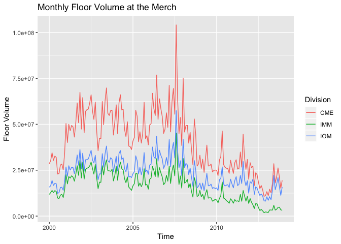

``` r
attach_monthly_vol <- function(ts_df, division, monthly_df = monthly_vol) {
  monthly_df <- dplyr::filter(monthly_df, Division==division)
  monthly_df <- select(monthly_df, -Division)
  left_join(ts_df, monthly_df, by='yearmon')
}

ts_cmeS_all <- attach_monthly_vol(cmeS, 'CME')
ts_immS_all <- attach_monthly_vol(immS, 'IMM')
ts_iomS_all <- attach_monthly_vol(iomS, 'IOM')
```

### Train / Test

Before fitting any models, remove the 2013 year from the timeseries objects and keep the 2013 year as the values to judge the forecasts.

``` r
ts_cmeS_2013 <- dplyr::filter(ts_cmeS_all, yearmon >= 2013)
ts_immS_2013 <- dplyr::filter(ts_immS_all, yearmon >= 2013)
ts_iomS_2013 <- dplyr::filter(ts_iomS_all, yearmon >= 2013)

ts_cmeS <- dplyr::filter(ts_cmeS_all, yearmon < 2013)
ts_immS <- dplyr::filter(ts_immS_all, yearmon < 2013)
ts_iomS <- dplyr::filter(ts_iomS_all, yearmon < 2013)
```

Task A: Fit Models
==================

Linear Regression
-----------------

Seat price is independent, Volume dependent

### CME

``` r
ts_with_floor_vol_plot <- function(ts_df, division) {
  X <- ts_df$yearmon
  Y1 <- ts_df$spline
  Y2 <- ts_df$floor.vol
  par(mar = c(5, 5, 3, 5))
  plot(x=X, y=Y1, type ="l", 
       ylab = paste("Interpolated Price of",division,"Seat"),
       main = paste(division, "Seat price & Floor Volume"), 
       xlab = "Time", xaxt='n',
       col = "blue")
  par(new = TRUE)
  plot(x=X, y=Y2, type = "l", 
       xaxt = "n", yaxt = "n", ylab = "", xlab = "", 
       col = "red", lty = 2)
  axis(side = 4)
  mtext("Floor Volume", side = 4, line = 3)
  legend("topleft", c("Seat Price", "Floor Volume"),
         col = c("blue", "red"), lty = c(1, 2))
}

lm_cme <- lm(spline ~ floor.vol, data=ts_cmeS)
ts_with_floor_vol_plot(ts_cmeS, 'CME')
```

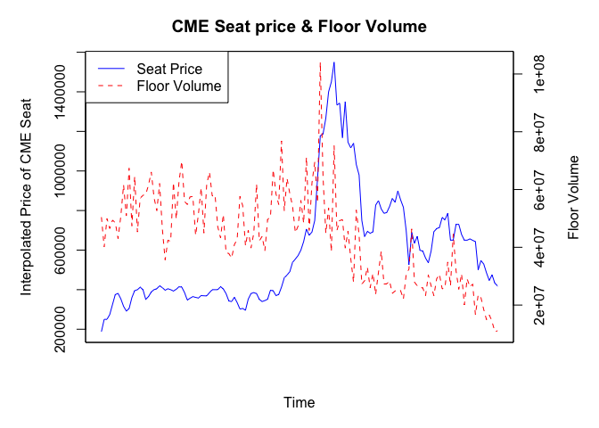

### IMM

I won't print the other summaries or plots for simplicity.

``` r
lm_imm <- lm(spline ~ floor.vol, data=ts_immS)
```

### IOM

``` r
lm_iom <- lm(spline ~ floor.vol, data=ts_iomS)
```

Linear Regression with ARIMA Errors
-----------------------------------

### CME

``` r
library(forecast)

lm_arima_cme <- auto.arima(ts_cmeS$spline, xreg=ts_cmeS$floor.vol)
summary(lm_arima_cme)
```

    ## Series: ts_cmeS$spline 
    ## Regression with ARIMA(0,1,0) errors 
    ## 
    ## Coefficients:
    ##        xreg
    ##       9e-04
    ## s.e.  5e-04
    ## 
    ## sigma^2 estimated as 4.1e+09:  log likelihood=-1785
    ## AIC=3574   AICc=3574.08   BIC=3579.92
    ## 
    ## Training set error measures:
    ##                    ME     RMSE      MAE       MPE     MAPE      MASE
    ## Training set 1843.689 63582.38 40326.97 0.1729572 6.513899 0.9892668
    ##                    ACF1
    ## Training set 0.06051796

### IMM

``` r
lm_arima_imm <- auto.arima(ts_immS$spline, xreg=ts_immS$floor.vol)
```

### IOM

``` r
lm_arima_iom <- auto.arima(ts_iomS$spline, xreg=ts_iomS$floor.vol)
```

Holt Winters
------------

### CME

``` r
hw_cme <- HoltWinters(ts(ts_cmeS$spline, start=2001, frequency = 12))
c(hw_cme$alpha, hw_cme$beta, hw_cme$gamma)
```

    ##     alpha      beta     gamma 
    ## 0.8933428 0.0000000 1.0000000

### IMM

``` r
hw_imm <- HoltWinters(ts(ts_immS$spline, start=2001, frequency = 12))
```

### IOM

``` r
hw_iom <- HoltWinters(ts(ts_iomS$spline, start=2001, frequency = 12))
```

ARIMA
-----

### CME

``` r
arima_cme <- auto.arima(ts_cmeS$spline, seasonal = F)
summary(arima_cme)
```

    ## Series: ts_cmeS$spline 
    ## ARIMA(0,1,0) 
    ## 
    ## sigma^2 estimated as 4.179e+09:  log likelihood=-1786.87
    ## AIC=3575.75   AICc=3575.77   BIC=3578.71
    ## 
    ## Training set error measures:
    ##                    ME     RMSE      MAE       MPE     MAPE      MASE
    ## Training set 1605.472 64420.79 40482.72 0.1484913 6.459397 0.9930876
    ##                   ACF1
    ## Training set 0.0484681

### IMM

``` r
arima_imm <- auto.arima(ts_immS$spline, seasonal = F)
```

### IOM

``` r
arima_iom <- auto.arima(ts_iomS$spline, seasonal = F)
```

Seasonal ARIMA
--------------

Seasonality is monthly

### CME

``` r
auto.arima(ts(ts_cmeS$spline, start=2001, frequency = 12))
```

    ## Series: ts(ts_cmeS$spline, start = 2001, frequency = 12) 
    ## ARIMA(0,1,0) 
    ## 
    ## sigma^2 estimated as 4.179e+09:  log likelihood=-1786.87
    ## AIC=3575.75   AICc=3575.77   BIC=3578.71

`auto.arima` won't automatically pick up a seasonal compoment on the CME seat version even when putting it into a time series object. So I'll manually fit one.

I looged at the acf or plots with a lagged 12 month seasonal difference and added terms to the ARMA part accordingly until I found (0,1,2)(0,0,1)\[12\]

First plot with a difference and a lagged seasonal (12 month) difference.

``` r
sarima_cme <- ts_cmeS$spline %>%
  ts(start=2001, frequency = 12) %>% 
  Arima(order=c(c(0,1,2)), seasonal=c(0,0,1))

checkresiduals(sarima_cme)
```

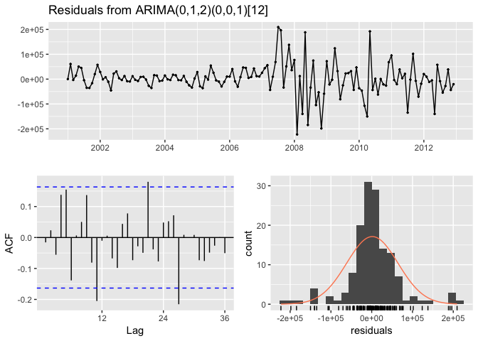

    ## 
    ##  Ljung-Box test
    ## 
    ## data:  Residuals from ARIMA(0,1,2)(0,0,1)[12]
    ## Q* = 33.305, df = 21, p-value = 0.04294
    ## 
    ## Model df: 3.   Total lags used: 24

``` r
summary(sarima_cme)
```

    ## Series: . 
    ## ARIMA(0,1,2)(0,0,1)[12] 
    ## 
    ## Coefficients:
    ##          ma1     ma2     sma1
    ##       0.0492  0.1701  -0.0841
    ## s.e.  0.0898  0.0754   0.0835
    ## 
    ## sigma^2 estimated as 4.056e+09:  log likelihood=-1783.29
    ## AIC=3574.58   AICc=3574.87   BIC=3586.43
    ## 
    ## Training set error measures:
    ##                    ME     RMSE      MAE      MPE     MAPE      MASE
    ## Training set 1484.123 62795.16 40575.22 0.161284 6.509511 0.2063234
    ##                     ACF1
    ## Training set -0.01569647

That's okay I think. It's not great but it's okay.

### IMM

IMM also didn't pick up a seasonality component from auto.arima so I again manually fit one. This time the results were slightly different.

``` r
sarima_imm <- ts_immS$spline %>%
  ts(start=2001, frequency = 12) %>% 
  Arima(order=c(c(0,1,1)), seasonal=c(0,0,1))
```

That's fine. This model only needed a c(0,1,1) non-seasonal model where the CME series needed a c(0,1,2). I think that's interesting.

### IOM

For this series, auto.arima picked up a seaonality term all its own. We'll go with that.

``` r
sarima_iom <- ts_iomS$spline %>%
  ts(start=2001, frequency = 12) %>% 
  Arima(order=c(c(0,1,1)), seasonal=c(0,0,1))
```

Fractional ARIMA
----------------

Check applicability first using the ACF. If the ACF decays very slowly then the series could be a good candidate for an ARFIMA model. ARFIMA models are good for detecting long-memory, and lots of autocorrelation at deep lags mean that the series has a long memory, or depenence on lots of lagged values.

### CME

Simulate a fractional ARIMA and plot the ACF of it against he ACF of the CME time series so that it is easy to see if they are similar or dissimilar.

``` r
library(fracdiff)

ts.test <- fracdiff.sim( 1000, ar = .55, ma = -.4, d = .3) 

par(mfrow=c(2,1))
acf(ts.test$series, lag=50)
acf(ts_cmeS$spline, lag=50)
```

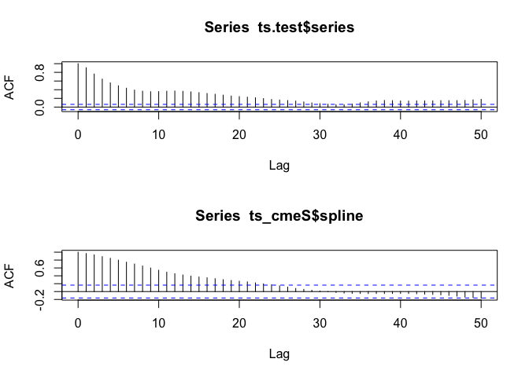

Looks to me like a slowly decaying ACF plot. Next, fit the ARFIMA.

``` r
arfima_cme <- arfima(ts(ts_cmeS$spline, start=2001, frequency = 12))

summary(arfima_cme)
```

    ## 
    ## Call:
    ##   arfima(y = ts(ts_cmeS$spline, start = 2001, frequency = 12)) 
    ## 
    ## Coefficients:
    ##        Estimate Std. Error z value Pr(>|z|)    
    ## d       0.31129    0.03492   8.914  < 2e-16 ***
    ## ar.ar1  0.70811    0.08446   8.384  < 2e-16 ***
    ## ar.ar2  0.21488    0.08236   2.609  0.00908 ** 
    ## ---
    ## Signif. codes:  0 '***' 0.001 '**' 0.01 '*' 0.05 '.' 0.1 ' ' 1
    ## sigma[eps] = 63038.66 
    ## [d.tol = 0.0001221, M = 100, h = 1.894e-05]
    ## Log likelihood: -1796 ==> AIC = 3600.254 [4 deg.freedom]

### IMM

``` r
acf(ts_immS$spline, lag=50)
```

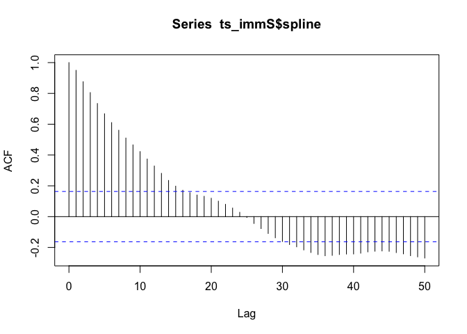

``` r
arfima_imm <- arfima(ts_immS$spline)

summary(arfima_imm)
```

    ## 
    ## Call:
    ##   arfima(y = ts_immS$spline) 
    ## 
    ## Coefficients:
    ##        Estimate Std. Error z value Pr(>|z|)    
    ## d       0.01651    0.02835   0.582     0.56    
    ## ar.ar1  0.94529    0.09504   9.946   <2e-16 ***
    ## ma.ma1 -0.50648    0.03149 -16.081   <2e-16 ***
    ## ---
    ## Signif. codes:  0 '***' 0.001 '**' 0.01 '*' 0.05 '.' 0.1 ' ' 1
    ## sigma[eps] = 34184.94 
    ## [d.tol = 0.0001221, M = 100, h = 1.8e-05]
    ## Log likelihood: -1708 ==> AIC = 3423.233 [4 deg.freedom]

### IOM

``` r
acf(ts_iomS$spline, lag=50)
```

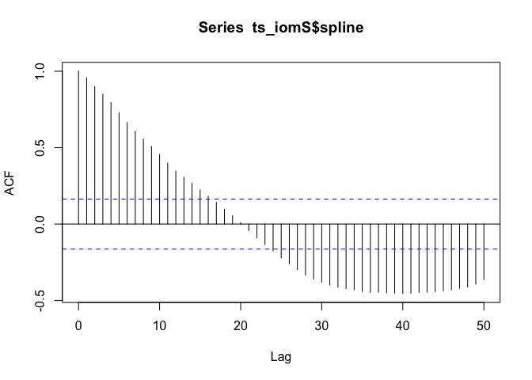

``` r
arfima_iom <- arfima(ts_iomS$spline)

summary(arfima_iom)
```

    ## 
    ## Call:
    ##   arfima(y = ts_iomS$spline) 
    ## 
    ## *** Warning during (fdcov) fit: unable to compute correlation matrix; maybe change 'h'
    ## 
    ## Coefficients:
    ##        Estimate
    ## d         0.000
    ## ar.ar1    0.949
    ## ma.ma1   -0.370
    ## sigma[eps] = 26067.75 
    ## [d.tol = 0.0001221, M = 100, h = 1.759e-05]
    ## Log likelihood: -1669 ==> AIC = 3345.158 [4 deg.freedom]

ARMA and GARCH combination
--------------------------

GARCH models are used when a time series displays heteroskedasticity, that is, non-constant variance. Specifically when the variance of the errors is autocorrelated.

Use the fGarch R library and garchFit()

### CME

``` r
acf(ts_cmeS$spline)
```

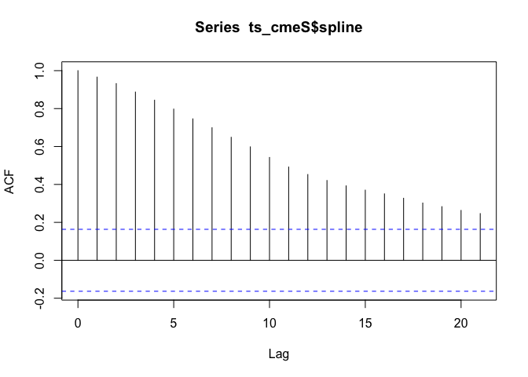

``` r
acf(ts_cmeS$spline^2)
```

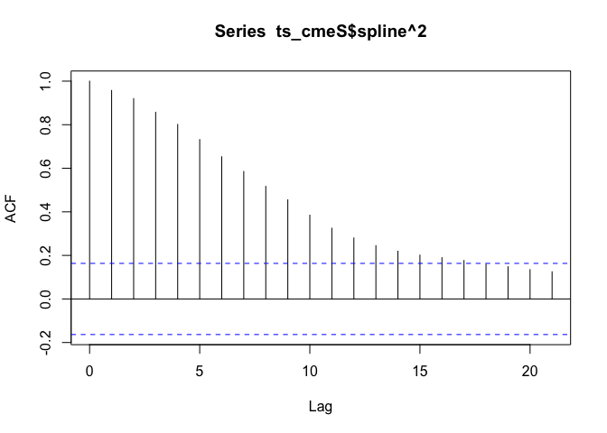

While the ACF of the time series shows autocorrelation, the ACF of the squared time series shows that the variance might also have autocorrelation.

A visual inspection of the residuals would show the same thing, for brevity's sake I'll omit it here and go straight to model fitting.

I had to use an `arma(1,0)` model to get the `garchFit` to work even though `auto.arima` did not detect an AR term when fitting that model above. Otherwise the hessian failed to invert

``` r
library(fGarch)
library(TSA)

garch_cme <- garchFit(~arma(1,0)+garch(1,1), 
                      data=ts(ts_cmeS$spline, frequency = 12), 
                      trace=F)
summary(garch_cme)
```

    ## 
    ## Title:
    ##  GARCH Modelling 
    ## 
    ## Call:
    ##  garchFit(formula = ~arma(1, 0) + garch(1, 1), data = ts(ts_cmeS$spline, 
    ##     frequency = 12), trace = F) 
    ## 
    ## Mean and Variance Equation:
    ##  data ~ arma(1, 0) + garch(1, 1)
    ## <environment: 0x7fcb44164730>
    ##  [data = ts(ts_cmeS$spline, frequency = 12)]
    ## 
    ## Conditional Distribution:
    ##  norm 
    ## 
    ## Coefficient(s):
    ##         mu         ar1       omega      alpha1       beta1  
    ## 3.0555e+04  9.2407e-01  1.9677e+07  2.8506e-01  7.6183e-01  
    ## 
    ## Std. Errors:
    ##  based on Hessian 
    ## 
    ## Error Analysis:
    ##         Estimate  Std. Error  t value Pr(>|t|)    
    ## mu     3.055e+04   2.419e+03   12.633  < 2e-16 ***
    ## ar1    9.241e-01   2.582e-03  357.842  < 2e-16 ***
    ## omega  1.968e+07          NA       NA       NA    
    ## alpha1 2.851e-01   7.113e-02    4.008 6.14e-05 ***
    ## beta1  7.618e-01   3.966e-02   19.208  < 2e-16 ***
    ## ---
    ## Signif. codes:  0 '***' 0.001 '**' 0.01 '*' 0.05 '.' 0.1 ' ' 1
    ## 
    ## Log Likelihood:
    ##  -1751.924    normalized:  -12.16614 
    ## 
    ## Description:
    ##  Mon Jun  3 14:00:55 2019 by user:  
    ## 
    ## 
    ## Standardised Residuals Tests:
    ##                                 Statistic p-Value     
    ##  Jarque-Bera Test   R    Chi^2  19.78289  5.060574e-05
    ##  Shapiro-Wilk Test  R    W      0.9702966 0.00320109  
    ##  Ljung-Box Test     R    Q(10)  24.55235  0.006261779 
    ##  Ljung-Box Test     R    Q(15)  27.12871  0.02770496  
    ##  Ljung-Box Test     R    Q(20)  28.94824  0.08878355  
    ##  Ljung-Box Test     R^2  Q(10)  7.840566  0.6444069   
    ##  Ljung-Box Test     R^2  Q(15)  9.800945  0.8320706   
    ##  Ljung-Box Test     R^2  Q(20)  15.70665  0.7346483   
    ##  LM Arch Test       R    TR^2   8.532908  0.7422232   
    ## 
    ## Information Criterion Statistics:
    ##      AIC      BIC      SIC     HQIC 
    ## 24.40172 24.50484 24.39941 24.44362

``` r
McLeod.Li.test(y=residuals(garch_cme))
```

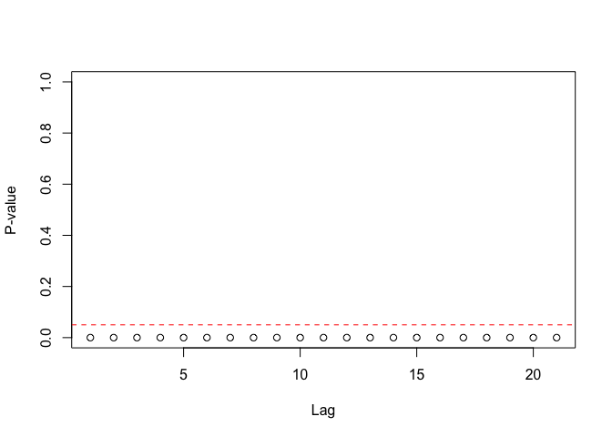

The null hypothesis, that is is no ARCH among lags, can be safely rejected.

### IMM

I cannot get garchFit to work on IMM or IOM series. It just gives the error:

    Error in solve.default(fit$hessian) : 
      system is computationally singular: reciprocal condition number = 2.04539e-21

I have tried using the uGarchFit package, winsorizing the outliers, and different solver but nothing seems to work. Not sure why it worked for CME but not IMM or IOM.

``` r
# garch_imm <- garchFit(~arma(1,0)+garch(1,1), 
#                       data=ts(ts_immS$spline, frequency = 12), 
#                       trace=F)
# summary(garch_imm)
# McLeod.Li.test(y=residuals(garch_imm))
```

### IOM

``` r
# garch_iom <- garchFit(~arma(0,1)+garch(1,1), 
#                       data=ts(ts_iomS$spline, frequency = 12), 
#                       trace=F)
# summary(garch_iom)
# McLeod.Li.test(y=residuals(garch_iom))
```

Task B: Evaluation
==================

Evaluated each model with sMAPE.
I'll only plot the forecasts for the CME models.

``` r
smape <- function(act, pred) {
  sm <- abs(act - pred) / ((abs(act) + abs(pred))/2)
  return(sum(sm, na.rm = T) * 100/length(act))
}

forecast_2013_plot <- function(df_, col, division, model) {
  SMAPE <- smape(df_$spline, df_[,col])
  
  df_ %>%
    melt(id.vars='yearmon', measure.vars = c('spline', col)) %>%
    ggplot(aes(x=yearmon, y=value, color=variable)) + 
    geom_line() +
    scale_x_yearmon() + 
    labs(title=paste(model, 'Forecast for 2013', division, 'Seat Price'),
         subtitle=paste0('SMAPE: ', round(SMAPE, 1), '%'))
}
```

Linear Regression
-----------------

``` r
ts_cmeS_2013$lm_forecast <- predict(lm_cme, newdata=ts_cmeS_2013)
ts_immS_2013$lm_forecast <- predict(lm_imm, newdata=ts_immS_2013)
ts_iomS_2013$lm_forecast <- predict(lm_iom, newdata=ts_iomS_2013)

smape_df <- data.frame(
  row.names = c('cme', 'imm', 'iom'),
  Linear.Regression = c(with(ts_iomS_2013, smape(spline, lm_forecast)),
                        with(ts_immS_2013, smape(spline, lm_forecast)),
                        with(ts_cmeS_2013, smape(spline, lm_forecast))))

forecast_2013_plot(ts_cmeS_2013, 'lm_forecast', 'CME', 'Linear Regression')
```

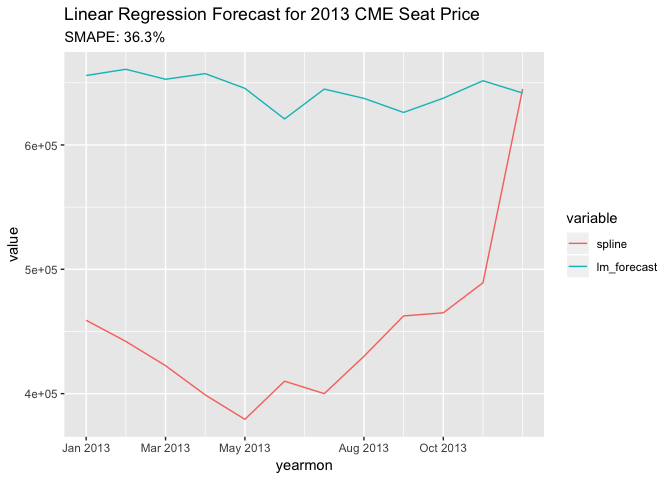

Not a great forecast.

Regression with ARIMA Errors
----------------------------

``` r
ts_cmeS_2013$lm_arima_forecast <- 
  predict(lm_arima_cme, newxreg=ts_cmeS_2013$floor.vol)$pred

ts_immS_2013$lm_arima_forecast <- 
  predict(lm_arima_imm, newxreg=ts_immS_2013$floor.vol)$pred

ts_iomS_2013$lm_arima_forecast <- 
  predict(lm_arima_iom, newxreg=ts_iomS_2013$floor.vol)$pred

smape_df$LM.ARIMA <- c(
  with(ts_cmeS_2013, smape(spline, lm_arima_forecast)),
  with(ts_immS_2013, smape(spline, lm_arima_forecast)),
  with(ts_iomS_2013, smape(spline, lm_arima_forecast))
)

forecast_2013_plot(ts_cmeS_2013, 'lm_arima_forecast', 'CME', 'ARIMA with Regression Errors')
```

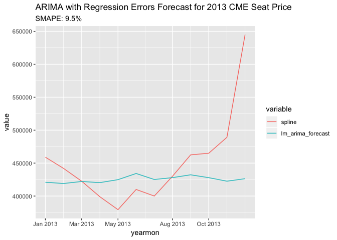

Holt-Winters
------------

``` r
ts_cmeS_2013$hw_forecast <- forecast(hw_cme, h=12)$mean
ts_immS_2013$hw_forecast <- forecast(hw_imm, h=12)$mean
ts_iomS_2013$hw_forecast <- forecast(hw_iom, h=12)$mean

smape_df$Holt.Winters <- c(
  with(ts_cmeS_2013, smape(spline, hw_forecast)),
  with(ts_immS_2013, smape(spline, hw_forecast)),
  with(ts_iomS_2013, smape(spline, hw_forecast))
)

forecast_2013_plot(ts_cmeS_2013, 'hw_forecast', 'CME', 'Holt-Winters')
```

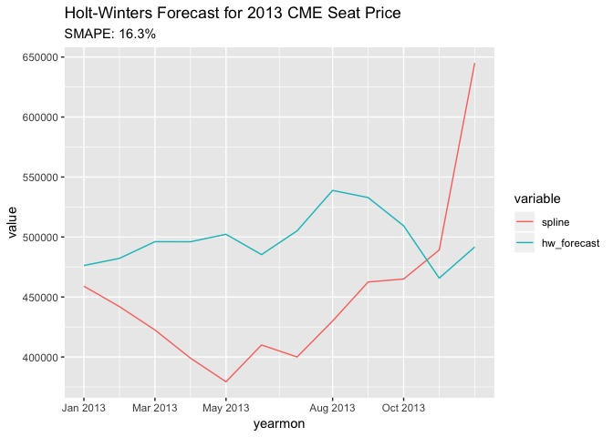

ARIMA
-----

``` r
arima_order <- function(fit_) {
  order <- setNames(fit_$arma, c("p", "q", "P", "Q", "m", "d", "D"))
  pdq <- order[c('p','d','q')]
  PDQ <- order[c('P','D','Q')]
  
  name <- paste0("ARIMA(", paste(pdq, collapse=","), ")")
  
  if(sum(PDQ) > 0) {
    name <- paste0(name, "(", paste(PDQ, collapse=","), ")", "[", order['m'], "]")
  }
  return(name)
}

ts_cmeS_2013$arima_forecast <- forecast(arima_cme, h=12)$mean
ts_immS_2013$arima_forecast <- forecast(arima_imm, h=12)$mean
ts_iomS_2013$arima_forecast <- forecast(arima_iom, h=12)$mean

smape_df$ARIMA <- c(
  with(ts_cmeS_2013, smape(spline, arima_forecast)),
  with(ts_immS_2013, smape(spline, arima_forecast)),
  with(ts_iomS_2013, smape(spline, arima_forecast))
)

forecast_2013_plot(ts_cmeS_2013, 'arima_forecast', 'CME', arima_order(arima_cme))
```

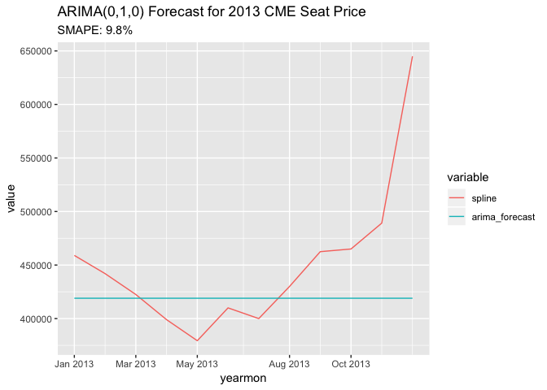

Seasonal ARIMA
--------------

``` r
ts_cmeS_2013$sarima_forecast <- forecast(sarima_cme, h=12)$mean
ts_immS_2013$sarima_forecast <- forecast(sarima_imm, h=12)$mean
ts_iomS_2013$sarima_forecast <- forecast(sarima_iom, h=12)$mean

smape_df$SARIMA <- c(
  with(ts_cmeS_2013, smape(spline, sarima_forecast)),
  with(ts_immS_2013, smape(spline, sarima_forecast)),
  with(ts_iomS_2013, smape(spline, sarima_forecast))
)

forecast_2013_plot(ts_cmeS_2013, 'sarima_forecast', 'CME', arima_order(sarima_cme))
```

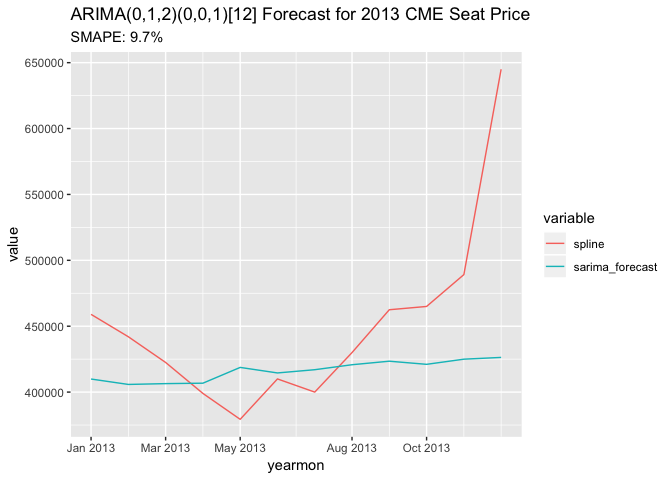

Fractional ARIMA
----------------

``` r
ts_cmeS_2013$arfima_forecast <- forecast(arfima_cme, h=12)$mean
ts_immS_2013$arfima_forecast <- forecast(arfima_imm, h=12)$mean
ts_iomS_2013$arfima_forecast <- forecast(arfima_iom, h=12)$mean

smape_df$ARFIMA <- c(
  with(ts_cmeS_2013, smape(spline, arfima_forecast)),
  with(ts_immS_2013, smape(spline, arfima_forecast)),
  with(ts_iomS_2013, smape(spline, arfima_forecast))
)

forecast_2013_plot(ts_cmeS_2013, 'arfima_forecast', 'CME', 'ARFIMA')
```

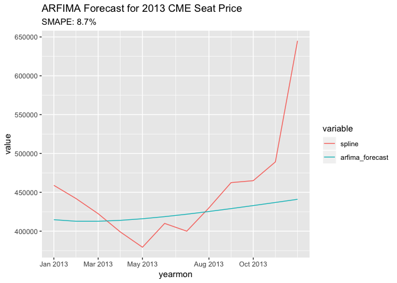

Garch
-----

``` r
ts_cmeS_2013$garch_forecast <- predict(garch_cme, 12)$meanForecast
#ts_cmeS_2013$garch_forecast <- predict(garch_imm, 12)$meanForecast
#ts_cmeS_2013$garch_forecast <- predict(garch_iom, 12)$meanForecast

smape_df$GARCH <- c(
  with(ts_cmeS_2013, smape(spline, garch_forecast)),
  NA,#with(ts_immS_2013, smape(spline, arfima_forecast))
  NA #with(ts_iomS_2013, smape(spline, arfima_forecast))
)

forecast_2013_plot(ts_cmeS_2013, 'garch_forecast', 'CME', 'GARCH')
```

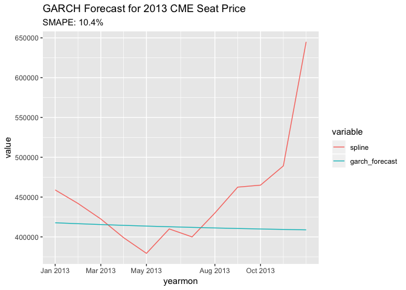

Recommendation
==============

``` r
data.frame(t(smape_df))
```

    ##                         cme      imm      iom
    ## Linear.Regression 94.263275 57.80023 36.31245
    ## LM.ARIMA           9.452810 18.02000 40.67704
    ## Holt.Winters      16.302780 11.31857 25.29221
    ## ARIMA              9.810515 18.09252 15.36330
    ## SARIMA             9.711101 22.25426 18.07419
    ## ARFIMA             8.680941 14.62086 52.17593
    ## GARCH             10.383003       NA       NA

I would recommend seasonal ARIMA. While ARIMA did slighly better on the SMAPE metric, it just predicted point forecasts which is silly.

All the models did pretty poorly though.
