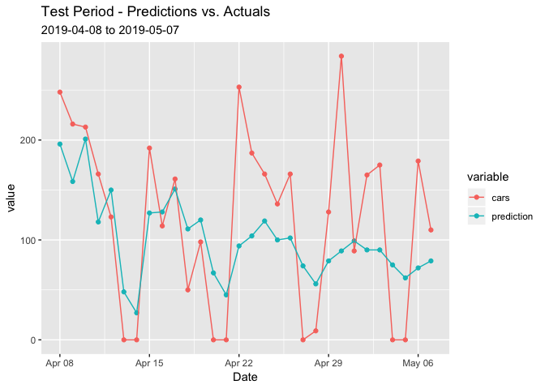
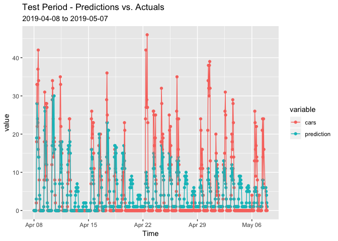

Poisson Count Time Series Model on Electric Vehicle Charging
================
Scott Shepard
6/6/2019

-   [Introduction](#introduction)
-   [Electric Vehicle Charging Data](#electric-vehicle-charging-data)
    -   [Data Exploration](#data-exploration)
    -   [Daily Count Time Series](#daily-count-time-series)
    -   [4-hour & Hourly Splits](#hour-hourly-splits)
    -   [Train / Test Split](#train-test-split)
-   [Poisson Time Series Modeling](#poisson-time-series-modeling)
    -   [ACP Model](#acp-model)
    -   [Forecasting with INGARCH / ACP](#forecasting-with-ingarch-acp)
    -   [Error Analysis](#error-analysis)
    -   [Prediction in EV Units](#prediction-in-ev-units)

Introduction
============

This is a notebook for my section of the final project for MScA 31006 Time Series Analysis. The prompt is to pick a real-world time series dataset, fit three different models, and compare the results.

For our project we chose an electric vehicle charging dataset from Argonne National Labs. This dataset contains the voltage output at a charging station for electric vehicles available to employees at Argonne. The data is in 15-minute increments and shows the current voltage at that station. The higher the voltage, the more cars are charging. In general, about 3.3v equals one car.

In this notebook, I fit an Autoregressive Conditional Poisson (ACP) model, also called an Integer General Autoregressive Conditional Heteroskedasticity model, to a transformed dataset, then use it to predict the daily average voltage.

Electric Vehicle Charging Data
==============================

1.  Read the data
2.  Explore the data
3.  Transform the data

Data Exploration
----------------

Read in the electric vehicle charging data and plot it whole.

``` r
df_full <- read.csv('~/Datasets/31006/EVData.csv', stringsAsFactors=F)
names(df_full)[2] <- "EV"
df_full$Time <- as.POSIXct(df_full$Time, format = "%Y-%m-%d %H:%M:%S")
df_full <- df_full[!is.na(df_full$Time), ]

library(ggplot2)
ggplot(df_full, aes(x=Time, y=EV)) + geom_line()
```


The data is quite spiky. This might be tough to try to predict. Try zooming in on the first few days.

``` r
ggplot(tail(df_full, 2000), aes(x=Time, y=EV)) + geom_line()
```


There *is* a strong timeseries component. We just need to be able to distinguish it from the stochastic spikes.

Daily Count Time Series
-----------------------

One approach to get a less stochastic time series is to turn the 15-minute EV charging data into a daily count of how many cars were plugged in. Here we assume that 3.3 volts is the standard charging for one car. Counting it out in 3.3 unit chunks gives us the number of cars plugged in at that time.

``` r
library(dplyr)

df <- df_full

df$Date <- as.Date(df$Time)
df$cars <- round(df$EV / 3.3)

ggplot(tail(df, 2000), aes(x=Time, y=cars)) + geom_line()
```


Now we want to know how many cars in total there were ofer the course of the day.

Since prediction in the original units is the end-game, instead of getting an actual count of cars-per-day, we just want to count car-quarter-hour units. It's a measure of energy basically. Then when predictions are finalized, they can be backwards calculated to an average voltage per day.

``` r
daily <- group_by(df, Date) %>%
  summarize(cars = sum(cars))

head(daily)
```

    ## # A tibble: 6 x 2
    ##   Date        cars
    ##   <date>     <dbl>
    ## 1 2017-07-20     0
    ## 2 2017-07-21     0
    ## 3 2017-07-22     9
    ## 4 2017-07-23     0
    ## 5 2017-07-24    27
    ## 6 2017-07-25    59

``` r
ggplot(daily, aes(x=Date, y=cars)) + geom_line(stat='identity')
```


Overall the plot of daily car counts looks pretty similar to 15 minute EV data.

How does one week in August compare?

``` r
filter(daily, Date >= '2018-08-01', Date < '2018-08-08') %>%
  ggplot(aes(x=Date, y=cars)) + geom_line()
```


``` r
filter(df, Date >= '2018-08-01', Date < '2018-08-08') %>%
  ggplot(aes(x=Time, y=EV)) + geom_line()
```


So it can transform pretty dramatically with lots of up and down.

4-hour & Hourly Splits
----------------------

There is a pretty strong hourly component to the seasonality, with night-time having no charging, morning with high charge and afternoon with smaller charge. So grouping by hour and 4-hour chunks might prove to be better transformations for the final result.

``` r
hourly <- df %>%
  mutate(hour = as.POSIXlt(Time)$hour) %>%
  group_by(Date, hour) %>%
  summarize(cars = sum(cars))

quarter_daily <- df %>%
  mutate(quarter_day = floor(as.POSIXlt(Time)$hour / 6)) %>%
  group_by(Date, quarter_day) %>%
  summarize(cars = sum(cars))
```

Train / Test Split
------------------

The final step before modeling is to split into train & test datasets. The timeseries package I'm using can'thandle gaps in the data so I'm using data since the 6/15/18 to avoid the large gap in the summer of 2018.

``` r
min_date <- '2018-06-15'
test_date <- '2019-04-08'

daily_train <- daily[(daily$Date >= min_date) & (daily$Date < test_date), ]
daily_train[is.na(daily_train$cars), ]$cars <- 0
daily_test  <- daily[daily$Date >= test_date, ]

hourly_train <- hourly[(hourly$Date >= min_date) & (hourly$Date < test_date), ]
hourly_train[is.na(hourly_train$cars), ]$cars <- 0
hourly_test  <- hourly[hourly$Date >= test_date, ]

quarter_daily_train <- quarter_daily[(quarter_daily$Date >= min_date) & (quarter_daily$Date < test_date), ]
quarter_daily_train[is.na(quarter_daily_train$cars), ]$cars <- 0
quarter_daily_test  <- quarter_daily[quarter_daily$Date >= test_date, ]
```

With 34 data points in test we are predicting about a month out.

Poisson Time Series Modeling
============================

ACP Model
---------

The library `tscount` provides the function `tsglm`. It fits an integer-valued GARCH model of order p and q, abbreviated as INGARCH(p,q). These models are also known as autoregressive conditional Poisson (ACP) models.

I have specificed a seasonality of 1 (daily) and 7 (weekly) to be fitted.

``` r
library(tscount)

daily_carsfit_pois <- tsglm(
  daily_train$cars,  
  model = list(past_obs = c(1, 7)),
  distr="poisson")

hourly_carsfit_pois <- tsglm(
  hourly_train$cars,  
  model = list(past_obs = c(1, 7)*24),
  distr="poisson")

quarter_daily_carsfit_pois <- tsglm(
  quarter_daily_train$cars,  
  model = list(past_obs = c(1, 7)*4),
  distr="poisson")
```

``` r
library(reshape2)

daily_train$fitted.values <- daily_carsfit_pois$fitted.values
daily_train %>% 
  melt(id.vars='Date', measure.vars = c('fitted.values', 'cars')) %>%
  ggplot(aes(x=Date, y=value, color=variable)) + 
  geom_point() + geom_line() + 
  theme(legend.position = "top",
        legend.title = element_blank())
```


``` r
hourly_train$fitted.values <- hourly_carsfit_pois$fitted.values
hourly_train %>% 
  mutate(hour = paste0(Date, '-', hour)) %>%
  melt(id.vars='hour', measure.vars = c('fitted.values', 'cars')) %>%
  ggplot(aes(x=hour, y=value, color=variable)) + 
  geom_point() + geom_line() + 
  theme(legend.position = "top",
        legend.title = element_blank())
```

    ## geom_path: Each group consists of only one observation. Do you need to
    ## adjust the group aesthetic?


``` r
quarter_daily_train$fitted.values <- quarter_daily_carsfit_pois$fitted.values
quarter_daily_train %>% 
  mutate(quarter = paste0(Date, quarter_day)) %>%
  melt(id.vars='quarter', measure.vars = c('fitted.values', 'cars')) %>%
  ggplot(aes(x=quarter, y=value, color=variable)) + 
  geom_point() + geom_line() + 
  theme(legend.position = "top",
        legend.title = element_blank())
```

    ## geom_path: Each group consists of only one observation. Do you need to
    ## adjust the group aesthetic?


Not bad? It seems like the poisson time series captures the weekend zeros pretty well.

``` r
acf(residuals(daily_carsfit_pois))
```


``` r
plot(residuals(daily_carsfit_pois), type='l')
```


Well hot damn that sure seems to fit well. The residuals look like white noise and the ACF chart indicates no autocorrelation. Though there is quite a bit of heteroskedasticity.

``` r
Box.test(residuals(daily_carsfit_pois), type='Ljung-Box')
```

    ## 
    ##  Box-Ljung test
    ## 
    ## data:  residuals(daily_carsfit_pois)
    ## X-squared = 1.8431, df = 1, p-value = 0.1746

Forecasting with INGARCH / ACP
------------------------------

``` r
daily_test$prediction <- predict(daily_carsfit_pois, nrow(daily_test))$median
hourly_test$prediction <- predict(hourly_carsfit_pois, nrow(hourly_test))$median
quarter_daily_test$prediction <- predict(quarter_daily_carsfit_pois, nrow(quarter_daily_test))$median
```

``` r
daily_test %>% 
  melt(id.vars='Date', measure.vars=c('cars', 'prediction')) %>%
  ggplot(aes(x=Date, y=value, color=variable)) + 
  geom_point() + geom_line() + 
  labs(title='Test Period - Predictions vs. Actuals',
       subtitle = paste(test_date, 'to', max(df$Date)))
```



Interesting pattern in the predictions. It seems to do pretty well initially but trend towards the median as we go farther out. I wouldn't trust this prediction beyond one or two weeks.

``` r
hourly_test$Time <- with(hourly_test, as.POSIXct(paste0(Date, " ", hour, ":00:00")))
hourly_test %>%
  melt(id.vars='Time', measure.vars=c('cars', 'prediction')) %>%
  ggplot(aes(x=Time, y=value, color=variable)) + 
  geom_point() + geom_line() + 
  labs(title='Test Period - Predictions vs. Actuals',
       subtitle = paste(test_date, 'to', max(df$Date)))
```



``` r
quarter_daily_test$Time <- with(quarter_daily_test, as.POSIXct(paste0(Date, " ", (quarter_day+1)*4, ":00:00")))
quarter_daily_test %>%
  melt(id.vars='Time', measure.vars=c('cars', 'prediction')) %>%
  ggplot(aes(x=Time, y=value, color=variable)) + 
  geom_point() + geom_line() + 
  labs(title='Test Period - Predictions vs. Actuals',
       subtitle = paste(test_date, 'to', max(df$Date)))
```


Error Analysis
--------------

``` r
smape <- function(actual, pred){

   N <- length(actual)

   bool.iid <- (actual==0)&(pred==0)
   actual <- actual[!bool.iid]
   pred <- pred[!bool.iid]

   val <- 200/N*sum(abs((actual - pred))/(actual+pred))

   return(val)
}
```

First compute SMAPE by the transformed set.

``` r
smape(daily_test$cars, daily_test$prediction)
```

    ## [1] 82.54451

``` r
smape(hourly_test$cars, hourly_test$prediction)
```

    ## [1] 125.0282

``` r
smape(quarter_daily_test$cars, quarter_daily_test$prediction)
```

    ## [1] 134.4557

``` r
week_index <- function(n, frequency=7) {
  week_i <- c() 
  i <- 1
  while(length(week_i) < n) {
    week_i <- c(week_i, rep(i,frequency))
    i = i + 1
  }
  week_i[1:n]
}

daily_test$week_i <- week_index(nrow(daily_test), 7)
hourly_test$week_i <- week_index(nrow(hourly_test), 7*24)
quarter_daily_test$week_i <- week_index(nrow(quarter_daily_test), 7*24/6)

group_by(daily_test, week_i) %>%
  summarize(smape = smape(cars, prediction))
```

    ## # A tibble: 5 x 2
    ##   week_i smape
    ##    <dbl> <dbl>
    ## 1      1  73.4
    ## 2      2  79.2
    ## 3      3  86.4
    ## 4      4  97.9
    ## 5      5  59.0

``` r
group_by(hourly_test, week_i) %>%
  summarize(smape = smape(cars, prediction))
```

    ## # A tibble: 5 x 2
    ##   week_i smape
    ##    <dbl> <dbl>
    ## 1      1  50.8
    ## 2      2 135. 
    ## 3      3 153. 
    ## 4      4 158. 
    ## 5      5 140.

``` r
group_by(quarter_daily_test, week_i) %>%
  summarize(smape = smape(cars, prediction))
```

    ## # A tibble: 5 x 2
    ##   week_i smape
    ##    <dbl> <dbl>
    ## 1      1 135. 
    ## 2      2 142. 
    ## 3      3 141. 
    ## 4      4 136. 
    ## 5      5  80.6

Initial small errors turn into hot garbage pretty quickly.

Prediction in EV Units
----------------------

Turn the predicted values back into voltage to get a final SMAPE value.

``` r
test <- df[df$Date >= test_date,]

test$week_i <- week_index(nrow(test), 7*24*4)

test <- test %>%
  mutate(quarter_day = floor(as.POSIXlt(Time)$hour / 6),
         hour = floor(as.POSIXlt(Time)$hour))

y <- daily_test %>% 
  mutate(daily_prediction = prediction / 24 / 4 * 3.3) %>% 
  select(Date, daily_prediction)
test <- left_join(test, y, by=c('Date'))

y <- hourly_test %>% 
  mutate(hourly_prediction = prediction / 4 * 3.3) %>% 
  select(Date, hour, hourly_prediction)
test <- left_join(test, y, by=c('Date', 'hour'))

y <- quarter_daily_test %>% 
  mutate(quarter_daily_prediction = prediction / 6 / 4 * 3.3) %>% 
  select(Date, quarter_day, quarter_daily_prediction)
test <- left_join(test, y, by=c('Date', 'quarter_day'))

head(test)
```

    ##                  Time        EV       Date cars week_i quarter_day hour
    ## 1 2019-04-07 19:00:00 0.2998278 2019-04-08    0      1           3   19
    ## 2 2019-04-07 19:15:00 0.2958556 2019-04-08    0      1           3   19
    ## 3 2019-04-07 19:30:00 0.2950667 2019-04-08    0      1           3   19
    ## 4 2019-04-07 19:45:00 0.2945314 2019-04-08    0      1           3   19
    ## 5 2019-04-07 20:00:00 0.2941842 2019-04-08    0      1           3   20
    ## 6 2019-04-07 20:15:00 0.2943833 2019-04-08    0      1           3   20
    ##   daily_prediction hourly_prediction quarter_daily_prediction
    ## 1           6.7375                 0                     0.55
    ## 2           6.7375                 0                     0.55
    ## 3           6.7375                 0                     0.55
    ## 4           6.7375                 0                     0.55
    ## 5           6.7375                 0                     0.55
    ## 6           6.7375                 0                     0.55

``` r
with(test, smape(EV, daily_prediction))
```

    ## [1] 137.5316

``` r
with(test, smape(EV, hourly_prediction))
```

    ## [1] 108.8989

``` r
with(test, smape(EV, quarter_daily_prediction))
```

    ## [1] 88.89625

``` r
group_by(test, week_i) %>%
  summarize(smape=smape(EV, daily_prediction))
```

    ## # A tibble: 5 x 2
    ##   week_i smape
    ##    <dbl> <dbl>
    ## 1      1  132.
    ## 2      2  138.
    ## 3      3  143.
    ## 4      4  139.
    ## 5      5  128.

``` r
group_by(test, week_i) %>%
  summarize(smape=smape(EV, hourly_prediction))
```

    ## # A tibble: 5 x 2
    ##   week_i smape
    ##    <dbl> <dbl>
    ## 1      1 141. 
    ## 2      2 107. 
    ## 3      3  93.4
    ## 4      4  98.0
    ## 5      5  93.3

``` r
group_by(test, week_i) %>%
  summarize(smape=smape(EV, quarter_daily_prediction)) %>%
  data.frame()
```

    ##   week_i     smape
    ## 1      1  55.50069
    ## 2      2  86.53942
    ## 3      3 100.08245
    ## 4      4 110.45654
    ## 5      5 100.77840

``` r
test %>% 
  melt(id.vars='Time', measure.vars=c('EV', 'daily_prediction', 'hourly_prediction', 'quarter_daily_prediction')) %>%
  ggplot(aes(x=Time, y=value, color=variable)) +
  geom_line()
```


``` r
str_pad_custom <- function(labels){
  new_labels <- stringr::str_pad(labels, 10, "right")
  return(new_labels)
}

quarter_daily_forecast_plot <- test %>% 
  melt(id.vars='Time', measure.vars=c('EV', 'quarter_daily_prediction')) %>%
  ggplot(aes(x=Time, y=value, color=variable)) +
  geom_line() + 
  scale_color_manual(labels  = c('Actuals   ', 'Forecast'),
                     values=c('Maroon', 'Blue4')) +
  theme(legend.position = 'top',
        axis.title.x=element_blank(),
        legend.title = element_blank(),
        legend.spacing.x = unit(0.25,'cm')) +
  labs(title='Autoregressive Conditional Poisson Forecast', 
       subtitle = paste(test_date, 'to', max(df$Date)),
       y='EV Charging Power')
quarter_daily_forecast_plot
```


``` r
test$quarter_daily_residuals<- with(test, EV - quarter_daily_prediction)

quarter_daily_residual_plot <- test %>% 
  ggplot(aes(x=Time, y=quarter_daily_residuals)) + 
  geom_line() + 
  labs(y='Acutals - Prediction', x='',
       title='Residuals on ACP Model', 
       axis.title.x=element_blank())
quarter_daily_residual_plot
```


``` r
library(grid)
library(gridExtra)
```

    ## 
    ## Attaching package: 'gridExtra'

    ## The following object is masked from 'package:dplyr':
    ## 
    ##     combine

``` r
grid.arrange(
  grobs = list(quarter_daily_forecast_plot, quarter_daily_residual_plot),
  heights = c(3,2),
  layout_matrix = rbind(c(1), c(2))
)
```


