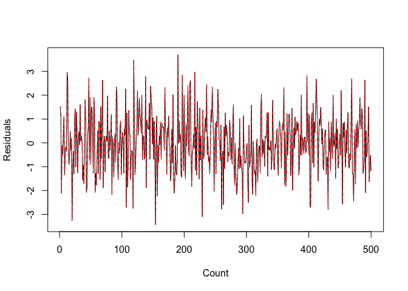
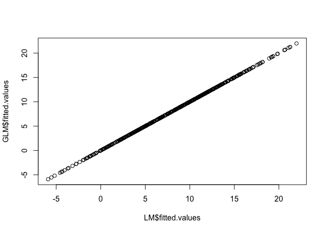
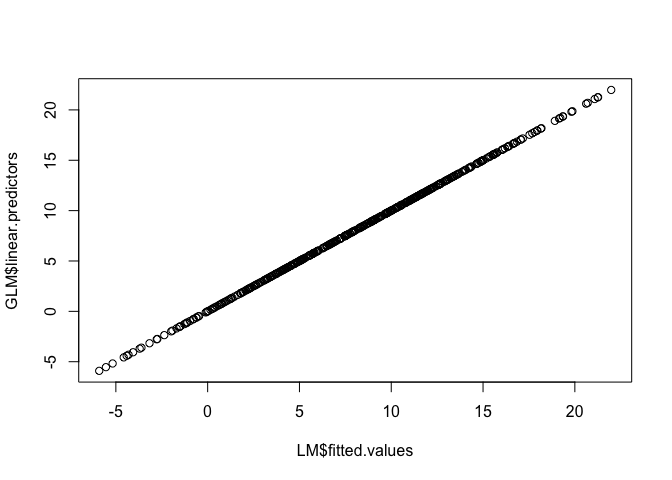

31010: Linear & Non-Linear Models -- Assignment 1
================
Scott Shepard
1/13/2019

Introduction
------------

The assignment is to explore how lm and glm are related by calculating outputs of glm using lm

Calculate: 1. Coefficients 2. Residuals 3. Fitted Values 4. Linear Predictors 5. Deviance - 5.1 Using deviance() - 5.2 Manually 6. Akaike Infomration Criterion - 6.1 Using aic() - 6.2 Manually 7. y 8. Null Deviance 9. Dispersion

0. Reading Data & Building Models
---------------------------------

Data comes from homework assignment in ilykei.
There is one output and three inputs

``` r
dataPath <- "~/Dropbox/MScA/31010 - Linear Non Linear/Assignment 1/"

df <- read.csv(
  file=paste(dataPath,"Week1_Homework_Project_Data.csv",sep="/"),
  header=TRUE,
  sep=",")

head(df, 10)
```

    ##       Output   Input1   Input2       Input3
    ## 1   5.451630 1.875976 2.721764 -0.011754874
    ## 2   4.544792 1.713108 2.570596  0.007136568
    ## 3   5.345051 2.804193 4.700366  0.056975906
    ## 4  11.239833 3.895376 6.863106 -0.103290465
    ## 5  10.055252 3.694171 6.405116 -0.142105913
    ## 6   1.720138 1.104742 1.203397  0.241145841
    ## 7   9.010973 2.947958 4.968758 -0.059639593
    ## 8   5.860532 2.743866 4.545334  0.048181014
    ## 9  13.368089 4.595102 8.226541 -0.189332876
    ## 10 10.193232 3.639261 6.228819 -0.074765940

Calculate linear modle and general linear model using the identity link. We will using LM to calculate values and GLM to confirm those calculations.

``` r
LM  <-  lm(
  Output ~ Input1 + Input2 + Input3, 
  data=df)

GLM <- glm(
  Output ~ Input1 + Input2 + Input3, 
  family=gaussian(link="identity"),
  data=df)
```

1. Coefficients
---------------

``` r
cbind(
  Output.LM=LM$coefficients,
  Output.GLM=GLM$coefficients)
```

    ##              Output.LM Output.GLM
    ## (Intercept) -2.3070078 -2.3070078
    ## Input1       2.3841593  2.3841593
    ## Input2       0.6475835  0.6475835
    ## Input3       0.6868760  0.6868760

2. Residuals
------------

This plots the residuals of lm against those of the glm. We can see they are exactly the same.

``` r
matplot(
  x=1:length(df[,1]),
  y=cbind(LM$residuals, GLM$residuals),
  type="l",
  ylab="Residuals",
  xlab="Count")
```



However the residuals aren't exactly the same. Since they were derived with different functions (maximum-likelihood vs least-squares) the values are every so slightly different,

``` r
head(LM$residuals == GLM$residuals)
```

    ##     1     2     3     4     5     6 
    ## FALSE FALSE FALSE FALSE FALSE FALSE

The toal sum of the differance between the residuals is very very small Rounding errors really

``` r
sum(abs(LM$residuals-GLM$residuals))
```

    ## [1] 5.711848e-12

3. Fitted Values
----------------

Similarly with residuals, the fitted values are not exactly the same

``` r
head(LM$fitted.values == GLM$fitted.values)
```

    ##     1     2     3     4     5     6 
    ## FALSE FALSE FALSE FALSE FALSE FALSE

However plotting them against each other leads to a perfectly straight line So the differences are rounding errors

``` r
plot(x=LM$fitted.values, y=GLM$fitted.values)
```



4. Linear Predictors
====================

Linear predictors of glm are the same as fitted.values of lm In the general case the predictors need to be transformed into fitted values using the link function. In classic linear the link function is the identity which is what was used before.

We should see the same plot as in part 3.

``` r
plot(x=LM$fitted.values, y=GLM$linear.predictors)
```



5. Deviance
===========

Deviance in the linear model is measured as sum of squares (SSE). Deviance can be computed by using the `deviance()` function or by computing deviance manually, in this case summing the squares of the residuals.

``` r
c(From.GLM=GLM$deviance,
  From.LM=sum(LM$residuals^2),
  Function.Deviance=deviance(LM))
```

    ##          From.GLM           From.LM Function.Deviance 
    ##          758.9499          758.9499          758.9499

6. AIC
======

AIC can be calculated from LM using the `AIC()` function. Use that to compare to the aic computed as a part of glm.

``` r
c(AIC(LM),
  GLM$aic)
```

    ## [1] 1637.602 1637.602

AIC can also be calculated manually.

AIC = -2\*log-likeihood + 2p

where p is number of predictors-1

``` r
manual_log_likelihood <- function(linear_model) {
  n = nrow(linear_model$model)
  y = linear_model$model[1,]
  sigma = sd(linear_model$residuals)
  - n/2 * log(2*pi*sigma**2) - 1/(2*sigma**2) * sum(linear_model$residuals**2)
}

manual_aic <- function(linear_model) {
  log_likelihood <- manual_log_likelihood(linear_model)
  p = length(linear_model$coefficients)-1
  -2*log_likelihood+2*p
}

cbind(AIC.Manual=manual_aic(LM),
      AIC.From.Function=AIC(LM),
      AIC.From.GLM=GLM$aic)
```

    ##      AIC.Manual AIC.From.Function AIC.From.GLM
    ## [1,]   1633.603          1637.602     1637.602

7. y
====

``` r
sum(abs(df[,1]-df$y))
```

    ## [1] 0

8. Null Deviance
================

Null deviance of glm() is the deviance of the null model, i.e. the model that has only intercept. Since deviance of glm() in case of
`family=gaussian(link="identity")` is equivalent to SSE of lm() we need to estimate the null model with only intercept and calculate its SSE.

``` r
LM.Null <- lm(Output~1, data=df)

c(LM.Null.SSE=sum(LM.Null$residuals**2), GLM.Null.Deviance=GLM$null.deviance)
```

    ##       LM.Null.SSE GLM.Null.Deviance 
    ##          15187.73          15187.73

9. Dispersion
=============

Dispersion for Gaussian models is the same as MSE.

We can get to that number from several starting points.

From LM sigma (residual standard deviation). MSE = sigma\*\*2

``` r
c(Disperson.From.GLM=summary(GLM)$dispersion,
  MSE.From.LM.Sigma=sigma(LM)**2)
```

    ## Disperson.From.GLM  MSE.From.LM.Sigma 
    ##           1.530141           1.530141

From variance of residuals of glm

``` r
var(GLM$residuals)*((nrow(df))/(nrow(df)-3))
```

    ## [1] 1.530122
